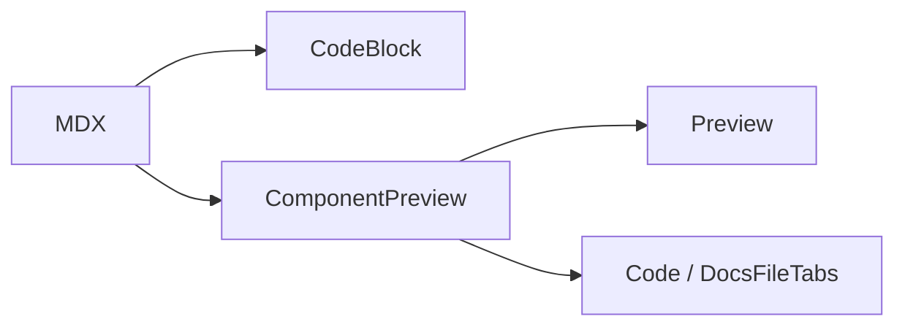

How to write posts and Learn materials for this site. Each feature below has **Source** (what you type) then **Result** (what readers see).

Also see: [MDX test](/blog/examples/markdown-all) · [Code features](/blog/examples/advanced-code-examples) · [Shiki transformers](/blog/examples/advanced-rehype-pretty-code-shiki-examples)

## How this page works

To show MDX as text without executing it, wrap it in a fence with **more backticks** than any fence inside:

- Outer: four backticks + `mdx` (or `md`)
- Inner: normal three-backtick fences and/or JSX
- Close with four backticks

Do **not** escape fences with `\```` — that does not work.

---

## Where posts live

Every `.md` / `.mdx` under `content/` (except `content/learn/`) becomes a blog post.

| File | URL |
| --- | --- |
| `content/algorithms/sorting.mdx` | `/blog/algorithms/sorting` |
| `content/guides/content-authoring.mdx` | `/blog/guides/content-authoring` |

- Prefer `.mdx` when you need components (`Figure`, `CodeTabs`, `PathVisualizer`).
- Kebab-case folders; numeric prefixes sort the tree only.
- Learn courses live under `content/learn/` → `/learn/...` (skipped by the blog crawler).

---

## Frontmatter

**Source**

```yaml
---
title: 'Understanding Vectors in Linear Algebra'
date: '2024-01-15'
excerpt: 'Vectors, operations, and geometric intuition.'
tags: ['math', 'linear-algebra', 'vectors']
coverImage: '/v1/content/math/linear-algebra/cover.png'
coverImageAlt: 'Two vectors added tip-to-tail'
---
```

| Field | Required | Notes |
| --- | --- | --- |
| `title` | yes | Hero, cards, tree, SEO |
| `date` | yes | `YYYY-MM-DD` |
| `excerpt` | recommended | Card / subtitle |
| `tags` | recommended | Related posts |
| `coverImage` / `coverImageAlt` | optional | Cards only show a cover when set |

Layout already renders `title` as `<h1>` — start the body at `##`.

---

## Code blocks (automatic)

Fenced code gets the shared card shell: filename or language badge, copy, collapse for long files. No wrapper component.

### Language badge only

**Source**

````mdx
```ts
const n = 1
```
````

**Result**

```ts
const n = 1
```

### Filename in the header

**Source**

````mdx
```tsx title="Button.tsx"
export function Button() {
  return <button className="btn">Save</button>
}
```
````

**Result**

```tsx title="Button.tsx"
export function Button() {
  return <button className="btn">Save</button>
}
```

---

## `CodeTabs` (multi-file)

Wrap related fences. Each fence needs `title="filename"` for the tab label.

**Source**

````mdx
<CodeTabs>

```tsx title="Button.tsx"
export function Button({ children }: { children: React.ReactNode }) {
  return <button className="btn">{children}</button>
}
```

```css title="Button.css"
.btn {
  padding: 0.5rem 1rem;
  border-radius: 0.375rem;
  font-weight: 500;
}
```

</CodeTabs>
````

**Result**

<CodeTabs>

```tsx title="Button.tsx"
export function Button({ children }: { children: React.ReactNode }) {
  return <button className="btn">{children}</button>
}
```

```css title="Button.css"
.btn {
  padding: 0.5rem 1rem;
  border-radius: 0.375rem;
  font-weight: 500;
}
```

</CodeTabs>

---

## Diff & highlight transformers

Comments like `// [!code ++]` style the line and are stripped from copy. More transformers: [Shiki examples](/blog/examples/advanced-rehype-pretty-code-shiki-examples).

### Diff / error

**Source**

````mdx
```ts
console.log('hewwo') // [!code --]
console.log('hello') // [!code ++]
console.error('boom') // [!code error]
```
````

**Result**

```ts
console.log('hewwo') // [!code --]
console.log('hello') // [!code ++]
console.error('boom') // [!code error]
```

### Meta line highlight

**Source**

````mdx
```ts showLineNumbers {1-2}
console.log('highlighted')
console.log('also highlighted')
console.log('plain')
```
````

**Result**

```ts showLineNumbers {1-2}
console.log('highlighted')
console.log('also highlighted')
console.log('plain')
```

### Word highlight

**Source**

````mdx
```ts /Hello/
const message = 'Hello World'
```
````

**Result**

```ts /Hello/
const message = 'Hello World'
```

---

## `Figure` (zoomable images)

Captioned image with size / align. Click opens a theme-aware lightbox (scroll to zoom, drag to pan, Esc to close). Set `zoom="false"` for decorative images.

**Important:** with `next-mdx-remote`, JSX expression props like `width={960}` are stripped at serialize time. Use **string** attributes: `width="960"`, `height="640"`, `zoom="false"`.

**Source**

````mdx
<Figure
  src="https://images.unsplash.com/photo-1555949963-aa79dcee981c?w=960&q=80"
  alt="Code on a laptop screen"
  caption="Fig 1. Click the image — scroll to zoom further"
  width="960"
  height="640"
  size="md"
/>
````

**Result**

<Figure
  src="https://images.unsplash.com/photo-1555949963-aa79dcee981c?w=960&q=80"
  alt="Code on a laptop screen"
  caption="Fig 1. Click the image — scroll to zoom further"
  width="960"
  height="640"
  size="md"
/>

Remote hosts must be listed in `next.config.ts` `images.remotePatterns` (Unsplash is already allowed). Local files go under `public/` and use root paths like `/v1/...`.

````mdx

<Figure
  src="/v1/demo.png"
  alt="BFS vs DFS travarsing"
  caption="A visual comparison of BFS and DFS traversal"
/>
````
---

## Math (KaTeX)

Keep `$...$` tight (`$x$`, not `$ x $`).

**Source**

````mdx
Inline: the vector $\mathbf{x} = (x_1, x_2, \dots, x_n)$ lives in $\mathbb{R}^n$.

$$
\mathbf{x} + \mathbf{y} = (x_1 + y_1, \dots, x_n + y_n)
$$
````

**Result**

Inline: the vector $\mathbf{x} = (x_1, x_2, \dots, x_n)$ lives in $\mathbb{R}^n$.

$$
\mathbf{x} + \mathbf{y} = (x_1 + y_1, \dots, x_n + y_n)
$$

---

## Standard Markdown

GFM is on: tables, strikethrough, task lists, autolinks.

**Source**

````md
> Left-bordered blockquote — fine for callouts on blog posts.

- Unordered item
1. Ordered item

- [ ] Todo
- [x] Done

| Algorithm | Average |
| --- | --- |
| Merge Sort | O(n log n) |

~~deprecated~~ · [Internal link](/blog/algorithms/sorting) · [External](https://example.com) · [Same-page heading](#standard-markdown)
````

**Result**

> Left-bordered blockquote — fine for callouts on blog posts.

- Unordered item
1. Ordered item

- [ ] Todo
- [x] Done

| Algorithm | Average |
| --- | --- |
| Merge Sort | $O(n \log n)$ |

~~deprecated~~ · [Internal link](/blog/algorithms/sorting) · [External](https://example.com) · [Same-page heading](#standard-markdown)

---

## `PathVisualizer`

Curriculum graph from YAML. Inline `script={\`...\`}` often arrives empty after MDX serialization — use a registered wrapper (like below) or the [playground](/tools/path-visualizer).

**Source**

````mdx
<AuthoringPathDemo />
````

**Result**

<AuthoringPathDemo />

---

## Annotations (handwritten marks)

Hand-drawn underlines, circles, boxes, and optional arrow sidenotes — powered by [rough-notation](https://roughnotation.com). Available on **blog and Learn**. Attach a note with props on the same `<Mark>` (`note="…"` must be a **string**). Marks and notes are always visible.

| Prop | Default | Values |
| --- | --- | --- |
| `type` | `underline` | `underline` \| `circle` \| `box` \| `highlight` \| `strike-through` \| `crossed-off` \| `bracket` |
| `color` | `#F08F87` | Preset name **or** any CSS color |
| `note` | — | String sidenote body |
| `noteLayout` | `floating` | `floating` \| `margin` \| `inline` |
| `noteSide` | `right` | `left` \| `right` \| `top` \| `bottom` (floating) |
| `noteVariant` | `plain` | `plain` \| `sticky` \| `card` |
| `noteMaxWidth` | content width | `18rem`, `280px`, `280`, … (single-line + ellipsis) |
| `noteColor` | same as `color` | Preset or CSS color for note + arrow |
| `arrow` | `true` | Show L-shaped connector |
| `brackets` | — | `left` \| `right` \| `top` \| `bottom` (or array) when `type="bracket"` |

**Color presets:** `default` (`#F08F87`), `note`, `tip`, `info`, `warning`, `danger`, `success`, `accent` — or a manual hex like `#2563eb`.

### Stroke types

**Source**

````mdx
<Mark type="underline">underline</Mark> ·
<Mark type="circle">circle</Mark> ·
<Mark type="box">box</Mark> ·
<Mark type="highlight">highlight</Mark> ·
<Mark type="strike-through">strike-through</Mark> ·
<Mark type="crossed-off">crossed-off</Mark> ·
<Mark type="bracket" brackets="left">bracket left</Mark> ·
<Mark type="bracket" brackets={['left', 'right']}>bracket both</Mark>
````

**Result**

<Mark type="underline">underline</Mark> ·
<Mark type="circle">circle</Mark> ·
<Mark type="box">box</Mark> ·
<Mark type="highlight">highlight</Mark> ·
<Mark type="strike-through">strike-through</Mark> ·
<Mark type="crossed-off">crossed-off</Mark> ·
<Mark type="bracket" brackets="left">bracket left</Mark> ·
<Mark type="bracket" brackets={['left', 'right']}>bracket both</Mark>

### Color presets + manual hex

**Source**

````mdx
Default <Mark>coral</Mark> ·
<Mark color="default">default</Mark> ·
<Mark color="note">note</Mark> ·
<Mark color="tip">tip</Mark> ·
<Mark color="info">info</Mark> ·
<Mark color="warning">warning</Mark> ·
<Mark color="danger">danger</Mark> ·
<Mark color="success">success</Mark> ·
<Mark color="accent">accent</Mark> ·
<Mark color="#2563eb">#2563eb</Mark> ·
<Mark color="rgb(14 165 233)">rgb()</Mark>
````

**Result**

Default <Mark>coral</Mark> ·
<Mark color="default">default</Mark> ·
<Mark color="note">note</Mark> ·
<Mark color="tip">tip</Mark> ·
<Mark color="info">info</Mark> ·
<Mark color="warning">warning</Mark> ·
<Mark color="danger">danger</Mark> ·
<Mark color="success">success</Mark> ·
<Mark color="accent">accent</Mark> ·
<Mark color="#2563eb">#2563eb</Mark> ·
<Mark color="rgb(14 165 233)">rgb()</Mark>

### Type × color matrix

**Source**

````mdx
<Mark type="underline" color="tip">underline tip</Mark> ·
<Mark type="circle" color="warning">circle warning</Mark> ·
<Mark type="box" color="info">box info</Mark> ·
<Mark type="highlight" color="accent">highlight accent</Mark> ·
<Mark type="strike-through" color="danger">strike danger</Mark> ·
<Mark type="crossed-off" color="note">crossed note</Mark> ·
<Mark type="bracket" brackets="right" color="success">bracket success</Mark> ·
<Mark type="circle" color="#F08F87">circle hex</Mark>
````

**Result**

<Mark type="underline" color="tip">underline tip</Mark> ·
<Mark type="circle" color="warning">circle warning</Mark> ·
<Mark type="box" color="info">box info</Mark> ·
<Mark type="highlight" color="accent">highlight accent</Mark> ·
<Mark type="strike-through" color="danger">strike danger</Mark> ·
<Mark type="crossed-off" color="note">crossed note</Mark> ·
<Mark type="bracket" brackets="right" color="success">bracket success</Mark> ·
<Mark type="circle" color="#F08F87">circle hex</Mark>

### Sidenote layouts (`noteLayout`)

Leave room in the paragraph so floating / margin notes do not collide.

**Source**

````mdx
Floating (default): a player makes a
<Mark type="underline" note="RL?" noteLayout="floating" noteSide="right">move</Mark>
in chess.

Margin (desktop): the
<Mark type="circle" note="CAP says pick two." noteLayout="margin" noteVariant="card" color="info">
  consistency boundary
</Mark>
matters.

Inline: the
<Mark type="underline" note="Drawn after the sentence." noteLayout="inline" color="tip">
  agent–environment loop
</Mark>
is central.
````

**Result**

Floating (default): a player makes a <Mark type="underline" note="RL?" noteLayout="floating" noteSide="right">move</Mark> in chess.

Margin (desktop): the <Mark type="circle" note="CAP says pick two." noteLayout="margin" noteVariant="card" color="info">consistency boundary</Mark> matters.

Inline: the <Mark type="underline" note="Drawn after the sentence." noteLayout="inline" color="tip">agent–environment loop</Mark> is central.

### Floating `noteSide`

**Source**

````mdx
Right:
<Mark note="→ right" noteLayout="floating" noteSide="right">anchor</Mark>
· Left:
<Mark note="← left" noteLayout="floating" noteSide="left">anchor</Mark>
· Top:
<Mark note="↑ top" noteLayout="floating" noteSide="top">anchor</Mark>
· Bottom:
<Mark note="↓ bottom" noteLayout="floating" noteSide="bottom">anchor</Mark>
````

**Result**

Right: <Mark note="→ right" noteLayout="floating" noteSide="right">anchor</Mark>
· Left: <Mark note="← left" noteLayout="floating" noteSide="left">anchor</Mark>
· Top: <Mark note="↑ top" noteLayout="floating" noteSide="top">anchor</Mark>
· Bottom: <Mark note="↓ bottom" noteLayout="floating" noteSide="bottom">anchor</Mark>

### Note variants (`noteVariant`)

**Source**

````mdx
Plain:
<Mark type="underline" note="plain ink" noteVariant="plain" color="tip">text</Mark>
· Sticky:
<Mark type="underline" note="Outbox first." noteVariant="sticky" color="warning">events</Mark>
· Card:
<Mark type="circle" note="CAP says pick two." noteVariant="card" color="info">boundary</Mark>
````

**Result**

Plain: <Mark type="underline" note="plain ink" noteVariant="plain" color="tip">text</Mark>
· Sticky: <Mark type="underline" note="Outbox first." noteVariant="sticky" color="warning">events</Mark>
· Card: <Mark type="circle" note="CAP says pick two." noteVariant="card" color="info">boundary</Mark>

### `noteMaxWidth`, `noteColor`, `arrow={false}`

**Source**

````mdx
Capped:
<Mark
  type="underline"
  note="can we say that is supervised learning or unsupervised learning?"
  noteMaxWidth="12rem"
  noteVariant="card"
  color="warning">
  move
</Mark>
· Separate note ink:
<Mark type="circle" note="green note" color="danger" noteColor="tip">stroke red</Mark>
· No arrow:
<Mark type="box" note="no arrow" arrow={false} color="accent">boxed</Mark>
````

**Result**

Capped: <Mark type="underline" note="can we say that is supervised learning or unsupervised learning?" noteMaxWidth="12rem" noteVariant="card" color="warning">move</Mark>
· Separate note ink: <Mark type="circle" note="green note" color="danger" noteColor="tip">stroke red</Mark>
· No arrow: <Mark type="box" note="no arrow" arrow={false} color="accent">boxed</Mark>

### Combined prose example

**Source**

````mdx
A master chess player makes a
<Mark type="underline" note="RL?" noteLayout="floating" noteSide="right">move</Mark>
— is that reinforcement learning? It differs from
<Mark type="circle" note="labels in, labels out" noteLayout="floating" noteVariant="card" color="info">
  supervised learning
</Mark>
and
<Mark type="circle" note="structure without labels" noteLayout="floating" noteVariant="card" color="accent">
  unsupervised learning
</Mark>.
Domain
<Mark type="underline" note="Outbox first." noteVariant="sticky" color="warning">events</Mark>
need an outbox.
````

**Result**

A master chess player makes a <Mark type="underline" note="RL?" noteLayout="floating" noteSide="right">move</Mark> — is that reinforcement learning? It differs from <Mark type="circle" note="labels in, labels out" noteLayout="floating" noteVariant="card" color="info">supervised learning</Mark> and <Mark type="circle" note="structure without labels" noteLayout="floating" noteVariant="card" color="accent">unsupervised learning</Mark>. Domain <Mark type="underline" note="Outbox first." noteVariant="sticky" color="warning">events</Mark> need an outbox.

---

## Checklist for a new post

1. Create `content/<topic>/<slug>.mdx`.
2. Fill `title`, `date`, `excerpt`, `tags` (+ cover only if you have a real image).
3. Start body at `##`.
4. Use `CodeTabs` for related files; transformers for diffs.
5. Preview at `/blog/<topic>/<slug>`.

### Do not

- Import React components in the post.
- Use deprecated `MultiFileCodeBlock`.
- Repeat the frontmatter title as an H1.
- Invent ignored frontmatter (`author`, `draft`, …).
- Hotlink image hosts not in `next.config.ts`.

---

## Learn docs (`content/learn/`)

Study materials live under `content/learn/` and publish at `/learn/...`. They are **not** blog posts — the blog crawler skips `content/learn/`. Browse courses from [/learn](/learn).

| File | URL |
| --- | --- |
| `content/learn/aspire-dotnet/index.mdx` | `/learn/aspire-dotnet` |
| `content/learn/aspire-dotnet/02-apphost/01-resources.mdx` | `/learn/aspire-dotnet/apphost/resources` |

Numeric folder/file prefixes (`01-overview`) control sort order only; they are stripped from URLs.

### Learn frontmatter

Blog and Learn share the same baseline fields (`title`, `excerpt`, `tags`). Course **roots** (`content/learn/<course>/index.mdx`) drive hub filtering — nested lessons do not need `tags`.

**Course root**

```yaml
---
title: 'Domain-Driven Design'
excerpt: 'Refactor an anemic rental model into a rich domain with .NET Minimal API.'
tags: ['ddd', 'domain-driven-design', 'dotnet']
icon: 'Layers3'
badge: 'New'
---
```

**Nested lesson** (tags optional; hub ignores them)

```yaml
---
title: 'Declaring Resources'
excerpt: 'Add databases and service references in AppHost.'
icon: 'Database'
badge: 'New'
---
```

| Field | Course root | Nested lesson | Notes |
| --- | --- | --- | --- |
| `title` | required | required | Page and sidebar label |
| `excerpt` | required | optional | Short blurb; legacy `description` still works via loader alias |
| `tags` | **required** | omit | Hub filters/groups by **course-root** tags only |
| `date` | recommended | omit OK | `YYYY-MM-DD` |
| `icon` | optional | optional | Lucide name: `BookOpen`, `Boxes`, `Code2`, `Database`, `Layers3`, `Network`, `Server`, `Sparkles` |
| `badge` | optional | optional | `New` / `Updated` pill |
| `order` | optional | optional | Sort override |
| `coverImage` / `coverImageAlt` | optional | omit OK | Rarely used on Learn |

No need to invent a third summary field — prefer `excerpt`; the loader treats `excerpt ?? description` as the summary. Start body at `##`.

### Learn-only MDX components

Learn uses the same **`CodeBlock`** card shell as blog posts. Learn-specific wrappers:

| Component | Use |
| --- | --- |
| `ComponentPreview` | Preview \| Code tabs. Props: `replay`, `flush`, `previewClassName`, `align`. Tab chrome sits **above** the body so code is not double-wrapped. |
| `Callout` | `variant`: `note` \| `tip` \| `warning` \| `dont`; optional `title` |
| `DocsFileTabs` | Multi-file code — prefer over blog `CodeTabs` on Learn |
| `InstallTabs` + `InstallTab` | CLI \| Manual install sections |
| `Guide` + `GuideStep` | Step-by-step tutorials |
| `Steps` + `Step` | Compact numbered steps inside `InstallTabs` manual tab |
| `CommandBlock` | pnpm/npm/yarn/bun commands |
| `Mermaid` | ` ```mermaid ` fence or `chart` prop |
| `FlowDiagram` | Architecture graphs (`script` YAML/JSON) |
| `PathVisualizer` | Curriculum YAML graphs |
| `Mark` | Handwritten underline/circle/box + optional `note` arrow sidenote |

Do **not** use blog-only names `CodeFrame`, `CodeTabs`, or `MultiFileCodeBlock` on Learn pages. Prefer `DocsFileTabs` over `CodeTabs`.

`Button`, `Card`, `Badge`, `Input` are available inside `ComponentPreview`.

---

### `Callout`

**Source**

````mdx
<Callout variant="note" title="Note">
  Supporting detail without changing the lesson flow.
</Callout>

<Callout variant="tip" title="Prefer transforms">
  Animate `x` / `y` / `scale` — not `left` / `width` — for 60fps UI motion.
</Callout>

<Callout variant="warning" title="Reduced motion">
  Respect `prefers-reduced-motion` before autoplaying scroll demos.
</Callout>

<Callout variant="dont" title="Do not ease-in on dropdowns">
  `ease-in` starts slow. On a 200ms menu it feels unresponsive.
</Callout>
````

**Result**

<Callout variant="note" title="Note">
  Supporting detail without changing the lesson flow.
</Callout>

<Callout variant="tip" title="Prefer transforms">
  Animate `x` / `y` / `scale` — not `left` / `width` — for 60fps UI motion.
</Callout>

<Callout variant="warning" title="Reduced motion">
  Respect `prefers-reduced-motion` before autoplaying scroll demos.
</Callout>

<Callout variant="dont" title="Do not ease-in on dropdowns">
  `ease-in` starts slow. On a 200ms menu it feels unresponsive.
</Callout>

---

### `CommandBlock`

**Source**

````mdx
<CommandBlock
  pnpm="pnpm add gsap @gsap/react"
  npm="npm install gsap @gsap/react"
  yarn="yarn add gsap @gsap/react"
  bun="bun add gsap @gsap/react"
/>
````

**Result**

<CommandBlock
  pnpm="pnpm add gsap @gsap/react"
  npm="npm install gsap @gsap/react"
  yarn="yarn add gsap @gsap/react"
  bun="bun add gsap @gsap/react"
/>

---

### `InstallTabs` + `InstallTab` + `Steps`

**Source**

````mdx
<InstallTabs>
  <InstallTab value="cli" label="CLI">
    <CommandBlock pnpm="pnpm add gsap" npm="npm install gsap" />
  </InstallTab>
  <InstallTab value="manual" label="Manual">
    <Steps>
      <Step>Install the package</Step>
      ```bash
      pnpm add gsap @gsap/react
      ```
    </Steps>
  </InstallTab>
</InstallTabs>
````

**Result**

<InstallTabs>
  <InstallTab value="cli" label="CLI">
    <CommandBlock pnpm="pnpm add gsap" npm="npm install gsap" />
  </InstallTab>
  <InstallTab value="manual" label="Manual">
    <Steps>
      <Step>Install the package</Step>
      ```bash
      pnpm add gsap @gsap/react
      ```
    </Steps>
  </InstallTab>
</InstallTabs>

---

### `DocsFileTabs`

**Source**

````mdx
<DocsFileTabs>

```tsx title="toast-enter.tsx"
gsap.from('.gsap-toast', { y: 24, autoAlpha: 0, duration: 0.35, ease: 'power2.out' });
```

```html title="toast-enter-markup.html"
<div class="gsap-toast rounded-lg border bg-card px-4 py-3">Changes saved</div>
```

</DocsFileTabs>
````

**Result**

<DocsFileTabs>

```tsx title="toast-enter.tsx"
gsap.from('.gsap-toast', { y: 24, autoAlpha: 0, duration: 0.35, ease: 'power2.out' });
```

```html title="toast-enter-markup.html"
<div class="gsap-toast rounded-lg border bg-card px-4 py-3">Changes saved</div>
```

</DocsFileTabs>

---

### `ComponentPreview`

Tab chrome is detached from the body: Preview gets the card; Code uses the code block’s own container.

**Source**

````mdx
<ComponentPreview>
  <Button>Save changes</Button>

```tsx title="save-button.tsx"
<Button>Save changes</Button>
```

</ComponentPreview>
````

**Result**

<ComponentPreview>
  <Button>Save changes</Button>

```tsx title="save-button.tsx"
<Button>Save changes</Button>
```

</ComponentPreview>

One-shot motion (page load, stagger in) should set `replay` so readers can remount without a refresh. Interactive demos (click / drag) usually omit `replay`. Scroll/pin demos use `flush` and a tall `previewClassName`.

**GSAP lessons:** always pair the TSX tab with an **HTML markup tab** inside `DocsFileTabs`. `ComponentPreview` routes `DocsFileTabs` to the Code tab automatically. Custom preview components are registered in `components/learn/gsap-demos/mdx-registry.tsx` — do not import them in the MDX file.

**Source** (GSAP multi-file pattern)

````mdx
<ComponentPreview replay>
  <GsapToastEnter />

  <DocsFileTabs>

```tsx title="toast-enter.tsx"
export function GsapToastEnter() { /* … */ }
```

```html title="toast-enter-markup.html"
<div class="gsap-toast">Changes saved</div>
```

  </DocsFileTabs>
</ComponentPreview>
````

---

### `Guide` + `GuideStep`

- `Guide` optional props: `title`, `numbered` (default `false` — grey pills; `true` — numbered circles), `headingLevel` (`2` | `3` | `4`, default `3`), `stepHeadingLevel` (defaults to `headingLevel`).
- `GuideStep` requires `title`; optional `headingLevel` overrides the Guide's step level. Children can be prose and fenced blocks.
- Guide headings appear in the page TOC (`TableOfContents`). Prefer `headingLevel={2}` + `stepHeadingLevel={3}` when the Guide is a major section.

**Source**

````mdx
<Guide title="Install Tailwind CSS v4" numbered headingLevel={2} stepHeadingLevel={3}>
  <GuideStep title="Create your project">

```bash
npx create-next-app@latest my-project --typescript --eslint
cd my-project
```

  </GuideStep>

  <GuideStep title="Add the CSS import">
    Create `app/globals.css` and add:

```css title="app/globals.css"
@import "tailwindcss";
```

  </GuideStep>
</Guide>
````

**Result**

<Guide title="Install Tailwind CSS v4" numbered headingLevel={2} stepHeadingLevel={3}>
  <GuideStep title="Create your project">

```bash
npx create-next-app@latest my-project --typescript --eslint
cd my-project
```

  </GuideStep>

  <GuideStep title="Add the CSS import">
    Create `app/globals.css` and add:

```css title="app/globals.css"
@import "tailwindcss";
```

  </GuideStep>
</Guide>

---

### Mermaid

**Source**

````mdx

````

**Result**


---

### `FlowDiagram`

On Learn pages, pass YAML/JSON via `script={`...`}`. Inline template literals can arrive empty after MDX serialization on the blog — this page uses a registered wrapper for the live demo.

**Source** (Learn markup)

````mdx
<FlowDiagram script={`nodes:
  - id: preview
    label: Preview
  - id: code
    label: Code tab
  - id: tabs
    label: DocsFileTabs
edges:
  - source: preview
    target: code
  - source: code
    target: tabs`} />
````

**Source** (blog-safe wrapper)

````mdx
<AuthoringFlowDemo />
````

**Result**

<AuthoringFlowDemo />

Long files use normal fences with `title="path/file.cs"` — they auto-collapse with **Expand**. The header filename is click-to-copy.
