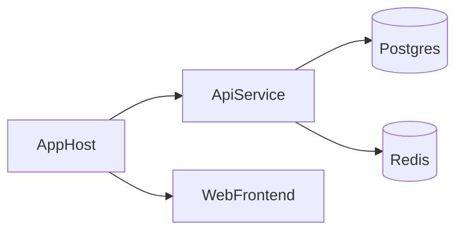

## Why Aspire?

.NET Aspire gives you a code-first way to describe **apps + dependencies** (Postgres, Redis, RabbitMQ, etc.) and run them together locally with observability baked in.



## Minimal AppHost

```csharp title="AppHost/Program.cs"
var builder = DistributedApplication.CreateBuilder(args);

var cache = builder.AddRedis("cache");
var api = builder.AddProject<Projects.ApiService>("api")
    .WithReference(cache);

builder.AddProject<Projects.Web>("web")
    .WithReference(api);

builder.Build().Run();
```

## Architecture snapshot

<FlowDiagram script={`nodes:
  - id: apphost
    label: AppHost
  - id: api
    label: API Service
  - id: web
    label: Web Frontend
  - id: redis
    label: Redis
edges:
  - source: apphost
    target: api
  - source: apphost
    target: web
  - source: api
    target: redis
  - source: web
    target: api`} />

Next: configure **resources** in the AppHost chapter.
