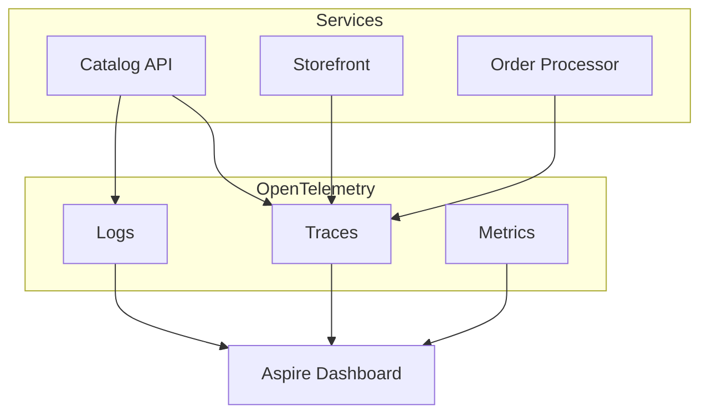

## Default instrumentation

ServiceDefaults registers ASP.NET Core, HTTP client, runtime, and EF Core instrumentation out of the box.



## Custom spans

Add business-context spans around expensive operations so traces tell a story beyond HTTP requests.

```csharp title="CatalogApi/Services/InventoryService.cs"
using System.Diagnostics;
using CatalogApi.Data;
using Microsoft.EntityFrameworkCore;

namespace CatalogApi.Services;

public sealed class InventoryService(CatalogContext db, ILogger<InventoryService> logger)
{
    private static readonly ActivitySource ActivitySource = new("CatalogApi.Inventory");

    public async Task<int> ReserveStockAsync(int productId, int quantity, CancellationToken ct)
    {
        using var activity = ActivitySource.StartActivity("ReserveStock");
        activity?.SetTag("product.id", productId);
        activity?.SetTag("quantity", quantity);

        logger.LogInformation("Reserving {Quantity} units for product {ProductId}", quantity, productId);

        var product = await db.Products
            .AsNoTracking()
            .FirstOrDefaultAsync(p => p.Id == productId, ct);

        if (product is null)
        {
            activity?.SetStatus(ActivityStatusCode.Error, "Product not found");
            throw new InvalidOperationException($"Product {productId} not found.");
        }

        await Task.Delay(50, ct); // simulate warehouse lookup

        activity?.SetTag("sku", product.Sku);
        activity?.SetStatus(ActivityStatusCode.Ok);

        return quantity;
    }
}
```

## OTLP configuration (long sample)

```yaml title="AppHost/otel.yaml"
# Aspire forwards OTLP to the dashboard by default in Development.
# This file shows a production-style split between traces, logs, and metrics.

exporters:
  otlp:
    traces:
      endpoint: https://otel-collector.example.com:4317
      protocol: grpc
      headers:
        authorization: Bearer ${OTEL_TOKEN}
    logs:
      endpoint: https://otel-collector.example.com:4317
      protocol: grpc
    metrics:
      endpoint: https://otel-collector.example.com:4317
      protocol: grpc

instrumentation:
  aspnetcore:
    enabled: true
    record_exception: true
    filter:
      - path: /health
        enabled: false
      - path: /alive
        enabled: false
  httpclient:
    enabled: true
  entityframeworkcore:
    enabled: true
    set_db_statement_for_text: true
  runtime:
    enabled: true

resource:
  attributes:
    service.namespace: aspire-shop
    deployment.environment: production
    service.version: 1.4.0

sampling:
  type: parentbased_traceidratio
  ratio: 0.25

batch:
  max_export_batch_size: 512
  scheduled_delay_ms: 5000
  export_timeout_ms: 30000
```

## Multi-file telemetry setup

<DocsFileTabs title="Telemetry wiring">

```csharp title="ServiceDefaults/TelemetryExtensions.cs"
public static class TelemetryExtensions
{
    public static IHostApplicationBuilder ConfigureOpenTelemetry(this IHostApplicationBuilder builder)
    {
        builder.Logging.AddOpenTelemetry(logging =>
        {
            logging.IncludeFormattedMessage = true;
            logging.IncludeScopes = true;
        });

        builder.Services.AddOpenTelemetry()
            .WithMetrics(metrics =>
            {
                metrics.AddAspNetCoreInstrumentation()
                    .AddHttpClientInstrumentation()
                    .AddRuntimeInstrumentation();
            })
            .WithTracing(tracing =>
            {
                tracing.AddAspNetCoreInstrumentation()
                    .AddHttpClientInstrumentation()
                    .AddEntityFrameworkCoreInstrumentation()
                    .AddSource("CatalogApi.Inventory");
            });

        builder.AddOpenTelemetryExporters();
        return builder;
    }
}
```

```csharp title="ServiceDefaults/ExporterExtensions.cs"
private static IHostApplicationBuilder AddOpenTelemetryExporters(this IHostApplicationBuilder builder)
{
    var useOtlp = !string.IsNullOrWhiteSpace(builder.Configuration["OTEL_EXPORTER_OTLP_ENDPOINT"]);
    if (useOtlp)
    {
        builder.Services.AddOpenTelemetry().UseOtlpExporter();
    }
    return builder;
}
```

```bash title="scripts/run-with-otel.sh"
#!/usr/bin/env bash
export OTEL_EXPORTER_OTLP_ENDPOINT="http://localhost:4317"
export OTEL_SERVICE_NAME="catalog-api"
export OTEL_RESOURCE_ATTRIBUTES="deployment.environment=development"
dotnet run --project CatalogApi
```

</DocsFileTabs>

## Diff-friendly edits

Highlight changes when updating sampling or filters:

```csharp title="ServiceDefaults/TelemetryExtensions.cs"
builder.Services.AddOpenTelemetry()
    .WithTracing(tracing =>
    {
        tracing.AddAspNetCoreInstrumentation()
            .AddHttpClientInstrumentation();
        // tracing.AddGrpcClientInstrumentation(); // [!code --]
        tracing.AddGrpcClientInstrumentation(options => // [!code ++]
        {
            options.SuppressDownstreamInstrumentation = false; // [!code ++]
        }); // [!code ++]
    });
```
