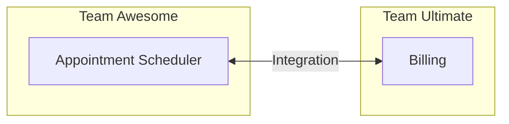
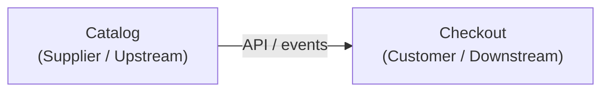
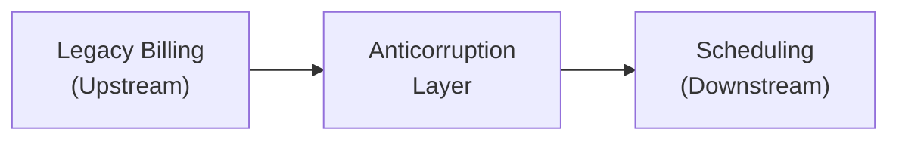
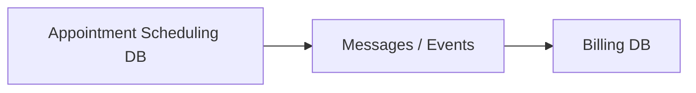

Domain-Driven Design (DDD) emphasizes collaboration between technical and domain experts so the software model matches the business problem.

## Domains and Subdomains

The **domain** is the overall business problem space. Inside it, work usually falls into three kinds of **subdomain**:

1. **Core** — what makes the business unique; invest the most here
2. **Supporting** — necessary but not differentiating
3. **Generic** — commodity capability; buy or reuse when you can

Example for an e-commerce system:

<Figure
  src="/learn/ddd/foundations/modelling/subdomains-1.png"
  alt="Subdomains in an e-commerce app"
  caption="Subdomains in an e-commerce app"
  width="600"
/>

## Bounded Contexts

A **bounded context** is a solution-space boundary: a self-contained model where terms and rules stay consistent. Concepts should not leak across that boundary.

The same word can mean different things in different contexts. Scheduling may only need:

```text
Client
 ├── Name
 └── ID
```

Billing may need much more:

```text
Client
 ├── Name
 ├── ID
 ├── Credit Cards
 ├── Address
 └── Credit Validation
```

Both say **Client**. They are not the same model. Forcing one shared `Client` type often makes both sides worse.

<Figure
  src="/learn/ddd/foundations/modelling/bcontext1.png"
  alt="Different Client models per bounded context"
  caption="Same name, different models — bounded contexts keep them apart"
  width="600"
/>

In an e-commerce system, contexts often look like this:

<Figure
  src="/learn/ddd/foundations/modelling/bcontext-ecom-1.png"
  alt="Bounded contexts in an e-commerce app"
  caption="Bounded contexts in an e-commerce app"
  width="600"
/>

Each context typically owns its API and logic. Whether it also owns a separate database is a later design choice — not a DDD requirement.

## Context Maps

A **context map** shows how bounded contexts relate and how teams integrate.



Use the map to see ownership, communication paths, shared concepts, and where translation is required. The arrow between contexts is not just “calls an API” — it is a **relationship pattern**.

### Shared Kernel

Two contexts share a **small** slice of model/code (and often schema). Both teams must agree before changing it.

**Use when:** closely related teams need the same types (e.g. shared `Money` / `TenantId` library).

**Cost:** every kernel change is a joint release. Keep it tiny.

<Figure
  src="/learn/ddd/foundations/modelling/context-map-1.png"
  alt="Shared Kernel between contexts"
  caption="Shared Kernel — shared model, shared change cost"
  width="600"
/>

### Partnership

Two contexts succeed or fail together. Teams plan and ship in lockstep; neither is “just a consumer.”

**Use when:** two products are co-dependent (e.g. Checkout and Payments launched as one initiative).

**Cost:** high coordination. Prefer only when independent delivery is unrealistic.

### Customer / Supplier

**Upstream (supplier)** provides a model or service; **downstream (customer)** consumes it. The supplier treats the customer as a real stakeholder and plans with their needs in mind.



**Use when:** Checkout needs product and price data, and Catalog will prioritize Checkout’s contract needs.

**Not the same as Conformist:** here the downstream has influence.

### Conformist

Downstream **adopts the upstream model as-is**. Little or no negotiation — often because the upstream is a large platform, vendor, or another team that will not adapt.

**Use when:** you integrate with a corporate identity service or a SaaS CRM and must use their fields and IDs.

**Risk:** their language leaks into your core model. Prefer an Anticorruption Layer if the mismatch is large.

### Anticorruption Layer (ACL)

Downstream builds a **translation layer** at the boundary. Talk to the upstream in *their* terms; expose only *your* model inside.



**Use when:** protecting a clean domain from a messy legacy API, or mapping vendor DTOs into your ubiquitous language.

**Example:** map `LEGACY_CLT_NO` → `ClientId`; never let billing codes sit on your `Appointment` entity.

### Open Host Service (OHS)

Upstream offers a **stable, general-purpose protocol** (API/events) for many consumers, instead of one-off integrations per team.

**Use when:** Catalog publishes a versioned Product API used by Checkout, Search, and Recommendations.

**Pair with:** Published Language for the payload shape.

### Published Language

A **well-documented shared exchange format** (schema) for integration — JSON/Avro/Protobuf events, industry standards (iCal, etc.).

**Use when:** `OrderPlaced` events must mean the same thing to Shipping, Billing, and Analytics.

Often combined with Open Host Service: OHS is *how* you expose; Published Language is *what* you exchange.

### Separate Ways

No meaningful integration. Each context solves the need alone (or via UI/manual process).

**Use when:** integration cost exceeds the benefit (e.g. marketing microsite vs core commerce — duplicate a thin product list rather than couple systems).

### Choosing a relationship

| Situation | Prefer |
|-----------|--------|
| Tiny shared types, high trust | Shared Kernel |
| Downstream needs influence over upstream | Customer / Supplier |
| No influence; accept upstream model | Conformist |
| Upstream model would pollute yours | Anticorruption Layer |
| Many consumers, one stable API | Open Host Service + Published Language |
| Co-destiny products | Partnership |
| Integration not worth it | Separate Ways |

Sharing always creates coupling. Context maps make that coupling **visible and intentional**.

## Separate Databases?

Does every bounded context need its own database? **No.**

DDD does not mandate a storage layout. One shared database used by many processes does make strong model boundaries harder to keep.

If you do separate data stores, synchronize with events, queues, batch jobs, or APIs — whatever supports the model boundaries:



The goal is not “one DB per context.” It is: **data architecture that respects domain boundaries.**

## Putting It Together

For a veterinary application, contexts might look like this:

<Figure
  src="/learn/ddd/foundations/modelling/appcontext.png"
  alt="Bounded contexts in the veterinary application"
  caption="Example bounded contexts in the application"
  width="600"
/>

Boundaries are discovered, not predetermined — and unclear boundaries make DDD hard to apply. Getting them right is one of the hardest parts of the approach.
