## Modeling Problems in Software


## Why Domain-Driven Design Starts With the Problem

Software development often fails in one of two ways:

1. **We build the thing wrong.**
2. **We build the wrong thing.**

The second problem is especially dangerous. A technically excellent application can still fail if it does not correctly represent the business problem it is supposed to solve.

Domain-Driven Design (DDD) provides a way to reduce this risk by putting the **domain**—the business problem and its rules—at the center of software design.

Instead of beginning with:

> "What classes should we create?"

or:

> "What database tables do we need?"

DDD encourages us to begin with:

> **"How does this business actually work?"**

The first goal is therefore to understand the **problem domain**.

### Problem Domain

The **problem domain** is the specific problem that the software is trying to solve.

For example, if we are building software for a veterinary practice, the domain is not simply "CRUD operations for pets."

The real domain includes things such as:

* clients and patients,
* appointments,
* office visits,
* surgeries,
* doctors and technicians,
* examination rooms,
* operating rooms,
* recovery spaces,
* billing,
* prescriptions,
* laboratory testing,
* staff scheduling,
* inventory, and more.

The software model should emerge from an understanding of these business concepts.

---

## Learning the Domain

### Domain Exploration

A useful way to discover the domain is through structured conversations with domain experts.

The questions should initially focus on the **business**, rather than the technology.

For example:

* What happens when a client wants an appointment?
* Who makes the appointment?
* What is an appointment for?
* What resources are required?
* Are all appointments the same?
* What is different about a surgery?
* Who needs to be available?
* Which rooms are required?
* What happens when an appointment is completed?
* Which other parts of the business depend on the appointment?

The important principle is:

> **Learn and communicate in the language of the domain, not the language of technology.**

At this stage, we should concentrate on **how the domain works**, not on how the software will eventually implement it.

Consider a veterinary practice.

The practice does much more than simply care for animals. Its business may include:

* scheduling,
* invoices,
* payments,
* medical records,
* laboratory testing,
* prescriptions,
* surgeries,
* inventory,
* sales,
* staff scheduling,
* client management,
* patient management,
* notifications,
* external systems.

This immediately suggests that the veterinary practice is not one simple problem.

There are multiple areas of responsibility.

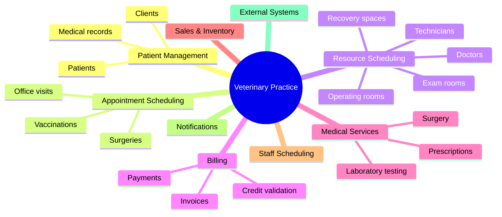

This observation leads naturally to the concept of **subdomains**.

---


## What Are Domains and Subdomains ?

The Domain represents the overall business problem space your application is addressing. Within this domain, we separate Subdomains into three categories:

1. **Core Domain** : What makes your business unique and gives you a competitive advantage. This is where the majority of your effort should go.
2. **Supporting Subdomains** : Necessary but not unique to your business. Important, but you can put less effort into them.
3. **Generic Subdomains** : Commodity services that can often be outsourced or handled by third-party providers.


Subdomains in our E-Commerce App would be as following :

<Figure
  src="/learn/ddd/foundations/modelling/subdomains-1.png"
  alt="Subdomains in our E-Commerce App"
  caption="Subdomains in our E-Commerce App"
  width={400}
/>


The veterinary practice may contain subdomains such as:

* Staff
* Visit Records
* Accounting
* Appointment Scheduling
* Client and Patient Records
* Sales and Inventory
* Laboratory Testing
* Prescriptions

The slides emphasize an important distinction:

> **Subdomain is a problem-space concept.**

A subdomain describes a meaningful area of the business problem, regardless of how we eventually implement the software.

---


Not every part of the business is equally important.

The **core domain** is the key differentiator for the customer's business—something the business must do particularly well and generally cannot simply outsource.

For example, a veterinary practice might consider some specialized aspect of its patient-care or appointment-management process to be strategically important.

Other capabilities may be necessary but not differentiating.

This gives us a useful vocabulary:

| Concept            | Meaning                                                           |
| ------------------ | ----------------------------------------------------------------- |
| **Problem Domain** | The overall business problem being addressed                      |
| **Core Domain**    | The strategically important part that differentiates the business |
| **Subdomain**      | A distinct area of the business problem                           |

These concepts describe the **problem space**.

---

# 6. Exploring the Appointment Scheduling Subdomain

Suppose our conversations with the veterinary practice reveal the following rules:

* Clients are people.
* Patients are pets.
* Clients schedule appointments for patients.
* Appointments may be office visits or surgeries.
* Office visits may require a doctor or a technician.
* Office visits require an examination room.
* Surgeries require an operating room and recovery space.
* Different procedures require different staff.
* Different appointment types require different resources.

This is valuable domain knowledge.

Notice how much of this information is independent of programming.

We have not yet discussed:

* C# classes,
* REST APIs,
* SQL tables,
* controllers,
* repositories,
* microservices.

We are first discovering the **business model**.

---

# 7. Making Implicit Knowledge Explicit

One of the most valuable effects of domain exploration is that it can help the domain experts themselves.

During a discussion, a domain expert may realize:

> "Wow, I never thought of that before."

Explicitly discussing business rules can reveal assumptions, exceptions, dependencies, and inconsistencies.

Therefore, DDD is not simply developers extracting requirements from customers.

It is a collaborative process.

The development team helps make the business's implicit knowledge explicit, while the domain experts help ensure that the resulting model represents the real business.

---

# 8. Taking a First Pass at the Domain Model

From the appointment-scheduling conversations, we might initially identify:

* **Client**
* **Patient**
* **Appointment**
* **Appointment Type**
* **Surgery**
* **Procedure**
* **Resources**
* **Exam Room**
* **Doctor**
* **Operating Room**
* **Recovery**

For example:

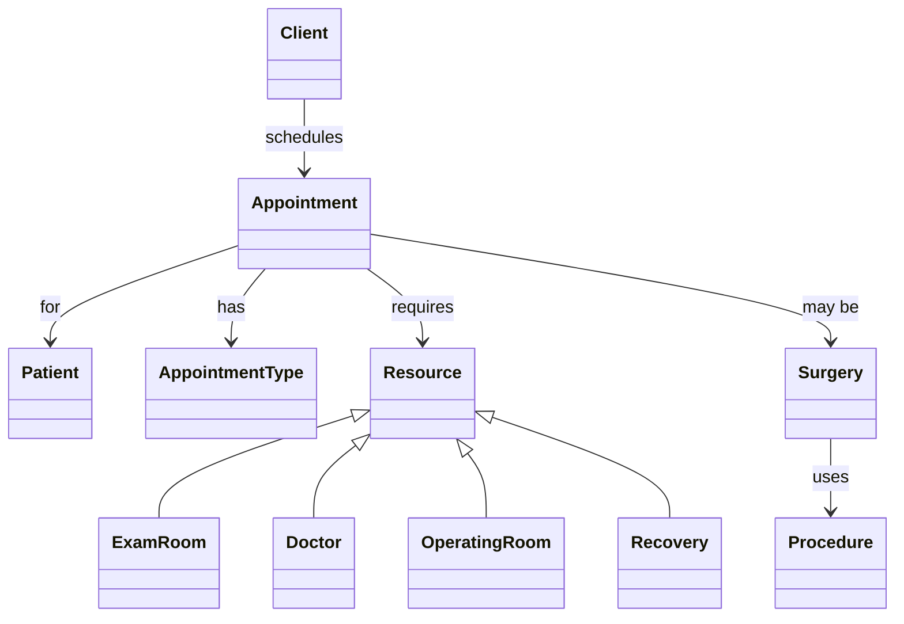

This is only a **first pass**.

DDD does not assume that the first model is perfect.

The model evolves as the team learns more about the domain.

---

# 9. The Problem of Shared Concepts

At first glance, concepts such as **Client** may appear to be universal.

For example, the appointment-scheduling system might need:

```text
Client
 ├── Name
 └── Identity
```

But the billing system might need much more:

```text
Client
 ├── Name
 ├── Identity
 ├── Credit Cards
 ├── Address
 ├── Billing Validation
 └── Credit Validation
```

Both systems use the word **Client**.

But do they mean exactly the same thing?

Not necessarily.

This is where **bounded contexts** become important.

---

# 10. Bounded Contexts

A **bounded context** defines a clear boundary around a model.

Within that boundary, concepts have a specific meaning.

The purpose is to prevent concepts from one model from leaking into another model where they no longer make sense.

The key idea is:

> **A model should be consistent within its boundaries.**

For example:

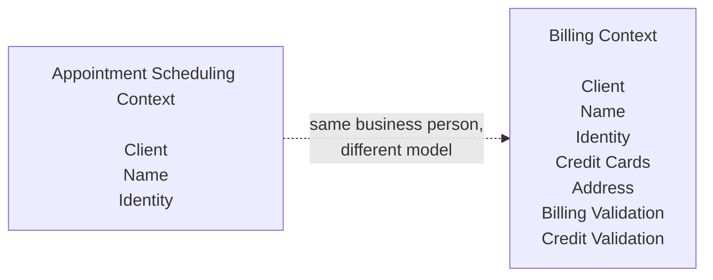

There is nothing wrong with having a `Client` concept in both contexts.

In fact, forcing both contexts to use exactly the same `Client` model could make the design worse.

The two bounded contexts have different responsibilities.

---

# 11. Subdomain vs. Bounded Context

This distinction is one of the most important DDD concepts.

### Subdomain

A **subdomain** belongs to the **problem space**.

It answers:

> "What business problem or area are we dealing with?"

### Bounded Context

A **bounded context** belongs to the **solution space**.

It answers:

> "Within what boundary does this particular model apply?"

The relationship can be visualized as:

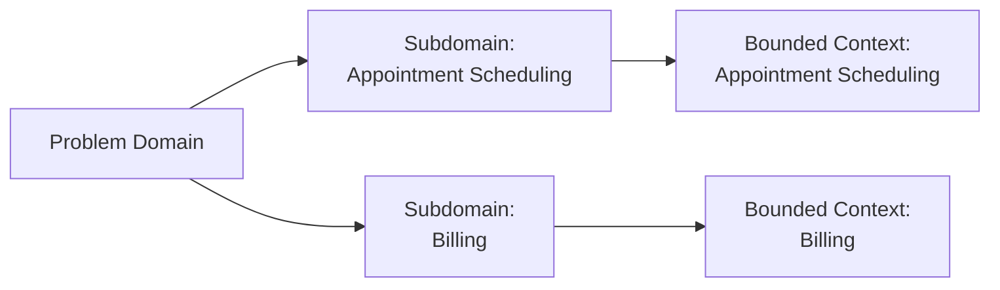

They are related concepts, but they are **not synonyms**.

A subdomain describes a business area.

A bounded context establishes a model boundary.

---

# 12. Problem Space vs. Solution Space

A useful analogy from the material is a room with a bare floor.

The **bare floor** represents the problem space.

A solution might cover it with:

* wall-to-wall carpet, or
* several area rugs.

The solution does not necessarily have to have the same structure as the original problem.

Likewise, a business may have one broad subdomain, while the software solution may divide responsibilities into several bounded contexts.

This is why we should not assume:

> "One subdomain = exactly one software component."

The solution structure should be guided by the business model and its boundaries.

---

# 13. Context Maps

Once multiple bounded contexts exist, we need to understand how they relate.

A **context map** identifies bounded contexts and shows their relationships.

For our veterinary application, we might have:

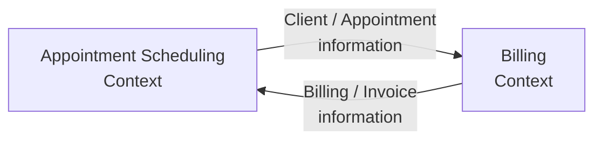

A context map is useful because different teams may own different bounded contexts.

For example:

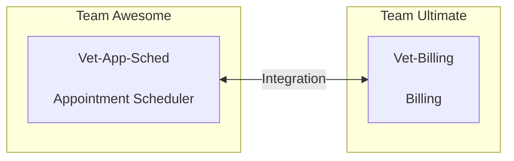

The map helps teams understand:

* which context owns which concepts,
* how contexts communicate,
* where boundaries exist,
* which concepts are shared,
* and where translation may be required.

---

# 14. Shared Kernel

Sometimes two bounded contexts genuinely need to share a small part of their model.

This can be represented as a **Shared Kernel**.

A shared kernel is:

> Part of the model shared by two or more teams, who agree not to change it without collaboration.

For example:

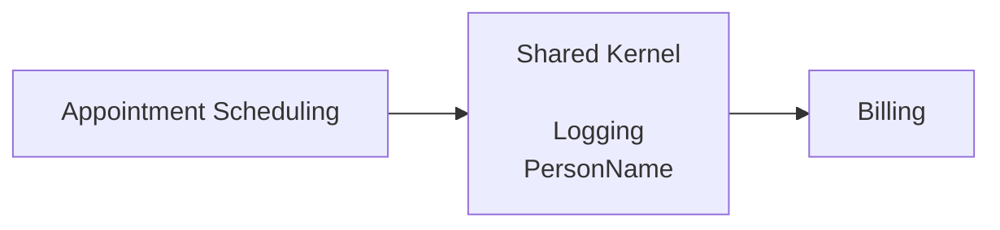

The shared kernel should be treated carefully.

If one team changes a shared model, the other team may be affected.

Therefore, sharing creates a form of coupling.

The slides emphasize that complete separation is rarely achieved in real-world systems. Namespaces, folders, and projects can provide practical separation, while DDD provides guidance rather than rigid rules.

---

# 15. Do We Need Separate Databases?

Once bounded contexts are identified, a natural question appears:

> "Does every bounded context need its own database?"

Not necessarily.

DDD does not require a particular database architecture.

However, sharing one database between many independent processes can make it difficult to maintain strong model boundaries.

If hundreds of processes directly modify the same database, it becomes harder to maintain the kind of independent domain models that DDD encourages.

Possible strategies for separating or synchronizing data include:

* publisher/subscriber mechanisms,
* two-way synchronization,
* message queues,
* database processes,
* batch jobs,
* synchronization APIs,
* other integration mechanisms.

For example:

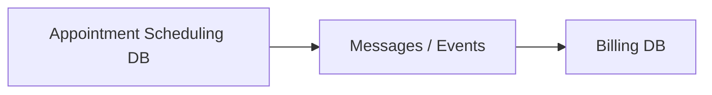

The important point is not:

> "Every bounded context must have its own database."

Instead:

> **The data architecture should support the boundaries and responsibilities of the domain models.**

---

# 16. Bounded Contexts in the Application

For our veterinary application, the evolving design might identify contexts such as:

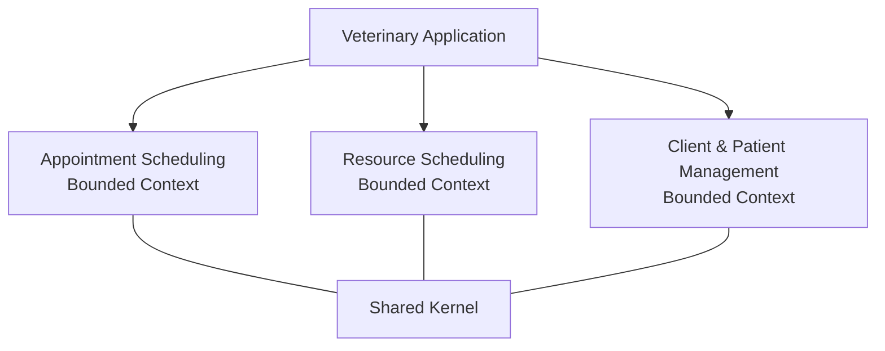

The exact boundaries are not predetermined.

Defining boundaries is one of the hardest parts of DDD.

As the material notes, a lack of clear boundaries makes it difficult to apply DDD effectively; the bounded context is therefore an essential ingredient of the approach.

---

# 17. Ubiquitous Language

Once a bounded context exists, another critical concept appears:

## Ubiquitous Language

The **ubiquitous language** is the shared vocabulary used by:

* domain experts,
* developers,
* analysts,
* documentation,
* models,
* and code

within a particular bounded context.

The goal is that everyone is talking about the same concepts using the same terms.

The material emphasizes that a ubiquitous language applies to a **single bounded context** and is used throughout conversations and code for that context.

---

# 18. Why Language Matters

Suppose a veterinarian says:

> "Create an appointment for a patient."

A developer might interpret "patient" as a person.

Another developer might interpret "patient" as an animal.

Another might introduce a generic `Customer` entity.

These differences seem small, but they can cause significant modeling problems.

DDD therefore treats language as a critical part of the model.

We should avoid situations where developers and domain experts need to translate terminology back and forth.

The goal is not merely to have a glossary.

The language should actually appear in the model and code.

---

# 19. Example: Building the Ubiquitous Language

During conversations about the appointment-scheduling context, we might initially hear several terms:

### For the person

* Client
* Pet owner
* Owner
* Caretaker

We need to determine which term has the correct meaning in this context.

The domain discussion establishes:

### Client

The person who:

* makes appointments,
* pays the bills,
* brings pets to the clinic.

Therefore, **Client** becomes the preferred term.

---

## 19.1 Patient

We might hear:

* Pet
* Patient
* Animal

Again, we need to determine the precise domain meaning.

The agreed definition becomes:

### Patient

The animal for whom medical records are kept.

This is an important distinction:

> **Client ≠ Patient**

A client is a person.

A patient is an animal.

One client may be associated with one or more patients.

---

# 20. Appointment

The domain conversation can similarly refine the meaning of **Appointment**.

An appointment is a scheduled time for:

* a surgery, or
* a regular office visit.

This gives us a much stronger model than simply saying:

```text
Appointment = Date + Time
```

The domain definition carries business meaning.

---

# 21. Ubiquitous Language Changes the Model

A particularly important DDD principle is:

> **A change in the ubiquitous language is a change in the model.**

If the domain experts decide that "Pet" and "Patient" mean different things, this is not merely a documentation change.

It may affect:

* class names,
* property names,
* methods,
* database concepts,
* API contracts,
* events,
* tests,
* documentation.

For example, if the language establishes:

```text
Client
Patient
Appointment
Surgery
Office Visit
Procedure
```

then our code should use those terms rather than arbitrary technical alternatives.

---

# 22. Ubiquitous Language in Code

A bounded context might therefore contain concepts such as:

```text
AppointmentScheduling
    Client
    Patient
    Appointment
    Surgery
    OfficeVisit
    Procedure
    ExamRoom
```

Namespaces can help developers immediately understand which bounded context they are working in.

For example:

```text
AppointmentScheduling.Client
Billing.Client
```

These are intentionally different concepts even though both are called `Client`.

This prevents accidental mixing of models.

---

# 23. Avoiding "Translation Layers" in Conversation

A useful technique is to explain your understanding back to the domain expert.

For example:

> "So, if I understand correctly, a client schedules an appointment for a patient, and an appointment can represent either an office visit or a surgery."

The domain expert can then correct the model:

> "Not quite. Vaccinations are also considered appointments."

This feedback is extremely valuable.

Instead of assuming we understood correctly, we continuously validate our understanding.

---

# 24. A Complete Conceptual Picture

At this point we can connect the major DDD concepts:

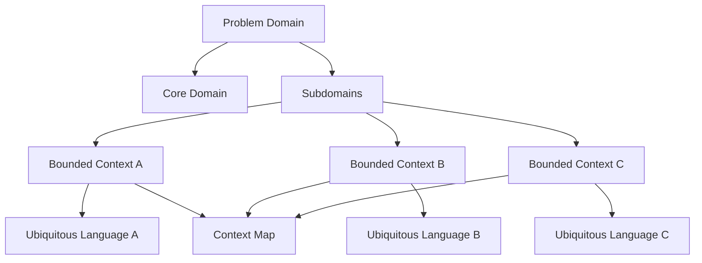

The concepts fit together as follows:

### Problem Domain

The overall business problem.

### Core Domain

The strategically important part of that problem.

### Subdomains

Distinct areas of the problem space.

### Bounded Contexts

Boundaries within which a particular model is valid.

### Ubiquitous Language

The shared language used consistently inside a bounded context.

### Context Map

The representation of relationships between bounded contexts.

### Shared Kernel

A deliberately shared portion of a model between contexts.

---

# 25. Important DDD Distinctions

## 25.1 Client vs. Patient

In the veterinary domain:

```text
Client = person
Patient = animal
```

Do not assume that because both participate in an appointment they are the same type of concept.

---

## 25.2 Subdomain vs. Bounded Context

```text
Subdomain
    ↓
Problem Space

Bounded Context
    ↓
Solution Space
```

A subdomain describes the business.

A bounded context describes the boundary of a software model.

---

## 25.3 Domain Model vs. Database Model

A domain model describes meaningful business concepts and relationships.

A database model describes how data is persisted.

They may be related, but they are not automatically identical.

DDD asks us to understand the domain before allowing technical structures to dominate our thinking.

---

## 25.4 Shared Concept vs. Shared Model

Two contexts may use the same word while meaning different things.

For example:

```text
Appointment Scheduling:
    Client = identity needed to schedule

Billing:
    Client = identity + address + payment information + credit validation
```

The fact that both are called `Client` does not mean they must share one model.

---

# 26. Common Mistakes

## Mistake 1: Starting With Technology

Bad starting point:

> "Let's create a microservice for clients."

Better starting point:

> "What does a client mean in this part of the business?"

---

## Mistake 2: Assuming One Universal Model

It is tempting to create one giant `Client` object and reuse it everywhere.

This can result in:

* unnecessary dependencies,
* bloated objects,
* inappropriate properties,
* coupling between unrelated parts of the system,
* unclear boundaries.

---

## Mistake 3: Ignoring Domain Experts

Developers should not assume that requirements documents contain all the business knowledge.

Important rules often emerge only during conversations.

---

## Mistake 4: Using Programmer Vocabulary

Avoid replacing domain concepts with arbitrary technical terminology.

If the business says **Patient**, do not automatically rename it to `AnimalEntity` merely because it seems technically convenient.

---

## Mistake 5: Treating the First Model as Final

DDD is exploratory.

As conversations reveal more information, the model should evolve.

---

## Mistake 6: Sharing Everything

A shared database, shared classes, and shared models can look convenient.

But excessive sharing creates coupling.

DDD encourages deliberate boundaries.

---

# 27. Practical Workflow for Domain Modeling

A practical process based on this material can be summarized as follows.

### Step 1 — Identify the problem domain

Ask:

> What business problem are we actually solving?

---

### Step 2 — Find domain experts

Identify people who understand how the business works.

---

### Step 3 — Explore the business

Have conversations focused on:

* processes,
* rules,
* responsibilities,
* terminology,
* exceptions,
* dependencies.

---

### Step 4 — Identify subdomains

Group related business problems into meaningful areas.

---

### Step 5 — Identify the core domain

Determine what is strategically important and differentiating.

---

### Step 6 — Identify bounded contexts

Draw explicit boundaries around models that have their own meanings and responsibilities.

---

### Step 7 — Create a context map

Document how bounded contexts relate to each other.

---

### Step 8 — Identify shared concepts

Ask which concepts genuinely need to be shared.

Do not share them automatically.

---

### Step 9 — Establish the ubiquitous language

Agree on precise domain terminology with the domain experts.

---

### Step 10 — Put the language into the model and code

The agreed terminology should appear consistently in:

* discussions,
* diagrams,
* requirements,
* class names,
* methods,
* properties,
* tests,
* documentation.

---

# 28. Study Example: Modeling an Appointment

Suppose a client wants to schedule a veterinary appointment.

The domain conversation tells us:

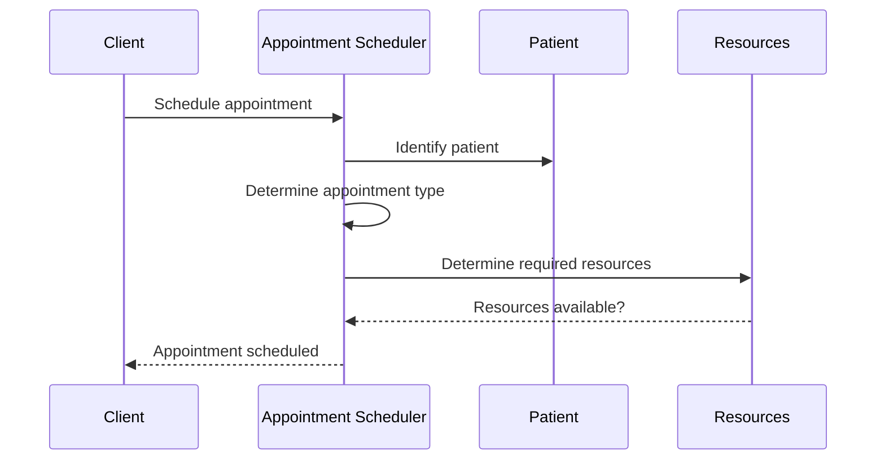

But the important insight is that the diagram is not primarily about software calls.

It represents domain knowledge.

For example:

* A **Client** schedules.
* The appointment is for a **Patient**.
* The appointment has a type.
* The appointment may require resources.
* Different appointment types have different resource requirements.

The software implementation comes later.

---

# 29. Study Example: Surgery

A surgery introduces additional domain concepts.

A surgery may depend on:

* a procedure,
* an operating room,
* recovery space,
* a doctor,
* a technician,
* other staff.

Therefore:

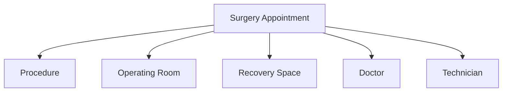

An ordinary office visit may have different requirements:

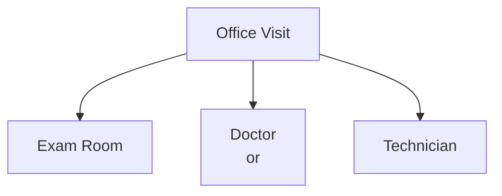

The model therefore captures domain rules rather than treating every appointment as an identical record.

---

# 30. How to Think Like a DDD Practitioner

When you encounter a new business requirement, avoid immediately asking:

> "What class do I need?"

Instead ask:

### Domain questions

* What does this term mean?
* Who performs this action?
* Why do they perform it?
* What business rule applies?
* What other concepts are involved?
* Does this meaning apply everywhere?
* Does another part of the business use the term differently?

### Boundary questions

* Which subdomain does this belong to?
* Which bounded context owns this concept?
* Should another context know about it?
* Are we accidentally sharing a model?

### Language questions

* What does the domain expert call this?
* Does everyone use the same term?
* Is the term ambiguous?
* Does the code use the same terminology?

These questions lead to better models.

---

# 31. Key Takeaways

The major lessons from this module are:

### 1. Start with the domain

Understand the business problem before designing the software.

### 2. Work with domain experts

They possess essential knowledge about the business.

### 3. Make implicit knowledge explicit

Conversations can expose assumptions and business rules that were previously unstated.

### 4. Identify the core domain

Find the part of the business that provides its key differentiation.

### 5. Identify subdomains

Break the overall problem into meaningful business areas.

### 6. Use bounded contexts

Give each model a clear boundary and prevent unrelated concepts from leaking across that boundary.

### 7. Use context maps

Understand and communicate how bounded contexts relate.

### 8. Be careful with shared models

A shared kernel can be useful, but sharing creates coupling and requires collaboration.

### 9. Establish a ubiquitous language

Domain experts and developers should use the same terminology within a bounded context.

### 10. Put the language into the code

The ubiquitous language should be reflected in the software model.

---

# 32. Exam/Interview Cheat Sheet

| Question                                                | Short Answer                                                                                                     |
| ------------------------------------------------------- | ---------------------------------------------------------------------------------------------------------------- |
| What is the problem domain?                             | The specific business problem the software is trying to solve.                                                   |
| What is a core domain?                                  | The key differentiator for the business; something it must do well and generally cannot outsource.               |
| What is a subdomain?                                    | A distinct area of the business problem.                                                                         |
| What is a bounded context?                              | A specific responsibility with explicit boundaries separating it from other parts of the system.                 |
| What is context mapping?                                | Identifying bounded contexts and their relationships.                                                            |
| What is a shared kernel?                                | A portion of the model shared by multiple teams that agree to change it collaboratively.                         |
| What is ubiquitous language?                            | The domain language used consistently by domain experts and developers within a bounded context.                 |
| Is a subdomain the same as a bounded context?           | No. A subdomain is a problem-space concept; a bounded context is a solution-space concept.                       |
| Why use bounded contexts?                               | To keep models consistent and prevent concepts from leaking into contexts where they do not make sense.          |
| Why are domain experts important?                       | They provide the business knowledge needed to build an accurate domain model.                                    |
| Why does language matter?                               | Shared terminology creates shared understanding and reduces ambiguity between business and development teams.    |
| Does every bounded context require a separate database? | No. Database separation is an architectural choice, although strong boundaries may benefit from data separation. |
| Can two bounded contexts have a `Client` concept?       | Yes. The same word may represent different models in different contexts.                                         |
| What happens when the ubiquitous language changes?      | The domain model may need to change as well.                                                                     |

---

# 33. Final Mental Model

Remember DDD as a progression:

```text
UNDERSTAND THE BUSINESS
          ↓
    DOMAIN EXPERTS
          ↓
   DOMAIN EXPLORATION
          ↓
   PROBLEM DOMAIN
          ↓
      SUBDOMAINS
          ↓
     CORE DOMAIN
          ↓
  BOUNDED CONTEXTS
          ↓
   CONTEXT MAPS
          ↓
UBIQUITOUS LANGUAGE
          ↓
      DOMAIN MODEL
          ↓
        CODE
```

The most important principle is simple:

> **The software should reflect a shared understanding of the business domain.**

DDD is therefore not primarily about drawing class diagrams or choosing architectural technologies. It is about creating a software model that faithfully represents the important concepts, rules, language, and boundaries of the business.

The veterinary practice example demonstrates this progression: we begin by understanding clients, patients, appointments, surgeries, procedures, and resources; then we discover that different parts of the business require different models; finally, we establish explicit boundaries and a shared language so that both domain experts and developers can reason about the system consistently.
