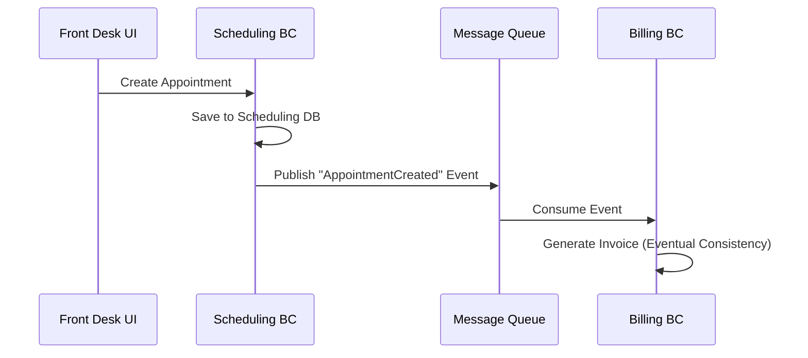

## Understanding Entities

In DDD, objects are generally divided into two categories: those defined by their **Identity/ID** (Entities) and those defined by their **Values** (Value Objects).

### What is an Entity?

An **Entity** is an object that is not fundamentally defined by its attributes, but rather by a **thread of continuity and identity**. 
*   **Mutable:** Their attributes can change over time.
*   **Identity:** They retain their identity even if all their attributes change. (e.g., A person changes their hair color and address, but they are still the same person).

### CRUD vs. Complex Entities

Not every table in your database needs to be a rich DDD Entity. 
*   **Supporting Data (CRUD):** Things like managing a list of `Rooms` or `Doctors` often only require basic Create, Read, Update, and Delete operations. Anemic models or simple property bags are perfectly fine here.
*   **Complex Problems:** Entities like `Appointment` or `Patient` involve complex rules, state transitions, and behaviors. These benefit greatly from Rich Domain Models.

---

### Eventual Consistency: Synchronizing Data Across Contexts

Because each Bounded Context should ideally have its own database, Entities that exist in multiple contexts (like a `Client`) must be kept in sync. We do not use strict, immediate database transactions across contexts. Instead, we rely on **Eventual Consistency**.

*Message Queues (e.g., RabbitMQ, Azure Service Bus) are the standard way to share data and trigger behaviors across isolated Bounded Contexts.*

