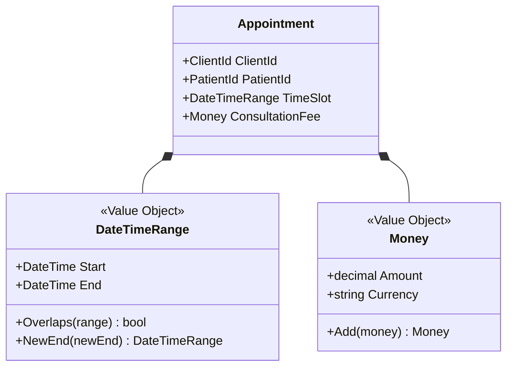

## Elements of a Domain Model – Value Objects

*Based on the teachings of Steve Smith (@ardalis) and Julie Lerman (@julielerman), featuring insights from Eric Evans and Vaughn Vernon.*

## 1. The Power of Value Objects (VOs)
While Entities are defined by their *identity* and lifecycle, **Value Objects (VOs)** are defined entirely by their *values*. They measure, quantify, or describe things in the domain.

### Core Characteristics of Value Objects
*   **No Conceptual Identity:** A $10 bill is interchangeable with any other $10 bill. We care about the *value*, not the specific physical object.
*   **Immutable:** Once created, a VO's state cannot be changed. Any operation that appears to modify it actually returns a *new* instance.
*   **Equality by Value:** Two VOs are considered equal if all their properties are equal.
*   **No Side Effects:** Methods on a VO should perform pure reasoning without altering external state or relying on outside infrastructure.

> *"I think that value objects are a really good place to put methods and logic... because we can do our reasoning without side effects and identity, all those things that make logic tricky."* — **Eric Evans**

---

## 2. Recognizing and Designing Value Objects

### The "VO First" Mindset
Developers often default to creating Entities for everything. Vaughn Vernon advises flipping this instinct:
1.  **Ask:** *Is this a Value Object?*
2.  **Otherwise:** *Make it an Entity.*

Entities should be biased toward serving as "value containers" rather than complex webs of child entities.

### Classic Examples of Value Objects
*   **Strings:** The most common VO in programming. Notice how string methods like `.ToUpper()` or `.Replace()` do not change the original string; they return a *new* string.
*   **Money:** Instead of using a primitive `decimal` (which lacks context), a `Money` VO combines an **Amount** and a **Currency Unit** (e.g., $50,000,000 USD). This prevents accidental addition of US Dollars to Australian Dollars.
*   **DateTimeRange:** Combines a `Start` and `End` date. It can encapsulate logic like `Overlaps()` or `Duration()`.
*   **AnimalType:** Combines `Species` and `Breed`.



---

## 3. Implementing Value Objects in Code

In C#, while VOs conceptually map to "value types," they are typically implemented as `classes` (reference types) that inherit from a base `ValueObject` class to handle equality comparisons.

### Key Implementation Rules
1.  **Enforce Immutability:** Use `private set;` or `init;` on properties.
2.  **Define Equality:** Override equality components so the base class can compare VOs by their values, not their memory references.
3.  **Return New Instances:** Methods that "modify" the VO must return a new instance.

```csharp
public class DateTimeRange : ValueObject
{
    public DateTime Start { get; private set; }
    public DateTime End { get; private set; }

    public DateTimeRange(DateTime start, DateTime end)
    {
        Guard.Against.OutOfRange(start, nameof(start), start, end);
        Start = start;
        End = end;
    }

    // Returns a NEW instance to preserve immutability
    public DateTimeRange NewEnd(DateTime newEnd) 
        => new DateTimeRange(this.Start, newEnd);

    public bool Overlaps(DateTimeRange other) 
        => this.Start < other.End && this.End > other.Start;

    // Used by base class to compare by value
    protected override IEnumerable<object> GetEqualityComponents()
    {
        yield return Start;
        yield return End;
    }
}
```

### Typed IDs (Explicit Identifier VOs)

Instead of using raw primitives (`int`, `Guid`) for Entity IDs, wrap them in a Value Object (e.g., `ClientId`, `PatientId`). 
*   **Benefit:** Prevents parameter mix-ups. The compiler will stop you from accidentally passing a `PatientId` into a method that expects a `ClientId`.

---

## 4. Refactoring Entities with Value Objects
Moving primitive properties and generic logic out of Entities and into Value Objects yields massive benefits:
1.  **Easier Testing:** Pure logic in VOs is trivial to unit test.
2.  **Orchestration:** The Entity is freed from low-level data manipulation and becomes a high-level orchestrator.
3.  **Precise Ubiquitous Language:** Extracting primitives into named VOs creates a richer, more concise domain language.

***

**Next:** [Domain Services](/learn/ddd/02-elements-of-a-domain-model/03-domainservice) — when logic does not belong on one entity.
