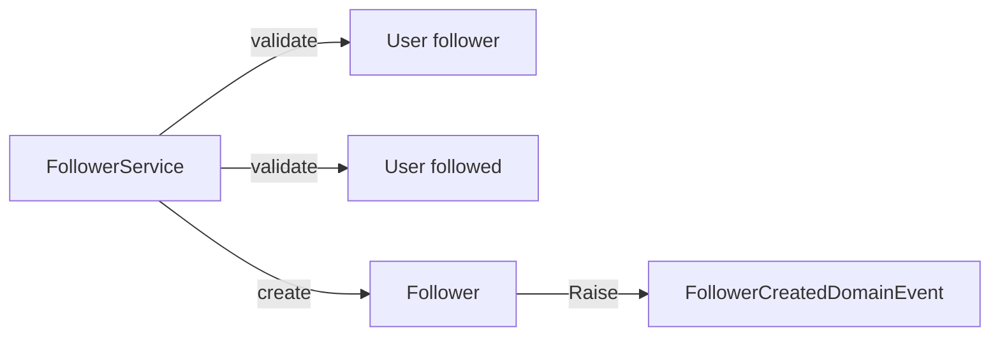
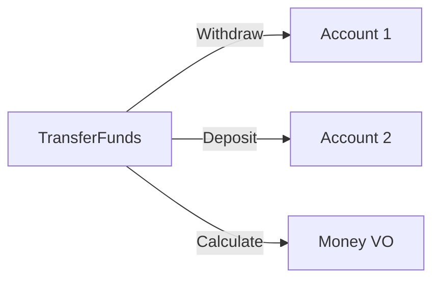

## When you need a domain service

Sometimes a business operation does not naturally belong to any single **entity** or **value object**. Forcing it onto an entity bloats the model. That is when a **domain service** fits.

Use one when the operation:

*   Spans **two or more** entities (or aggregates) and does not fit cleanly on one root  
*   Would **pollute** an entity with foreign concerns (e.g. querying the DB for “already following”)  
*   Is still **domain language** — not UI, HTTP, or “save the unit of work”

### Traits

*   **Stateless** — no long-lived state of its own  
*   **Orchestrator** — coordinates entities, VOs, and repository ports  
*   **Domain-centric** — methods speak Ubiquitous Language, not infrastructure  
*   **May have side effects** — via repository ports or domain events (unlike pure VOs)

**Follow** is the classic case: user A follows user B. Putting `Follow` on `User` forces one user to own the other, or both to know about `Follower` and persistence checks.



Another familiar shape is **transferring funds** between two accounts — neither account alone owns the whole operation:



> **Do not overuse.** If every rule lives in a “service,” entities become bags of data — an **anemic** model. Prefer rich entities and VOs first; reach for a domain service only when the fit is wrong.

---

## How to implement (Follow)

### 1. Entity + factory (raise events outside the constructor)

Composite identity (`UserId` + `FollowedId`). Private constructor; static `Create` raises the domain event so ORMs/serializers cannot fire side effects by calling the ctor.

```csharp title="Followers/Follower.cs"
public sealed class Follower : AggregateRoot
{
    public Guid UserId { get; private set; }
    public Guid FollowedId { get; private set; }
    public DateTime CreatedOnUtc { get; private set; }

    private Follower() { } // ORM

    private Follower(Guid userId, Guid followedId, DateTime createdOnUtc)
    {
        UserId = userId;
        FollowedId = followedId;
        CreatedOnUtc = createdOnUtc;
    }

    public static Follower Create(Guid userId, Guid followedId, DateTime createdOnUtc)
    {
        var follower = new Follower(userId, followedId, createdOnUtc);
        follower.Raise(new FollowerCreatedDomainEvent(userId, followedId));
        return follower;
    }
}

public sealed record FollowerCreatedDomainEvent(Guid UserId, Guid FollowedId) : IDomainEvent;
```

Use `AggregateRoot` so `Raise` matches Domain and Integration Events. Avoid raising inside a public constructor — serializers/ORMs can call it and fire unintended events.

### 2. Repository port in the domain (implementation outside)

```csharp title="Followers/IFollowerRepository.cs"
public interface IFollowerRepository
{
    Task<bool> IsAlreadyFollowingAsync(Guid userId, Guid followedId, CancellationToken ct);
    void Insert(Follower follower);
}
```

Interface lives in **Domain**; EF/ADO implementation lives in **Infrastructure**. That is a deliberate tradeoff: the domain service can encapsulate “already following” without pushing those rules into an application use case.

### 3. Domain service — rules, then create

```csharp title="Followers/FollowerService.cs"
public sealed class FollowerService(IFollowerRepository followers)
{
    public async Task<Follower> StartFollowingAsync(
        User user,
        User followed,
        DateTime createdOnUtc,
        CancellationToken ct)
    {
        if (user.Id == followed.Id)
            throw new DomainException("Can't follow yourself.");

        if (!followed.HasPublicProfile)
            throw new DomainException("Can't follow a non-public profile.");

        if (await followers.IsAlreadyFollowingAsync(user.Id, followed.Id, ct))
            throw new DomainException("Already following.");

        var follower = Follower.Create(user.Id, followed.Id, createdOnUtc);
        followers.Insert(follower);
        return follower;
    }
}
```

Side effects like “notify the followed user” stay as a **domain event** (`FollowerCreatedDomainEvent`), not an email/SMS interface in the domain.

---

## Domain service vs other services

| | **Domain service** | **Application service / use case** | **Repository** | **Infrastructure service** |
| :--- | :--- | :--- | :--- | :--- |
| **Job** | Domain rules + orchestration across entities | Load models, call domain, `SaveChanges`, map DTOs | Persist / query existence | Email, files, external APIs |
| **Language** | Ubiquitous Language (`StartFollowing`) | Use-case verbs (`FollowUserCommand`) | Storage (`Insert`, `IsAlreadyFollowing`) | Technical (`SendEmail`) |
| **Layer** | Domain | Application | Port in Domain; adapter in Infrastructure | Infrastructure |
| **Holds** | No long-lived state | Request/transaction scope | No business rules | No domain rules |

**Traditional “service + repository” stack (anemic):** controller → fat service with all `if`s → entities as DTOs → repository. Rules live outside the model.

**DDD shape:** application service loads `User`s → **`FollowerService`** enforces follow rules → repository persists → events handle notifications. Entities stay meaningful; the domain service exists only because follow is **between** two users.

***

**Next:** Aggregates — who is the root when many objects change together.
