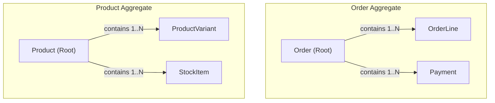
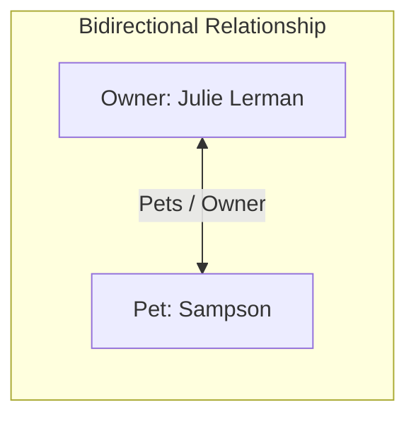
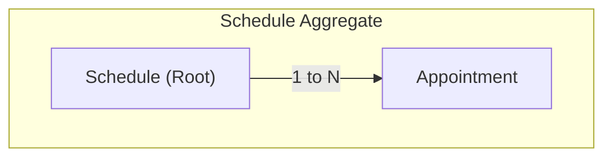

We'll examine what aggregates are, why aggregate roots matter, how invariants shape aggregate design, and how to evolve your model as your understanding of the domain deepens.

##  What Are Aggregates?

> "An aggregate is a cluster of associated objects that we treat as a unit for the purpose of data changes."
> — Eric Evans, *Domain-Driven Design*

An aggregate groups related entities and value objects into a single unit. Each aggregate has one **aggregate root**—the only entry point through which external objects may access the aggregate's contents.

Consider an **Order** aggregate and a **Product** aggregate in an e-commerce model:



**Key characteristics:**
- **Order** is the aggregate root; `OrderLine` and `Payment` are entities inside it and are only reached through the Order
- **Product** is the aggregate root; `ProductVariant` and `StockItem` are entities changed through the Product, not from outside
- Value objects (e.g. money amounts, addresses) can still live on these entities — they are not shown here
- Other aggregates may know an Order or Product **by ID** — they never hold a direct reference to an `OrderLine` or `ProductVariant`

---

## The Importance of Aggregate Roots

The aggregate root serves as the guardian of the aggregate's integrity. It is responsible for:

1. **Enforcing invariants** — Business rules that must always be true
2. **Controlling access** — External objects interact only with the root
3. **Maintaining consistency** — Ensuring the aggregate remains valid after every operation

### Shared base types: `Entity` and `AggregateRoot`

Every domain object with identity inherits a shared **Entity** base (`Guid` id). Only roots implement **`IAggregateRoot`** (usually via an **`AggregateRoot`** base). Repositories load and save roots; child entities are reached only by navigating from their root.

```csharp title="SharedKernel/Domain/Entity.cs"
/// <summary>
/// Base type for every entity. Identity (Id) defines equality over time;
/// attributes may change without changing which entity it is.
/// </summary>
public abstract class Entity
{
    public Guid Id { get; protected set; }

    public override bool Equals(object? obj)
    {
        if (obj is not Entity other)
            return false;

        if (ReferenceEquals(this, other))
            return true;

        if (Id == Guid.Empty || other.Id == Guid.Empty)
            return false;

        return Id == other.Id;
    }

    public override int GetHashCode() => Id.GetHashCode();
}
```

```csharp title="SharedKernel/Domain/AggregateRoot.cs"
/// <summary>
/// Marker interface. Repositories are constrained to
/// "where T : class, IAggregateRoot" — only roots are loaded or saved directly.
/// </summary>
public interface IAggregateRoot;

/// <summary>
/// Aggregate root = entity + the unit of consistency. Child entities inherit
/// <see cref="Entity"/> only; they are not roots and must not be persisted alone.
/// (Domain-event plumbing is added later — see Domain and Integration Events.)
/// </summary>
public abstract class AggregateRoot : Entity, IAggregateRoot
{
}
```

**How examples in this chapter use them:**

| Type | Base | Role |
|------|------|------|
| `Client`, `Patient`, `Appointment` (child) | `Entity` | Identity + state inside or across boundaries |
| `Order`, `Schedule` | `AggregateRoot` | Root — entry point and invariant guardian |

---

## Invariants in Aggregates

> "An invariant is a condition that should always be true for the system to be in a consistent state."

The aggregate root is responsible for maintaining invariants across all objects within the aggregate.

### Examples of Aggregate Invariants

| Aggregate | Invariant |
|-----------|-----------|
| Purchase Order | Total items do not exceed limit |
| Calendar/Schedule | Two appointments do not overlap |
| Date Range | End date follows begin date |

### ACID Properties

Data changes within an aggregate should follow ACID principles:

- **Atomic** — All changes succeed or all fail
- **Consistent** — The system remains in a valid state
- **Isolated** — Changes don't interfere with other operations
- **Durable** — Once committed, changes persist

---

## Associations and Relationships Among Entities

When modeling relationships between entities, DDD provides guidance on when to use bidirectional versus unidirectional associations.

### Default to One-Way Associations

> "A bidirectional association means that both objects can be understood only together. When application requirements do not call for traversal in both directions, adding a traversal direction reduces interdependence and simplifies the design."
> — Eric Evans

### Bidirectional Relationships

Consider a Pet and Owner relationship:



In code, this might look like:

```csharp
public class PetOwner
{
    public string Name { get; set; }
    public List<Pet> Pets { get; set; }
}

public class Pet
{
    public string Name { get; set; }
    public PetOwner Owner { get; set; }
}
```

Bidirectional links force both types to understand each other. Prefer **one direction** unless you truly need traversal both ways.

Ask: **"Which single direction matches the use case?"**

- **Scheduling an appointment?** You start from the **Client** and pick their **Patients** — `Client → Patient`. You rarely need “given a Patient, navigate the Client’s full graph” inside the same operation, so skip the reverse navigation.
- **Paying a bill?** You start from the **Client** and open their **Invoices** — `Client → Invoice`. An invoice may store `ClientId`, but it does not need a live `Client` navigation property for payment.

One-way associations cut interdependence: each type stays readable on its own.

### One-Way Client:Patient Relationship


```csharp
public class Client : Entity
{
    public string FullName { get; set; }
    public List<Patient> Patients { get; set; }
}

public class Patient : Entity
{
    public string AnimalType { get; set; }
    public Guid ClientId { get; set; }  // Reference by ID, not navigation
    public string Gender { get; set; }
    public string Name { get; set; }
}
```

---

## Handling Relationships That Span Aggregates

### The Rule

> "External objects should interact with only the aggregate root."

<Figure 
    src="/learn/ddd/aggregates-and-associations/association.png" 
    alt="Association between aggregates"
    caption="Association between aggregates"
    width="600"
/>

### Reference ID Values

Instead of holding direct object references across aggregates, use ID values:

<Figure 
    src="/learn/ddd/aggregates-and-associations/refid.png" 
    alt="Reference ID values"
    caption="Reference ID values"
    width="600"
/>

This approach:
- Avoids serialization issues
- Reduces coupling between aggregates
- Clarifies aggregate boundaries

---

## Evolving Aggregate Design: A Case Study

### Initial Design: Appointment Aggregate

Our first attempt at modeling appointments might look like this:

<Figure 
    src="/learn/ddd/aggregates-and-associations/design-1.png" 
    alt="Initial Design: Appointment Aggregate" 
    caption="Initial Design: Appointment Aggregate"
    width="600"
/>


### Applying the Delete Test

When you delete an appointment, should you also delete:
- The patient? **No**
- The doctor? **No**
- The exam room? **No**
- The appointment type? **No**
- The client? **No**

None of these should be deleted with the appointment. This suggests that Appointment may not be a good aggregate root for these relationships.

Contrast with an **Order** aggregate, where the delete test **passes**:

When you delete (or cancel and purge) an order, should you also delete:
- Its **order lines / items**? **Yes** — they have no meaning without that order
- The **customer**? **No** — lives in another aggregate/context
- The **product catalog entries**? **No** — shared across many orders

So `OrderLine` belongs *inside* the Order aggregate. **Order** is a natural root: it owns the lifecycle of its lines. The appointment graph failed this test because Patient, Doctor, and Room outlive any single appointment.

### Revised Design: Reference by ID

Appointment keeps only **IDs** for everything that failed the delete test. Those concepts become roots (or members) of *other* aggregates / contexts.

<Figure 
    src="/learn/ddd/aggregates-and-associations/design-2.png" 
    alt="Revised Design: Reference by ID"
    caption="Revised Design: Reference by ID"
    width="600"
/>

**What this solves:**
- Deleting an appointment no longer implies deleting patients, doctors, or rooms
- Each related concept can change and persist on its own lifecycle
- Appointment stays a small, consistent unit — it loads and validates *its* data, then looks up peers by ID when needed
- Boundaries stay clear: no fat object graph glued together only because the UI shows them on one screen

### Examining Invariants Leads to Discovery

An **invariant** is a condition that must always be true for the system to stay consistent. The aggregate **root** is responsible for enforcing the rules *inside* its boundary.

Examples:


| Aggregate | Invariant | How the root enforces it |
|-----------|-----------|--------------------------|
| Purchase Order | Total items do not exceed a limit | `if (Lines.Count >= MaxItems) throw;` — root sees every line |
| Date range | End date follows begin date | `if (End <= Begin) throw;` — both values live on the same object |
| Appointment *(as its own root)* | Two appointments do not overlap | **Cannot enforce** — one appointment cannot see the others |


```csharp
// Purchase Order — works: root owns all lines
public class Order : AggregateRoot
{
    public List<OrderLine> Lines { get; private set; } = new();
    public int MaxItems { get; private set; }

    public void AddItem(OrderLine line)
    {
        if (Lines.Count >= MaxItems)
            throw new DomainException("Item limit exceeded.");
        Lines.Add(line);
    }
}

// Date range — works: both ends on one value object
public sealed class DateRange
{
    public DateTime Begin { get; }
    public DateTime End { get; }

    public DateRange(DateTime begin, DateTime end)
    {
        if (end <= begin)
            throw new DomainException("End must follow begin.");
        Begin = begin;
        End = end;
    }
}

// Appointment as aggregate root — fails the overlap invariant
public class Appointment : AggregateRoot
{
    public DateTimeRange DateTimeRange { get; private set; }

    public void Reschedule(DateTimeRange range)
    {
        // ❌ No access to sibling appointments.
        // Cannot ask: "does this collide with another booking?"
        DateTimeRange = range;
    }
}
```


For a purchase order, enforcement is local: the **Order** root sees every line and can reject “too many items.” Same idea for a date range — begin and end sit together.

For appointments, the important rule is:

> **Two appointments must not overlap.**

That rule is about *many* appointments together — not about one appointment in isolation. An `Appointment` root that only knows itself has **nowhere to put the check**, so the invariant is not enforceable at the aggregate boundary.

If each Appointment is its own aggregate root:

- Appointment A has no business knowing about Appointment B (“appointments should not know about each other”)
- Yet *someone* must check that A and B do not collide on the same doctor, room, or time

So the overlap rule becomes a **cross-aggregate invariant**: no single Appointment root can enforce it. That is a **red flag**. Models evolve as you learn the domain — this is a normal breakthrough, not a failure.

Ask:

1. Should these objects live in the **same** aggregate so one root can police the rule?
2. Is there a better root than Appointment?

### Introducing the Schedule Aggregate

As understanding of the clinic deepened, **Schedule** appeared as the missing root: each clinic has a schedule, and a schedule is a series of appointments.



**Why Appointment was not enough:** it owns its own fields (time, patient id, doctor id), but it cannot see sibling appointments — so it cannot guarantee “no overlaps.”

**Why Schedule works:** the Schedule root holds the appointments for a clinic. Adding or moving a booking goes through Schedule, which can scan the set and mark conflicts. Consistency stays inside **one** aggregate boundary.

```csharp
// Schedule = aggregate root. Appointment = entity inside the boundary.
public class Schedule : AggregateRoot
{
    public Guid ClinicId { get; private set; }
    public DateTimeOffsetRange DateRange { get; private set; }

    private readonly List<Appointment> _appointments = new();
    public IReadOnlyList<Appointment> Appointments => _appointments;

    public void AddNewAppointment(Appointment appointment)
    {
        if (_appointments.Any(a => a.Id == appointment.Id))
            throw new DomainException("Duplicate appointment.");

        _appointments.Add(appointment);
        MarkConflictingAppointments(); // ← root enforces the invariant
    }

    public void DeleteAppointment(Guid appointmentId)
    {
        _appointments.RemoveAll(a => a.Id == appointmentId);
        MarkConflictingAppointments();
    }

    // Called after an appointment's time/type changes
    public void RefreshConflicts() => MarkConflictingAppointments();

    private void MarkConflictingAppointments()
    {
        foreach (var appointment in _appointments)
        {
            // Same patient cannot have two overlapping bookings
            var conflicts = _appointments
                .Where(a => a != appointment
                    && a.PatientId == appointment.PatientId
                    && a.TimeRange.Overlaps(appointment.TimeRange))
                .ToList();

            // (Same idea for room / doctor — still inside this method)
            appointment.IsPotentiallyConflicting = conflicts.Any();
        }
    }
}

public class Appointment : Entity
{
    public Guid ScheduleId { get; private set; }
    public Guid PatientId { get; private set; }
    public Guid DoctorId { get; private set; }
    public Guid RoomId { get; private set; }
    public DateTimeOffsetRange TimeRange { get; private set; }
    public bool IsPotentiallyConflicting { get; set; }

    // Time change asks the Schedule root to re-check overlaps
    public void UpdateStartTime(DateTimeOffset newStart, Action scheduleHandler)
    {
        TimeRange = new DateTimeOffsetRange(newStart, TimeRange.Duration);
        scheduleHandler(); // e.g. schedule.RefreshConflicts()
    }
}
```

**What this shows:**

- Outside code talks to **`Schedule`**, not to orphaned appointments as roots
- `MarkConflictingAppointments` can see **all** siblings — that is why Schedule is the root
- `Appointment` still holds IDs and its own time range; it does not enforce clinic-wide rules alone

### Does Schedule Make a Good Aggregate Root?

| Test | Appointment as root | Schedule as root |
|------|---------------------|------------------|
| Enforces the overlap invariant? | No — needs other appointments | Yes — sees the whole series |
| Save saves a consistent unit? | Only one appointment | Schedule + its appointments together |
| Cascading delete OK? | Deleting one appointment is fine; it never owned peers | Deleting a schedule can cascade to its appointments |

**Schedule as the root feels right:**

- Each clinic has its own schedule
- A schedule owns a series of appointments
- An appointment still coordinates date, time, patient, doctor — but as a **member** of the schedule, not as a peer root fighting over the same invariant

### API usage: create Schedule vs create Appointment

A **Schedule** is not one booking. It is the clinic calendar aggregate — usually empty at first. An **Appointment** is a booking written *into* that schedule.

**Mental picture**

```text
POST /api/schedules
  → Schedule { ClinicId: 1, DateRange: Mon–Sun, Appointments: [] }

POST /api/appointments { ScheduleId, PatientId, DoctorId, RoomId, Start, ... }
  → load Schedule (+ appointments)
  → schedule.AddNewAppointment(...)
  → update Schedule (appointments + conflict flags)
```

| Question | Answer |
|----------|--------|
| What is creating a schedule? | Creating the clinic calendar aggregate (root + clinic/date identity), usually with no appointments yet |
| Why create it at all? | Later bookings need a root to attach to and a place for overlap rules |
| Who creates appointments? | The API loads that schedule, calls `AddNewAppointment`, then saves the schedule |
| Is schedule create always called from the UI? | Sometimes the schedule is seeded once per clinic/day; the pattern still matters for how appointments are written |

Creating a schedule answers: *“Where do this clinic’s appointments live, and who enforces ‘no overlaps’?”*  
Creating an appointment answers: *“Book a slot **on that schedule**.”*

**Why the API loads Schedule to create an appointment**

The invariant lives on **Schedule**, not on Appointment:

1. Load the schedule **with** its appointments (specification / include)
2. `AddNewAppointment` can see siblings
3. `MarkConflictingAppointments` sets `IsPotentiallyConflicting`
4. One `UpdateAsync(schedule)` persists the consistent unit

```csharp
// Minimal API shape — appointment create goes through the root

app.MapPost("/api/schedules", async (
    CreateScheduleRequest request,
    IRepository<Schedule> schedules) =>
{
    var schedule = new Schedule(request.ClinicId,
                                new DateTimeOffsetRange(request.StartDate, request.EndDate),
                                new List<Appointment>());
    await schedules.AddAsync(schedule);
    return Results.Created($"/api/schedules/{schedule.Id}", MapToDto(schedule));
});

app.MapPost("/api/appointments", async (
    CreateAppointmentRequest request,
    IRepository<Schedule> schedules) =>
{
    var schedule = await schedules.GetByIdWithAppointmentsAsync(request.ScheduleId);
    if (schedule is null) return Results.NotFound();

    var appointment = new Appointment(/* ids, time range, title */);
    schedule.AddNewAppointment(appointment);   // conflict check here
    await schedules.UpdateAsync(schedule);      // save the whole aggregate

    return Results.Created($"/api/appointments/{appointment.Id}", MapToDto(appointment));
});


```

Do **not** insert an appointment through a standalone `IRepository<Appointment>` if Schedule is the root — that bypasses the overlap rule.

---

##  Aggregate Design Tips

### Best Practices

1. **Aggregates are not always the answer** — Sometimes simpler patterns suffice
2. **Aggregates can connect only by the root** — External references point to the root only
3. **Don't overlook using foreign keys for non-root entities** — FKs help with persistence
4. **Too many FKs to non-root entities may suggest a problem** — It might indicate missing aggregates
5. **"Aggregates of one" are acceptable** — A single entity can be its own aggregate
6. **Follow the Rule of Cascading Deletes** — If delete doesn't cascade, reconsider the boundary

---
