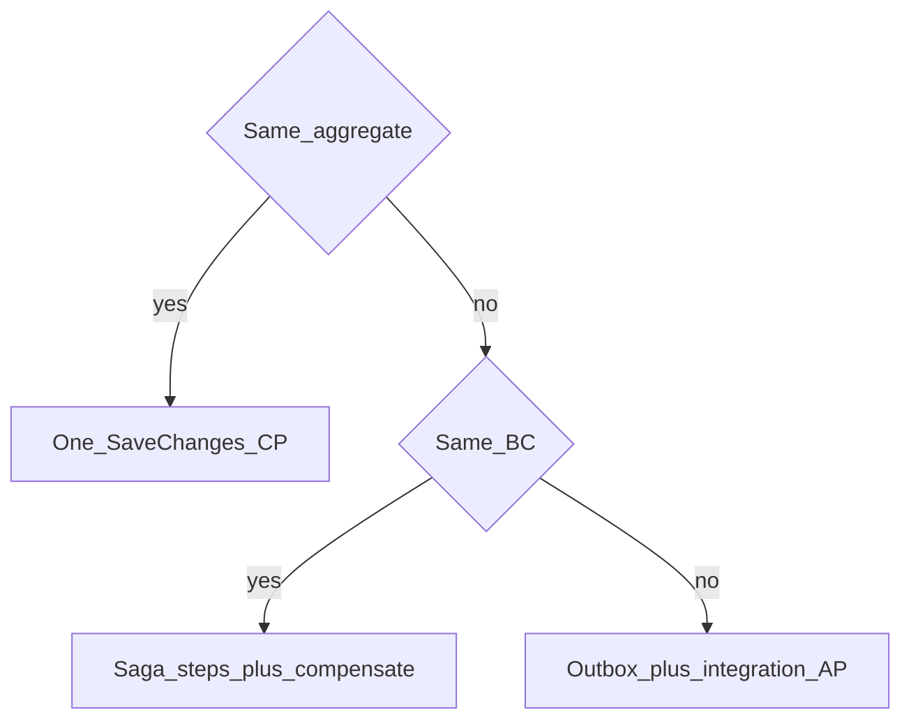
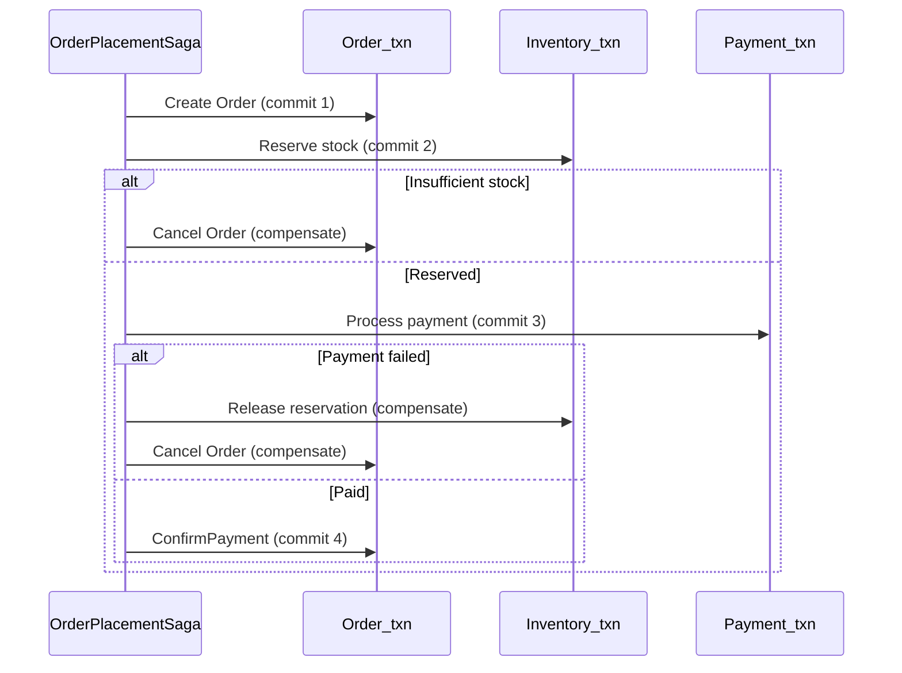
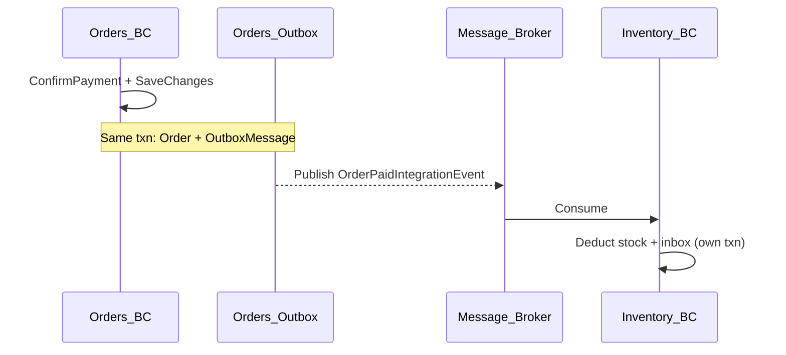

## Why this lesson exists

[Domain and Integration Events](/learn/ddd/domain-and-integration-events) teach **how** to raise events, defer dispatch until `SavingChangesAsync`, and publish reliably via the outbox. This lesson answers **which consistency model to use**:

1. Inside one aggregate → strong consistency (CP)
2. Several aggregates in the same Bounded Context → saga (CP/AP hybrid)
3. Across Bounded Contexts → eventual consistency (AP) via outbox / integration events

Never wrap Order + Inventory + Payment in one distributed transaction (2PC). Never treat MediatR as a message broker.

---

## CAP in one page

The CAP theorem says a distributed system cannot simultaneously guarantee **Consistency**, **Availability**, and **Partition tolerance**.

**Partition tolerance is not optional.** Networks fail: packet loss, region outages, deploys, DNS blips. So the real question under a partition is:

> Do you choose **consistency** (block / fail until data is correct) or **availability** (keep serving, reconcile later)?

| Style | Guarantees | Typical DDD fit |
| --- | --- | --- |
| **CP** | Consistency + Partition tolerance | Inside one aggregate; ledgers; “must be correct now” |
| **AP** | Availability + Partition tolerance | Cross-BC notifications; feeds; inventory catch-up |
| **Saga** | CP preference with temporary inconsistency | Multi-step process in one BC; compensations on failure |



---

## Decision framework

Not executable — a review checklist expressed as a C# comment block:

```csharp
// This isn't executable code — it's a decision framework expressed as C# comments
/*
┌─────────────────────────────────────────────────────────────────────────────┐
│                    DDD CAP DECISION FRAMEWORK                                │
├─────────────────────────────────────────────────────────────────────────────┤
│                                                                             │
│  Q1: Are all entities in the SAME AGGREGATE?                                │
│      ├── YES → Use ACID transaction (CP)                                    │
│      │         var order = Order.Create(...);                               │
│      │         order.ConfirmPayment(paymentId);                             │
│      │         await unitOfWork.SaveChangesAsync(); // ONE transaction      │
│      │                                                                       │
│      └── NO → Continue to Q2                                                │
│                                                                             │
│  Q2: Are the aggregates in the SAME BOUNDED CONTEXT?                        │
│      ├── YES → Use Saga pattern (CP/AP hybrid)                              │
│      │         var order = await CreateOrderAsync();        // Tx 1         │
│      │         var reserved = await ReserveInventoryAsync(); // Tx 2        │
│      │         if (!reserved) await CancelOrderAsync();       // Compensate │
│      │         var paid = await ProcessPaymentAsync();        // Tx 3        │
│      │         if (!paid) {                                                  │
│      │             await ReleaseInventoryAsync();             // Compensate │
│      │             await CancelOrderAsync();                  // Compensate │
│      │         }                                                             │
│      │                                                                       │
│      └── NO → Continue to Q3                                                │
│                                                                             │
│  Q3: Are the operations across BOUNDED CONTEXTS?                             │
│      ├── YES → Use eventual consistency (AP)                                │
│      │         order.ConfirmPayment(paymentId);                             │
│      │         await unitOfWork.SaveChangesAsync();                         │
│      │         // Domain event → outbox → broker                            │
│      │         // InventoryContext handles asynchronously                   │
│      │         // Temporary inconsistency is acceptable                     │
│      │                                                                       │
│      └── NO → External system? Use Anti-Corruption Layer + async            │
│                                                                             │
└─────────────────────────────────────────────────────────────────────────────┘
*/
```

---

## Type 1 — Same aggregate (CP)

**Rule (Vaughn Vernon):** one transaction = one aggregate. Everything inside the consistency boundary (Order, OrderItems, StatusHistory) commits together. Domain events are raised on the root and dispatched with deferred infrastructure — they do not pull other aggregates into this transaction.

### Aggregate

```csharp title="Domain/Orders/Order.cs"
public sealed class Order : AggregateRoot
{
    private readonly List<OrderItem> _items = [];
    private readonly List<OrderStatusHistory> _statusHistory = [];

    public Guid CustomerId { get; private set; }
    public decimal TotalAmount { get; private set; }
    public OrderStatus Status { get; private set; }
    public Guid? PaymentId { get; private set; }

    public IReadOnlyCollection<OrderItem> Items => _items.AsReadOnly();

    public static Order Create(Guid customerId, IEnumerable<OrderItem> items)
    {
        var order = new Order
        {
            Id = Guid.NewGuid(),
            CustomerId = customerId,
            Status = OrderStatus.Pending,
            TotalAmount = 0m
        };

        foreach (var item in items)
            order._items.Add(item);

        order.RecalculateTotal();
        order._statusHistory.Add(OrderStatusHistory.Create(order.Id, OrderStatus.Pending));
        order.Raise(new OrderCreatedDomainEvent(order.Id, customerId, order.TotalAmount));
        return order;
    }

    public void ConfirmPayment(Guid paymentId)
    {
        if (Status != OrderStatus.Pending)
            throw new DomainException($"Cannot confirm payment in {Status}");

        PaymentId = paymentId;
        Status = OrderStatus.Paid;
        _statusHistory.Add(OrderStatusHistory.Create(Id, OrderStatus.Paid));
        Raise(new OrderPaidDomainEvent(Id, paymentId, TotalAmount));
    }

    public void Cancel(string reason)
    {
        if (Status is OrderStatus.Shipped or OrderStatus.Delivered)
            throw new DomainException("Cannot cancel shipped or delivered order");

        Status = OrderStatus.Cancelled;
        _statusHistory.Add(OrderStatusHistory.Create(Id, OrderStatus.Cancelled));
        Raise(new OrderCancelledDomainEvent(Id, reason));
    }

    private void RecalculateTotal()
        => TotalAmount = _items.Sum(i => i.SubTotal);
}
```

### Repository + single commit

```csharp title="Infrastructure/Orders/OrderRepository.cs"
public sealed class OrderRepository(AppDbContext db) : IOrderRepository
{
    public Task<Order?> GetByIdAsync(Guid id, CancellationToken ct)
        => db.Orders
            .Include(o => o.Items)
            .Include(o => o.StatusHistory)
            .FirstOrDefaultAsync(o => o.Id == id, ct);

    public void Add(Order order) => db.Orders.Add(order);
}
```

```csharp title="Application/Orders/ConfirmPaymentCommandHandler.cs"
public sealed record ConfirmPaymentCommand(Guid OrderId, Guid PaymentId);

public sealed class ConfirmPaymentCommandHandler(
    IOrderRepository orders,
    AppDbContext db)
{
    public async Task HandleAsync(ConfirmPaymentCommand command, CancellationToken ct)
    {
        var order = await orders.GetByIdAsync(command.OrderId, ct)
            ?? throw new NotFoundException("Order not found");

        order.ConfirmPayment(command.PaymentId);

        // SINGLE COMMIT — Order + Items + StatusHistory (+ outbox if bridge runs)
        await db.SaveChangesAsync(ct);
    }
}
```

If anything fails, nothing commits. That is CP inside the aggregate boundary.

<Callout variant="dont" title="Do not">
  Load a separate `InventoryItem` aggregate and mutate it in this same `SaveChanges`. That is Type 2 or Type 3 — not Type 1.
</Callout>

---

## Type 2 — Same Bounded Context, multiple aggregates (Saga)

**Problem:** place order requires Create Order + Reserve Inventory + Process Payment. These are **different aggregates**. Do **not** wrap them in one EF transaction or 2PC.

**Saga:** each step is its own transaction. On failure, run **compensating** actions so the system returns to a known state. Temporary inconsistency during compensation is expected (CP/AP hybrid).



### Full orchestrated saga

```csharp title="Application/Orders/Sagas/OrderPlacementSaga.cs"
public sealed class OrderPlacementSaga(
    IOrderRepository orders,
    IInventoryService inventory,
    IPaymentService payments,
    AppDbContext db,
    ILogger<OrderPlacementSaga> logger)
{
    public async Task<Result<Guid>> ExecuteAsync(PlaceOrderRequest request, CancellationToken ct)
    {
        var sagaId = Guid.NewGuid();
        logger.LogInformation("Starting saga {SagaId}", sagaId);

        // ─── STEP 1: Create Order (Transaction 1) ───
        var order = Order.Create(
            request.CustomerId,
            request.Items.Select(i => OrderItem.Create(i.ProductId, i.Name, i.UnitPrice, i.Quantity)));

        orders.Add(order);
        await db.SaveChangesAsync(ct); // Commit 1

        Guid? reservationId = null;

        try
        {
            // ─── STEP 2: Reserve Inventory (Transaction 2 — own UoW / service) ───
            var reservation = await inventory.ReserveAsync(
                order.Items.Select(i => new ReserveItemRequest(i.ProductId, i.Quantity)),
                ct);

            if (!reservation.IsSuccess)
            {
                await CompensateOrderAsync(order.Id, "Inventory.Insufficient", ct);
                return Result<Guid>.Failure("Inventory.Insufficient", reservation.Error!);
            }

            reservationId = reservation.ReservationId;

            // ─── STEP 3: Process Payment (Transaction 3) ───
            var payment = await payments.ProcessAsync(
                new ProcessPaymentRequest(order.Id, order.TotalAmount, request.PaymentToken),
                ct);

            if (!payment.IsSuccess)
            {
                await inventory.ReleaseReservationAsync(reservationId.Value, ct);
                await CompensateOrderAsync(order.Id, "Payment.Failed", ct);
                return Result<Guid>.Failure("Payment.Failed", payment.Error!);
            }

            // ─── STEP 4: Confirm Order (Transaction 4) ───
            var tracked = await orders.GetByIdAsync(order.Id, ct)
                ?? throw new InvalidOperationException("Order disappeared");

            tracked.ConfirmPayment(payment.PaymentId);
            await db.SaveChangesAsync(ct); // Commit 4 — may also enqueue outbox for other BCs

            return Result<Guid>.Success(order.Id);
        }
        catch (Exception ex)
        {
            logger.LogError(ex, "Saga {SagaId} failed unexpectedly", sagaId);
            if (reservationId is { } rid)
                await inventory.ReleaseReservationAsync(rid, ct);
            await CompensateOrderAsync(order.Id, "Saga.Unexpected", ct);
            throw;
        }
    }

    private async Task CompensateOrderAsync(Guid orderId, string reason, CancellationToken ct)
    {
        var order = await orders.GetByIdAsync(orderId, ct);
        if (order is null) return;

        order.Cancel($"Compensated: {reason}");
        await db.SaveChangesAsync(ct);
    }
}
```

### Inventory / payment ports (same BC)

```csharp title="Application/Abstractions/IInventoryService.cs"
public interface IInventoryService
{
    Task<ReservationResult> ReserveAsync(IEnumerable<ReserveItemRequest> items, CancellationToken ct);
    Task ReleaseReservationAsync(Guid reservationId, CancellationToken ct);
}

public sealed record ReserveItemRequest(Guid ProductId, int Quantity);

public sealed record ReservationResult(bool IsSuccess, Guid ReservationId, string? Error)
{
    public static ReservationResult Ok(Guid id) => new(true, id, null);
    public static ReservationResult Fail(string error) => new(false, Guid.Empty, error);
}
```

```csharp title="Application/Abstractions/IPaymentService.cs"
public interface IPaymentService
{
    Task<PaymentResult> ProcessAsync(ProcessPaymentRequest request, CancellationToken ct);
}

public sealed record ProcessPaymentRequest(Guid OrderId, decimal Amount, string Token);
public sealed record PaymentResult(bool IsSuccess, Guid PaymentId, string? Error);
```

Each `ReserveAsync` / `ProcessAsync` implementation uses **its own** unit of work (or a clearly separate `SaveChanges`). The saga coordinates; it does not merge three aggregates into one DbContext commit.

<Callout variant="tip" title="Degrade under partition">
  If Inventory is unreachable, prefer failing the saga step or queueing a retry — not silently updating Inventory “later” inside Order’s interceptor. Circuit breakers belong on the saga’s outbound calls.
</Callout>

---

## Type 3 — Across Bounded Contexts (AP)

Orders Context must not share a database transaction with Inventory Context. After Order is paid/placed:

1. Domain event raised on the Order aggregate  
2. Deferred dispatch runs the **bridge** → outbox row in Orders’ DB  
3. Worker / bus publishes the **integration** event  
4. Inventory Context consumes it in **its** transaction (inbox for idempotency)

Mechanics (Custom / MediatR / Wolverine / MassTransit) are detailed in [Domain and Integration Events](/learn/ddd/domain-and-integration-events). Below is the AP shape end-to-end.



### Orders side — raise + bridge (sketch)

```csharp title="Orders/Domain/OrderPaidDomainEvent.cs"
public sealed class OrderPaidDomainEvent : IDomainEvent
{
    public Guid EventId { get; init; } = Guid.NewGuid();
    public DateTime OccurredOnUtc { get; init; } = DateTime.UtcNow;
    public Guid OrderId { get; init; }
    public Guid PaymentId { get; init; }
    public decimal Amount { get; init; }
    public IReadOnlyList<OrderLineDto> Lines { get; init; } = [];
}
```

```csharp title="Orders/Application/PublishOrderPaidIntegrationEventHandler.cs"
public sealed class PublishOrderPaidIntegrationEventHandler(
    IOutboxWriter outbox) : IDomainEventHandler<OrderPaidDomainEvent>
{
    public Task HandleAsync(OrderPaidDomainEvent e, CancellationToken ct)
    {
        var integration = new OrderPaidIntegrationEvent(
            e.EventId,
            e.OrderId,
            e.PaymentId,
            e.Amount,
            e.Lines,
            e.OccurredOnUtc);

        return outbox.WriteAsync(integration, ct);
    }
}
```

### Inventory side — eventual consumer

```csharp title="Inventory/Application/DeductStockOnOrderPaidHandler.cs"
public sealed class DeductStockOnOrderPaidHandler(
    IInboxStore inbox,
    IInventoryRepository inventory,
    InventoryDbContext db) : IIntegrationEventHandler<OrderPaidIntegrationEvent>
{
    public async Task HandleAsync(
        OrderPaidIntegrationEvent e,
        Guid messageId,
        CancellationToken ct)
    {
        if (await inbox.HasBeenProcessedAsync(messageId, ct))
            return;

        foreach (var line in e.Lines)
        {
            var item = await inventory.GetBySkuAsync(line.Sku, ct)
                ?? throw new DomainException($"Unknown SKU {line.Sku}");

            item.Deduct(line.Quantity);
        }

        await inbox.MarkAsProcessedAsync(messageId, ct);
        await db.SaveChangesAsync(ct); // Inventory's transaction only
    }
}
```

Temporary inconsistency (Order paid, stock not yet deducted) is **acceptable** here. Availability of Orders stays high; Inventory catches up. Use inbox keys so retries stay idempotent.

---

## Anti-patterns

| Anti-pattern | Why it hurts | Prefer |
| --- | --- | --- |
| 2PC / MSDTC across services | Slow, brittle, doesn’t scale under partition | Saga or outbox |
| Mutating Inventory inside Order’s `SavingChanges` | Fake “atomicity”; couples aggregates/BCs | Type 2 or Type 3 |
| `CreateScope` in the domain-event interceptor | New `DbContext` → outbox not in Order txn | Same scope as command |
| Dumping domain events into outbox and replaying as domain handlers | Blurs domain vs integration; hard to version | Bridge → integration contract |
| MediatR as the cross-BC bus | In-process only | MassTransit / Rebus / NServiceBus / Wolverine messaging |
| Calling another BC over HTTP inside the aggregate | Temporal coupling; no compensation story | Outbox or saga |

---

## Chapter summary

| Question | Answer | Consistency |
| --- | --- | --- |
| Same aggregate? | One `SaveChanges` | CP |
| Same BC, multiple aggregates? | Saga + compensate | CP/AP hybrid |
| Different BCs? | Outbox + integration + inbox | AP |

**Related:** [Domain and Integration Events](/learn/ddd/domain-and-integration-events) for deferred dispatch, Custom/MediatR/Wolverine wiring, and outbox/inbox implementations.

## References

- Vaughn Vernon — *Implementing Domain-Driven Design* (aggregate consistency boundaries)
- [Transactional Outbox](https://microservices.io/patterns/data/transactional-outbox.html)
- [Saga pattern](https://microservices.io/patterns/data/saga.html)
- CAP theorem — Brewer / Gilbert & Lynch
