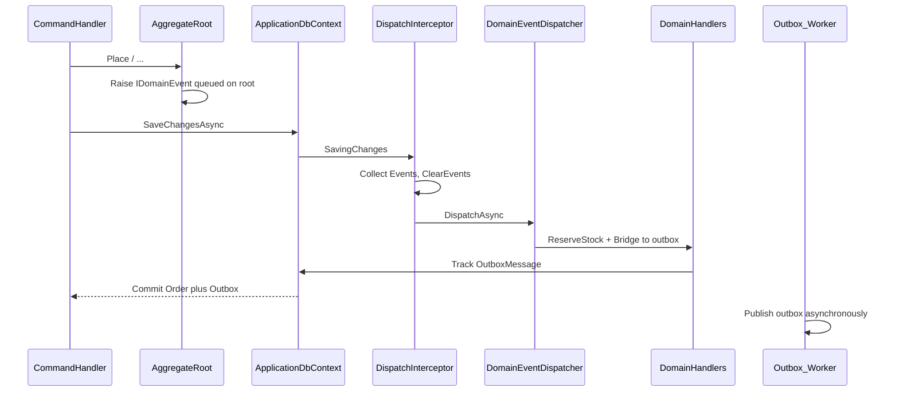
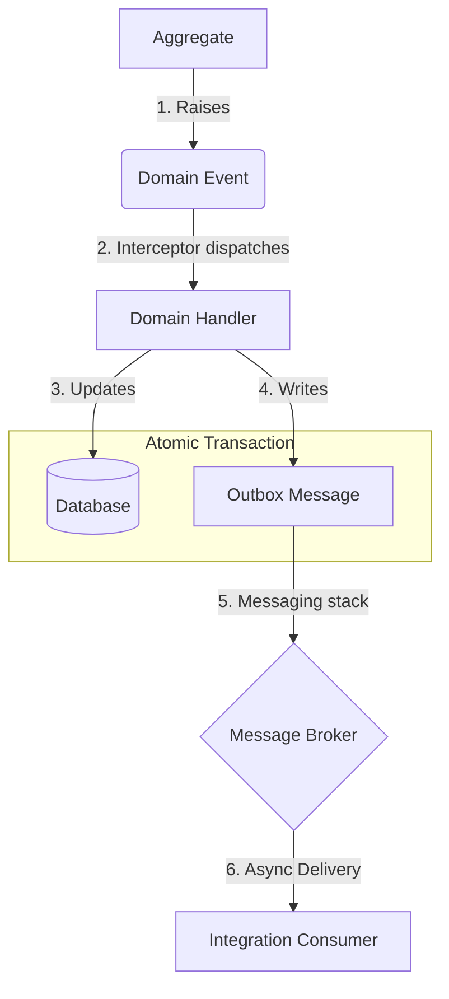
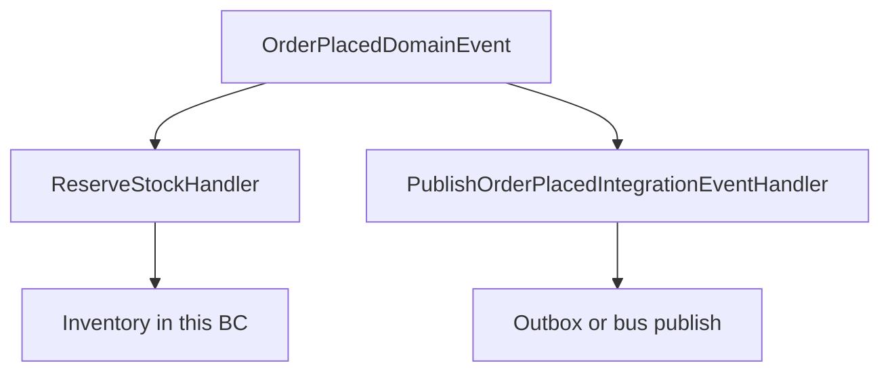
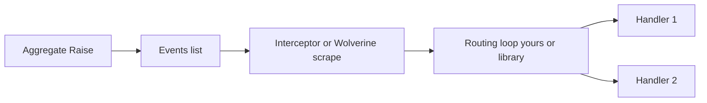
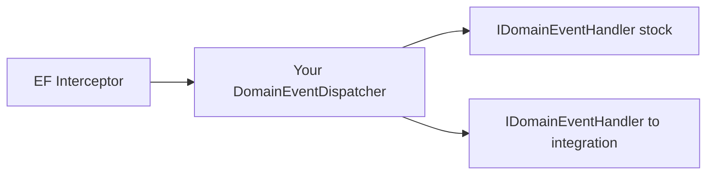
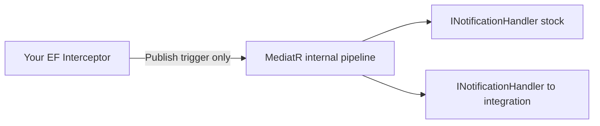
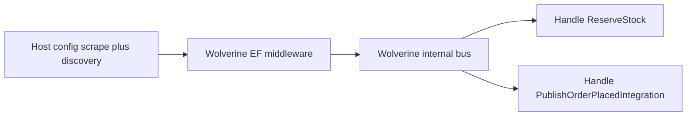
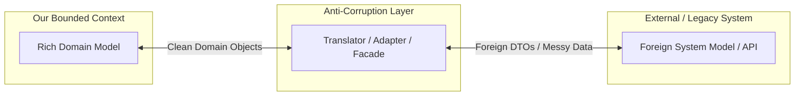

## Understanding Domain Events (Internal Events)

In a complex domain, actions often trigger secondary effects. Instead of tightly coupling these effects inside your entities (which leads to bloated, untestable code), DDD uses **Domain Events**.

A Domain Event captures the occurrence of something that *happened* in the domain. It alerts the system that an activity occurred or a state changed, allowing other parts of the application (or other Bounded Contexts) to subscribe to the "news" and react accordingly.

<Figure 
    src="/learn/ddd/domain-and-integration-events/aggregate-domain-event-handlers.png" 
    caption="Domain Events"
    alt="Domain Events"
    width="600"
/>

### Characteristics of Domain Events
*   **Represent the Past:** They are named using the past tense in your Ubiquitous Language (e.g., `AppointmentScheduled`, `PaymentReceived`, `ClientRegistered`).
*   **Immutable:** Once created, the event data should not change.
*   **Encapsulated Objects:** Each event is a full-fledged class containing only the data relevant to that specific occurrence.
*   **No Side Effects:** The event class itself holds data; it does not contain behavior or execute side effects (like sending emails).

### Identifying Domain Events

Listen to your domain experts. Domain events are usually hiding in phrases like:
*   *"**When** this happens, **then** something else should happen."*
*   *"**Notify** the user if..."*
*   *"**Inform** the billing department when..."*

> **Pro Tip (YAGNI):** Create events *as needed*, not just in case. Don't over-engineer your system with events for every minor property change.

---

### The Domain Event Workflow

Only **aggregate roots** raise events. During a state-changing method the root calls `Raise(...)`, which appends to a private collection. On `SaveChangesAsync`, an EF interceptor drains those events, runs in-process handlers (including a bridge that writes **outbox** rows), then EF commits aggregate state and outbox rows **together**. A background worker publishes outbox messages afterward.



The last hop (“publish outbox”) is your **messaging stack** — a custom worker, or MassTransit / Rebus / NServiceBus / Wolverine. The earlier hops (raise → interceptor → in-process handlers) stay the same regardless of which broker library you pick.

**When to publish?**

| Timing | Tradeoff |
|--------|----------|
| **Before** commit (same `SaveChanges`) | Domain handlers + outbox rows share one transaction — preferred when you need atomicity |
| **After** `SaveChangesAsync` | Eventual consistency; handlers can fail after the write; crash between save and publish can lose the event |

Domain events stay **inside** the Bounded Context. To cross boundaries, map them to **integration events** (via the outbox) — covered next.

---

## Integration Events (External Events) : Crossing Bounded Contexts 

When a Domain Event needs to be communicated *outside* of its local Bounded Context (e.g., to another microservice or external app via a Message Queue), it becomes an **Integration Event**.


<Figure 
    src="/learn/ddd/domain-and-integration-events/Gemini_Generated_Image_yprpilyprpilyprp.jpeg" 
    caption="Domain Events"
    alt="Domain Events"
    width="600"
/>


### Rules for Integration Events

1.  **Contract Matching:** The property names and data types must match between the publishing app and the consuming app, though the class names can differ.
2.  **Avoid Chattiness:** A major pitfall is publishing an event with insufficient data (e.g., just an `OrderId`). This forces the consuming app to make synchronous API calls back to the source app to fetch the rest of the details, creating "chattiness" and tight coupling. **Include enough data in the event payload** so the consumer can process it independently.

---

## Domain Events vs. Integration Events

While semantically both represent something that occurred in the past, their **intent, scope, and transport mechanisms** are vastly different.

| Aspect | Domain Events | Integration Events |
| :--- | :--- | :--- |
| **Scope** | Stay within a single Bounded Context | Cross Bounded Context / Microservice boundaries |
| **Transport** | In-process routing (your dispatcher, or MediatR / Wolverine internals) | Message broker (RabbitMQ, Azure Service Bus, …) |
| **Timing** | Synchronous (usually same request lifecycle) | Completely Asynchronous (processed at consumer's pace) |
| **Consistency** | Strong / Immediate (same DB transaction) | Eventual Consistency |
| **Primary Use** | Triggering side effects across **multiple aggregates** within the same domain | Notifying external systems to react to a business occurrence |
| **Schema** | Internal, can reference domain types | Public contract, must use primitives & versioning |


**The Golden Rule:** 
> *Domain events stay inside the Bounded Context. Integration events go outside.*

*Note: Domain events are frequently used to **generate** integration events, acting as the bridge between internal state changes and external broadcasts.*

---

## Implementing Domain Events and Integration Events

Two layers, two library groups:

1. **In-process domain events** (same Bounded Context, same request / transaction) — you write **handlers**; routing is either your `DomainEventDispatcher` (**Custom**) or **library-internal** (**MediatR**, **Wolverine**)
2. **Cross-process integration** (outbox → broker → consumer / inbox) — Custom worker, **MassTransit**, **Rebus**, **NServiceBus**, or **Wolverine** messaging

Domain model + EF timing stay the same. What changes is **how events get to handlers** (your dispatcher vs library pipeline) and the **messaging stack**. MassTransit / Rebus / NServiceBus are not in-process domain-event routers. MediatR is not a message broker. `IPublisher.Publish` is a **trigger** into MediatR’s internals — not “your dispatcher class.”

Canonical path below is **Custom** end-to-end. Tabs show handlers / call sites / config for other libraries — not always a 1:1 class substitute.

**Custom call chain:** command → `SaveChanges` → your interceptor → **your** `DomainEventDispatcher` → handlers → outbox table → worker → broker → inbox.

**MediatR call chain:** command → `SaveChanges` → your interceptor → `IPublisher.Publish` (**enters MediatR**) → handlers → outbox table → worker → broker → inbox.

**Wolverine call chain:** command → `SaveChanges` (or transactional flush) → scrape config → **Wolverine** middleware/bus → `Handle` methods → bus outbox (no custom interceptor, no custom dispatcher).

<Figure 
    src="/learn/ddd/domain-and-integration-events/Gemini_Generated_Image_ezvqcqezvqcqezvq.jpeg" 
    caption="Domain Events and Integration Events"
    alt="Domain Events and Integration Events"
    width="800"
/>

### Before vs after `SaveChanges`

You hook into EF Core via `SaveChangesAsync`, a `SaveChangesInterceptor`, or (with Wolverine) EF transactional middleware. Timing matters:

*   **Before commit** (`SavingChangesAsync` / transactional middleware): handlers / outbox writes join the same DB transaction — immediate consistency, but long work holds locks.
*   **After commit** (`SavedChangesAsync`): short transaction, eventual consistency; a crash between save and publish can lose the event.

**This lesson prefers before commit** so domain handlers and outbox rows share the aggregate transaction.



### Step by step implementation

<Guide title="Implementing domain → integration events" numbered>

  <GuideStep title="Common — Shared kernel base types">

**All approaches.** In DDD, **only Aggregate Roots** raise domain events. Child entities may change state, but the root owns the collection and is the unit of persistence. Identity is always a `Guid` (same shared kernel as Aggregates and Associations).

Design constraints: **immutable** facts, **past-tense** names (`OrderPlaced`), and a deliberate **fat vs thin** payload — enough for handlers to work without reloading the whole aggregate graph.

```csharp title="SharedKernel/Domain/Entity.cs" showLineNumbers {1}
public abstract class Entity
{
    public Guid Id { get; protected set; }

    public override bool Equals(object? obj)
    {
        if (obj is not Entity other)
            return false;

        if (ReferenceEquals(this, other))
            return true;

        if (Id == Guid.Empty || other.Id == Guid.Empty)
            return false;

        return Id == other.Id;
    }

    public override int GetHashCode() => Id.GetHashCode();
}
```

```csharp title="SharedKernel/Domain/AggregateRoot.cs" showLineNumbers {1,3,5-9,11,16}
public interface IAggregateRoot;

public interface IDomainEvent;

public interface IHasDomainEvents
{
    IReadOnlyCollection<IDomainEvent> Events { get; }
    void ClearEvents();
}

public abstract class AggregateRoot : Entity, IAggregateRoot, IHasDomainEvents
{
    private readonly List<IDomainEvent> _events = [];
    public IReadOnlyCollection<IDomainEvent> Events => _events.AsReadOnly();

    protected void Raise(IDomainEvent domainEvent) => _events.Add(domainEvent);

    public void ClearEvents() => _events.Clear();
}
```

Raise from a state-changing method on the root:

```csharp title="Orders/Order.cs" showLineNumbers {1,8,22-27}
public sealed class OrderPlacedDomainEvent : IDomainEvent
{
    public Guid OrderId { get; init; }
    public Guid CustomerId { get; init; }
    public decimal TotalAmount { get; init; }
}

public class Order : AggregateRoot
{
    public OrderStatus Status { get; private set; }
    public decimal TotalAmount { get; private set; }

    public static Order Place(Customer customer, List<LineItem> items)
    {
        var order = new Order
        {
            Id = Guid.NewGuid(),
            Status = OrderStatus.Placed,
            TotalAmount = items.Sum(i => i.LineTotal)
        };

        order.Raise(new OrderPlacedDomainEvent
        {
            OrderId = order.Id,
            CustomerId = customer.Id,
            TotalAmount = order.TotalAmount
        });

        return order;
    }
}
```

  </GuideStep>

  <GuideStep title="In-process — Handlers, then how they get called">

**In-process only** (Custom \| MediatR \| Wolverine). MassTransit / Rebus / NServiceBus are not used here — they are messaging stacks for integration events later.

We build this in two layers: **handlers first** (what should happen when an event exists), then **how those handlers get invoked** (your dispatcher class **or** a library’s internal pipeline). Mixing “routing job” with “class you write” is what confuses Custom vs MediatR vs Wolverine.

### 1. Handlers first — the reactions

A **handler** is a small class (or method) that reacts to **one** domain-event type. It does not own aggregate invariants. It does not call `Raise`. It only answers: “when `OrderPlacedDomainEvent` happened, what should I do?”

You can have **many** handlers for the same event. Example: one reserves stock **inside** the BC; another maps the domain event to an **integration** event and enqueues it for other systems. Each stays independent and testable.



<CodeTabs>

```csharp title="Custom" showLineNumbers {1-4,8,10}
public interface IDomainEventHandler<in TEvent> where TEvent : IDomainEvent
{
    Task HandleAsync(TEvent domainEvent, CancellationToken ct);
}

// One reaction. Register in DI: AddScoped<IDomainEventHandler<OrderPlacedDomainEvent>, ReserveStockHandler>()
public sealed class ReserveStockHandler(
    IInventoryService inventory) : IDomainEventHandler<OrderPlacedDomainEvent>
{
    public Task HandleAsync(OrderPlacedDomainEvent e, CancellationToken ct)
        => inventory.ReserveAsync(e.OrderId, e.TotalAmount, ct);
}
```

```csharp title="MediatR" howLineNumbers {3,6,8}
// Handler shape only. MediatR's *internal* pipeline invokes every INotificationHandler<T>
// after something calls IPublisher.Publish (your interceptor — later).
public interface IDomainEvent : INotification;

public sealed class ReserveStockHandler(IInventoryService inventory)
    : INotificationHandler<OrderPlacedDomainEvent>
{
    public Task Handle(OrderPlacedDomainEvent notification, CancellationToken ct)
        => inventory.ReserveAsync(notification.OrderId, notification.TotalAmount, ct);
}
```

```csharp title="Wolverine" showLineNumbers {7}
// No interface — convention: public Handle / HandleAsync, first parameter = message type.
// Discovery scans the whole assembly — Order is just any type in that DLL.
// Same assembly as Payment, Shipment, …? One IncludeAssembly covers all handlers.
// Handlers in another project? Call IncludeAssembly once per assembly.
public static class ReserveStockHandler
{
    public static Task Handle(
        OrderPlacedDomainEvent e,
        IInventoryService inventory,
        CancellationToken ct)
        => inventory.ReserveAsync(e.OrderId, e.TotalAmount, ct);
}
```     

</CodeTabs>

Handlers alone are useless until **something** invokes `HandleAsync` / `Handle`. That *job* is **routing** (find handlers → call them). Who performs that job differs by approach.

### 2. Why routing is required (concept ≠ class you write)

The aggregate only `Raise`s into a private list. It **must not** do this:

```csharp
// ❌ Broken DDD — Order knows every side effect
public void Place(...)
{
    Status = OrderStatus.Placed;
    new ReserveStockHandler(inventory).HandleAsync(...);      // coupled
    new PublishIntegrationHandler(outbox).HandleAsync(...); // coupled
}
```

Problems: domain depends on infrastructure; adding a third reaction means editing `Order`; testing the aggregate requires faking every handler.

So after `SaveChanges` (or inside Wolverine’s EF middleware), **infrastructure** must:

1. Read the raised events from tracked aggregates  
2. For each event, find all registered handlers  
3. Call each handler  

That is the **routing job**. It is **not** the same as “you always write a `DomainEventDispatcher`” or “`IPublisher` is your dispatcher class.”

| Approach | Who implements the routing loop? | What **you** write |
| :--- | :--- | :--- |
| **Custom** | **You** — `DomainEventDispatcher` | The class below + DI registration |
| **MediatR** | **MediatR internals** | Handlers + `AddMediatR`; interceptor only **triggers** via `IPublisher.Publish` |
| **Wolverine** | **Wolverine bus / middleware** | Handlers + discovery; scrape **config**; no dispatcher class |

| Role | Responsibility |
| :--- | :--- |
| **Handler** | React to one event type (you write this in every approach) |
| **Routing** | Resolve handlers and invoke them (you implement **or** a library does) |
| **Aggregate** | State + `Raise` only |



### 3. Custom: implement routing yourself

Only the **Custom** path owns a dispatcher type. MediatR/Wolverine tabs below are **not** alternate implementations of that class — they show **trigger / config** into library-internal routing.



```csharp title="Custom — DomainEventDispatcher.cs"
// You own this. Interceptor (later step) calls DispatchAsync.
public interface IDomainEventDispatcher
{
    Task DispatchAsync(IEnumerable<IDomainEvent> events, CancellationToken ct);
}

public sealed class DomainEventDispatcher(IServiceProvider sp) : IDomainEventDispatcher
{
    public async Task DispatchAsync(
        IEnumerable<IDomainEvent> events,
        CancellationToken ct)
    {
        foreach (var domainEvent in events)
        {
            var handlerType = typeof(IDomainEventHandler<>)
                .MakeGenericType(domainEvent.GetType());

            foreach (var handler in sp.GetServices(handlerType))
            {
                await (Task)handlerType
                    .GetMethod(nameof(IDomainEventHandler<IDomainEvent>.HandleAsync))!
                    .Invoke(handler, [domainEvent, ct])!;
            }
        }
    }
}
```

### 4. MediatR / Wolverine: library-internal routing — you register + trigger

**MediatR** — routing lives inside MediatR. You do **not** write a dispatcher. You register handlers with `AddMediatR`. Your interceptor only **calls** `IPublisher.Publish`, which enters MediatR’s pipeline.



```csharp title="MediatR — what you write"
// DI (routing is inside the package after this). Order = any type in the handlers assembly:
services.AddMediatR(cfg => cfg.RegisterServicesFromAssembly(typeof(Order).Assembly));

// Trigger from your interceptor — not a dispatcher implementation:
await publisher.Publish(domainEvent, ct);
```

**Wolverine** — routing lives inside Wolverine. You do **not** write a dispatcher or a `SaveChangesInterceptor` for domain events. You enable scrape + discovery; middleware publishes into the bus; `Handle` methods run.



```csharp title="Wolverine — what you write"
// Config only — not an equivalent of DomainEventDispatcher.
builder.Host.UseWolverine(opts =>
{
    opts.UseEntityFrameworkCoreTransactions();
    opts.PublishDomainEventsFromEntityFrameworkCore<AggregateRoot>(
        root => root.Events); // tell middleware where Events live
    // Any type in the handlers assembly — not "Order-only". Extra assemblies → extra IncludeAssembly.
    opts.Discovery.IncludeAssembly(typeof(Order).Assembly);
});
// You still Raise() on any AggregateRoot. Middleware scrapes and the bus invokes handlers.
```

  </GuideStep>

  <GuideStep title="Common — Integration event contract">

**All approaches.** When another Bounded Context must react, define a **public** integration schema — primitives only, versionable, no domain entity types. The broker library does not change this contract.

```csharp title="Contracts/OrderPlacedIntegrationEvent.cs"
public interface IIntegrationEvent
{
    Guid EventId { get; }
    DateTime OccurredOnUtc { get; }
}

public sealed record OrderPlacedIntegrationEvent(
    Guid EventId,
    Guid OrderId,
    Guid CustomerId,
    decimal TotalAmount,
    DateTime OccurredOnUtc) : IIntegrationEvent;
```

Domain events stay internal. Integration events leave the boundary (via outbox → broker).

  </GuideStep>

  <GuideStep title="In-process — Bridge handler: domain → outbox">

**Common shape for Custom / MediatR** (`OutboxMessage` + `IOutboxWriter`). Handler **wiring** still follows each approach (your dispatcher vs MediatR vs Wolverine bus).

When messaging is MassTransit / Rebus / NServiceBus / Wolverine, prefer that bus’s outbox API instead of a hand-rolled `OutboxMessage` table — see the Wolverine bridge tab (`IMessageBus.PublishAsync`), not a port of `EfOutboxWriter`.

A second domain handler maps the internal fact to the public contract and **enqueues outbound work** while the EF transaction is still open. Both `ReserveStockHandler` and this bridge run from the same in-process dispatch.

```csharp title="Persistence/OutboxMessage.cs"
public sealed class OutboxMessage
{
    public Guid Id { get; init; }
    public string Type { get; init; } = default!;
    public string Content { get; init; } = default!;
    public DateTime OccurredOnUtc { get; init; }
    public DateTime? ProcessedOnUtc { get; set; }
}
```

```csharp title="Persistence/EfOutboxWriter.cs"
public interface IOutboxWriter
{
    Task WriteAsync(IIntegrationEvent integrationEvent, CancellationToken ct);
}

// Adds a tracked OutboxMessage; it commits with the Order in SaveChanges.
public sealed class EfOutboxWriter(AppDbContext db) : IOutboxWriter
{
    public Task WriteAsync(IIntegrationEvent integrationEvent, CancellationToken ct)
    {
        db.Set<OutboxMessage>().Add(new OutboxMessage
        {
            Id = integrationEvent.EventId,
            OccurredOnUtc = integrationEvent.OccurredOnUtc,
            Type = integrationEvent.GetType().AssemblyQualifiedName!,
            Content = JsonSerializer.Serialize(
                integrationEvent,
                integrationEvent.GetType())
        });

        return Task.CompletedTask;
    }
}
```

<CodeTabs>

```csharp title="Custom"
public sealed class PublishOrderPlacedIntegrationEventHandler(
    IOutboxWriter outbox) : IDomainEventHandler<OrderPlacedDomainEvent>
{
    public Task HandleAsync(OrderPlacedDomainEvent e, CancellationToken ct)
    {
        var integrationEvent = new OrderPlacedIntegrationEvent(
            EventId: Guid.NewGuid(),
            OrderId: e.OrderId,
            CustomerId: e.CustomerId,
            TotalAmount: e.TotalAmount,
            OccurredOnUtc: DateTime.UtcNow);

        return outbox.WriteAsync(integrationEvent, ct);
    }
}
```

```csharp title="MediatR"
public sealed class PublishOrderPlacedIntegrationEventHandler(
    IOutboxWriter outbox)
    : INotificationHandler<OrderPlacedDomainEvent>
{
    public Task Handle(OrderPlacedDomainEvent e, CancellationToken ct)
    {
        var integrationEvent = new OrderPlacedIntegrationEvent(
            Guid.NewGuid(), e.OrderId, e.CustomerId, e.TotalAmount, DateTime.UtcNow);

        return outbox.WriteAsync(integrationEvent, ct);
    }
}
```

```csharp title="Wolverine"
// Prefer the bus outbox — do not also write a custom OutboxMessage row.
public static class PublishOrderPlacedIntegrationEventHandler
{
    public static Task Handle(
        OrderPlacedDomainEvent e,
        IMessageBus bus,
        CancellationToken ct)
    {
        var integrationEvent = new OrderPlacedIntegrationEvent(
            Guid.NewGuid(), e.OrderId, e.CustomerId, e.TotalAmount, DateTime.UtcNow);

        return bus.PublishAsync(integrationEvent); // durable when outbox policies enabled
    }
}
```

</CodeTabs>

  </GuideStep>

  <GuideStep title="Common — Command handler: the entry point">

**All approaches.** The application service never calls handlers, your dispatcher, or the message bus by hand. It creates the aggregate and persists; draining + routing is interceptor / library middleware.

```csharp title="Orders/PlaceOrderCommandHandler.cs"
public sealed record PlaceOrderCommand(Guid CustomerId, List<LineItemDto> Items);

public sealed class PlaceOrderCommandHandler(
    AppDbContext db,
    ICustomerDirectory customers)
{
    public async Task<Guid> HandleAsync(PlaceOrderCommand command, CancellationToken ct)
    {
        var customer = await customers.GetRequiredAsync(command.CustomerId, ct);
        var order = Order.Place(customer, command.Items.ToLineItems());

        db.Set<Order>().Add(order);
        // Custom: interceptor → your DomainEventDispatcher
        // MediatR: interceptor → IPublisher.Publish → MediatR internals
        // Wolverine: middleware scrape (no interceptor) → bus → Handle
        await db.SaveChangesAsync(ct);

        return order.Id;
    }
}
```

  </GuideStep>

  <GuideStep title="In-process — Drain Events and invoke routing">

**In-process only.** This step is **not** the same artifact in every approach:

*   **Custom:** you write a `SaveChangesInterceptor` that drains `Events` and calls **your** `IDomainEventDispatcher`.
*   **MediatR:** you still write an interceptor that drains `Events`, but it only **triggers** MediatR via `IPublisher.Publish` — MediatR runs the handler loop internally.
*   **Wolverine:** you write **host config**, not an interceptor. `PublishDomainEventsFromEntityFrameworkCore` tells Wolverine’s middleware to scrape `AggregateRoot.Events`. That config is a **replacement** for the interceptor pattern, not a third interceptor implementation.

Keep handlers short (no email / HTTP). Long work belongs on the messaging / inbox side.

<CodeTabs>

```csharp title="Custom — interceptor"
public sealed class DispatchDomainEventsInterceptor(
    IDomainEventDispatcher dispatcher) : SaveChangesInterceptor
{
    public override async ValueTask<InterceptionResult<int>> SavingChangesAsync(
        DbContextEventData eventData,
        InterceptionResult<int> result,
        CancellationToken cancellationToken = default)
    {
        if (eventData.Context is { } db)
            await DispatchDomainEventsAsync(db, cancellationToken);

        return await base.SavingChangesAsync(eventData, result, cancellationToken);
    }

    private async Task DispatchDomainEventsAsync(DbContext context, CancellationToken ct)
    {
        var domainEvents = context.ChangeTracker
            .Entries()
            .Select(e => e.Entity)
            .OfType<IHasDomainEvents>()
            .SelectMany(entity =>
            {
                var events = entity.Events.ToList();
                entity.ClearEvents();
                return events;
            })
            .ToList();

        if (domainEvents.Count == 0)
            return;

        await dispatcher.DispatchAsync(domainEvents, ct);
        // Bridge handler has now tracked OutboxMessage rows on the same context.
    }
}
```

```csharp title="MediatR — interceptor trigger"
// Same drain pattern as Custom, but Publish enters MediatR — you did not implement the handler loop.
public sealed class DispatchDomainEventsInterceptor(
    IPublisher publisher) : SaveChangesInterceptor
{
    public override async ValueTask<InterceptionResult<int>> SavingChangesAsync(
        DbContextEventData eventData,
        InterceptionResult<int> result,
        CancellationToken cancellationToken = default)
    {
        if (eventData.Context is { } db)
        {
            foreach (var domainEvent in CollectAndClear(db))
                await publisher.Publish(domainEvent, cancellationToken);
        }

        return await base.SavingChangesAsync(eventData, result, cancellationToken);
    }

    private static List<IDomainEvent> CollectAndClear(DbContext context)
    {
        return context.ChangeTracker
            .Entries()
            .Select(e => e.Entity)
            .OfType<IHasDomainEvents>()
            .SelectMany(entity =>
            {
                var events = entity.Events.ToList();
                entity.ClearEvents();
                return events;
            })
            .ToList();
    }
}
```

```csharp title="Wolverine — config not interceptor"
// Replaces the interceptor + dispatcher pair. Not a SaveChangesInterceptor subclass.
builder.Host.UseWolverine(opts =>
{
    opts.UseEntityFrameworkCoreTransactions();
    opts.PublishDomainEventsFromEntityFrameworkCore<AggregateRoot>(
        root => root.Events);
    opts.Discovery.IncludeAssembly(typeof(Order).Assembly); // whole assembly; not Order-specific
    opts.Policies.UseDurableLocalQueues(); // optional
});

// Command path: mutate any AggregateRoot → SaveChanges (or SaveChangesAndFlushMessagesAsync /
// [Transactional]). Middleware scrapes Events; bus invokes Handle methods.
```

</CodeTabs>

**Call chain for one place-order request:**

1. `PlaceOrderCommandHandler` → `Order.Place` → `Raise(OrderPlacedDomainEvent)`  
2. `SaveChangesAsync` (or Wolverine transactional flush)  
3. **Custom:** interceptor → **your** `DomainEventDispatcher`  
   **MediatR:** interceptor → `IPublisher.Publish` → **MediatR internals**  
   **Wolverine:** scrape config → **Wolverine middleware/bus**  
4. Handlers run (`ReserveStockHandler`, bridge → outbox / bus outbox)  
5. EF commits aggregate (+ outbox rows / Wolverine durable messages) together  

  </GuideStep>

  <GuideStep title="Messaging — Outbox publish">

**Messaging stack** (Custom \| MassTransit \| Rebus \| NServiceBus \| Wolverine). Shared **idea**: never dual-write “DB commit” and “broker publish” without an outbox. The **artifacts differ**:

*   **Custom:** you write `OutboxMessage` + `OutboxProcessor` + `IMessageBroker`.
*   **MassTransit / Rebus / NServiceBus / Wolverine:** the package owns outbox delivery; you enable it and **publish through the bus API** — not a port of `OutboxProcessor`.

<CodeTabs>

```csharp title="Custom — your worker"
public interface IMessageBroker
{
    Task PublishAsync(string type, string content, CancellationToken ct);
}

public sealed class OutboxProcessor(
    IServiceScopeFactory scopeFactory,
    IMessageBroker broker) : BackgroundService
{
    protected override async Task ExecuteAsync(CancellationToken stoppingToken)
    {
        while (!stoppingToken.IsCancellationRequested)
        {
            using var scope = scopeFactory.CreateScope();
            var db = scope.ServiceProvider.GetRequiredService<AppDbContext>();

            var batch = await db.Set<OutboxMessage>()
                .Where(m => m.ProcessedOnUtc == null)
                .OrderBy(m => m.OccurredOnUtc)
                .Take(20)
                .ToListAsync(stoppingToken);

            foreach (var message in batch)
            {
                await broker.PublishAsync(message.Type, message.Content, stoppingToken);
                message.ProcessedOnUtc = DateTime.UtcNow;
            }

            if (batch.Count > 0)
                await db.SaveChangesAsync(stoppingToken);

            await Task.Delay(TimeSpan.FromSeconds(2), stoppingToken);
        }
    }
}
```

```csharp title="MassTransit — enable outbox + Publish"
// Not OutboxProcessor. MT persists + delivers; you Publish on the bus.
services.AddMassTransit(x =>
{
    x.AddEntityFrameworkOutbox<AppDbContext>(o =>
    {
        o.UseSqlServer();
        o.UseBusOutbox();
    });

    x.UsingRabbitMq((context, cfg) => cfg.ConfigureEndpoints(context));
});

// From bridge / unit of work (same transaction as SaveChanges when using bus outbox):
await publishEndpoint.Publish(new OrderPlacedIntegrationEvent(
    Guid.NewGuid(), orderId, customerId, total, DateTime.UtcNow), ct);
```

```csharp title="Rebus — transport + Publish"
services.AddRebus(configure => configure
    .Transport(t => t.UseRabbitMq(connectionString, "orders"))
    .Options(o => o.EnableOutgoingMessageIdHeader())); // + outbox package as needed

await bus.Publish(new OrderPlacedIntegrationEvent(
    Guid.NewGuid(), orderId, customerId, total, DateTime.UtcNow));
```

```csharp title="NServiceBus — EnableOutbox + Publish"
endpointConfiguration.EnableOutbox();
endpointConfiguration.UsePersistence<SqlPersistence>();
// + transport (RabbitMQ, Azure Service Bus, …)

await context.Publish(new OrderPlacedIntegrationEvent(
    Guid.NewGuid(), orderId, customerId, total, DateTime.UtcNow));
```

```csharp title="Wolverine — durable outbox policy"
// Complements scrape/discovery from the in-process steps — still not OutboxProcessor.
opts.Services.AddDbContextWithWolverineIntegration<AppDbContext>(…);
opts.UseRabbitMq(…).AutoProvision();
opts.Policies.UseDurableOutboxOnAllSendingEndpoints();
// Bridge Handle calls bus.PublishAsync(integrationEvent) → library outbox.
```

</CodeTabs>

  </GuideStep>

  <GuideStep title="Messaging — Inbox / idempotent consumers">

**Messaging stack** (same five). Shared **idea**: idempotent consume. Artifacts differ — Custom builds a subscriber + `IIntegrationEventHandler<T>`; buses use `IConsumer` / `IHandleMessages` / convention `Handle`. Those are **consumer shapes**, not ports of `IntegrationEventSubscriber`.

**MediatR is not listed here** — it is not a broker consumer.

**Common inbox store** (Custom path; other hosts may use the bus’s idempotency features or the same table):

```csharp title="Persistence/InboxMessage.cs"
public sealed class InboxMessage
{
    public Guid MessageId { get; init; }
    public DateTime ProcessedOnUtc { get; init; }
}

public interface IInboxStore
{
    Task<bool> HasBeenProcessedAsync(Guid messageId, CancellationToken ct);
    Task MarkAsProcessedAsync(Guid messageId, CancellationToken ct);
}

public sealed class EfInboxStore(AppDbContext db) : IInboxStore
{
    public Task<bool> HasBeenProcessedAsync(Guid messageId, CancellationToken ct)
        => db.Set<InboxMessage>().AnyAsync(m => m.MessageId == messageId, ct);

    public async Task MarkAsProcessedAsync(Guid messageId, CancellationToken ct)
    {
        db.Set<InboxMessage>().Add(new InboxMessage
        {
            MessageId = messageId,
            ProcessedOnUtc = DateTime.UtcNow
        });
        await db.SaveChangesAsync(ct);
    }
}
```

<CodeTabs>

```csharp title="Custom"
public interface IIntegrationEventHandler<in TEvent> where TEvent : IIntegrationEvent
{
    Task HandleAsync(TEvent integrationEvent, Guid messageId, CancellationToken ct);
}

public sealed class IntegrationEventSubscriber(IServiceScopeFactory scopeFactory)
{
    public async Task OnMessageAsync(string type, string content, CancellationToken ct)
    {
        var eventType = Type.GetType(type, throwOnError: true)!;
        var integrationEvent = (IIntegrationEvent)JsonSerializer.Deserialize(content, eventType)!;

        using var scope = scopeFactory.CreateScope();
        var handlerType = typeof(IIntegrationEventHandler<>).MakeGenericType(eventType);

        foreach (var handler in scope.ServiceProvider.GetServices(handlerType))
        {
            await (Task)handlerType
                .GetMethod(nameof(IIntegrationEventHandler<IIntegrationEvent>.HandleAsync))!
                .Invoke(handler, [integrationEvent, integrationEvent.EventId, ct])!;
        }
    }
}

public sealed class SendOrderConfirmationHandler(
    IInboxStore inbox,
    IEmailService email) : IIntegrationEventHandler<OrderPlacedIntegrationEvent>
{
    public async Task HandleAsync(
        OrderPlacedIntegrationEvent e,
        Guid messageId,
        CancellationToken ct)
    {
        if (await inbox.HasBeenProcessedAsync(messageId, ct))
            return;

        await email.SendOrderConfirmationAsync(e.CustomerId, e.OrderId, ct);
        await inbox.MarkAsProcessedAsync(messageId, ct);
    }
}
```

```csharp title="MassTransit"
public sealed class SendOrderConfirmationConsumer(
    IInboxStore inbox,
    IEmailService email) : IConsumer<OrderPlacedIntegrationEvent>
{
    public async Task Consume(ConsumeContext<OrderPlacedIntegrationEvent> context)
    {
        var messageId = context.MessageId ?? context.Message.EventId;
        if (await inbox.HasBeenProcessedAsync(messageId, context.CancellationToken))
            return;

        await email.SendOrderConfirmationAsync(
            context.Message.CustomerId, context.Message.OrderId, context.CancellationToken);
        await inbox.MarkAsProcessedAsync(messageId, context.CancellationToken);
    }
}
```

```csharp title="Rebus"
public sealed class SendOrderConfirmationHandler(
    IInboxStore inbox,
    IEmailService email) : IHandleMessages<OrderPlacedIntegrationEvent>
{
    public async Task Handle(OrderPlacedIntegrationEvent message)
    {
        if (await inbox.HasBeenProcessedAsync(message.EventId, CancellationToken.None))
            return;

        await email.SendOrderConfirmationAsync(message.CustomerId, message.OrderId, default);
        await inbox.MarkAsProcessedAsync(message.EventId, default);
    }
}
```

```csharp title="NServiceBus"
public sealed class SendOrderConfirmationHandler(
    IInboxStore inbox,
    IEmailService email) : IHandleMessages<OrderPlacedIntegrationEvent>
{
    public async Task Handle(
        OrderPlacedIntegrationEvent message,
        IMessageHandlerContext context)
    {
        if (await inbox.HasBeenProcessedAsync(message.EventId, context.CancellationToken))
            return;

        await email.SendOrderConfirmationAsync(
            message.CustomerId, message.OrderId, context.CancellationToken);
        await inbox.MarkAsProcessedAsync(message.EventId, context.CancellationToken);
    }
}
```

```csharp title="Wolverine"
public static class SendOrderConfirmationHandler
{
    public static async Task Handle(
        OrderPlacedIntegrationEvent e,
        IInboxStore inbox,
        IEmailService email,
        CancellationToken ct)
    {
        if (await inbox.HasBeenProcessedAsync(e.EventId, ct))
            return;

        await email.SendOrderConfirmationAsync(e.CustomerId, e.OrderId, ct);
        await inbox.MarkAsProcessedAsync(e.EventId, ct);
    }
}
```

</CodeTabs>

  </GuideStep>

  <GuideStep title="Split — DI registration">

**Split registration:** common EF bits stay; then pick one **in-process** column and one **messaging** column (they can differ — e.g. MediatR + MassTransit).

```csharp title="Common — EF (Custom / MediatR only)"
// Skip AddInterceptors when using Wolverine’s PublishDomainEventsFromEntityFrameworkCore.
services.AddDbContext<AppDbContext>((sp, options) =>
    options
        .UseSqlServer(connectionString)
        .AddInterceptors(sp.GetRequiredService<DispatchDomainEventsInterceptor>()));
```

<CodeTabs>

```csharp title="In-process Custom"
services.AddScoped<IDomainEventDispatcher, DomainEventDispatcher>();
services.AddScoped<IOutboxWriter, EfOutboxWriter>();
services.AddScoped<IDomainEventHandler<OrderPlacedDomainEvent>, ReserveStockHandler>();
services.AddScoped<IDomainEventHandler<OrderPlacedDomainEvent>, PublishOrderPlacedIntegrationEventHandler>();
services.AddScoped<DispatchDomainEventsInterceptor>();
```

```csharp title="In-process MediatR"
// Order = anchor type; same for Payment/Shipment if they live in this assembly.
services.AddMediatR(cfg => cfg.RegisterServicesFromAssembly(typeof(Order).Assembly));
// Registers handlers; MediatR owns the routing loop after IPublisher.Publish.
services.AddScoped<IOutboxWriter, EfOutboxWriter>();
services.AddScoped<DispatchDomainEventsInterceptor>(); // injects IPublisher — trigger only
```

```csharp title="In-process Wolverine"
builder.Host.UseWolverine(opts =>
{
    opts.UseEntityFrameworkCoreTransactions();
    opts.PublishDomainEventsFromEntityFrameworkCore<AggregateRoot>(
        root => root.Events); // config — not DomainEventDispatcher
    opts.Discovery.IncludeAssembly(typeof(Order).Assembly); // all Handle* in that assembly
});
// AddDbContextWithWolverineIntegration — no DispatchDomainEventsInterceptor.
```

</CodeTabs>

<CodeTabs>

```csharp title="Messaging Custom"
services.AddScoped<IInboxStore, EfInboxStore>();
services.AddScoped<IIntegrationEventHandler<OrderPlacedIntegrationEvent>, SendOrderConfirmationHandler>();
services.AddSingleton<IMessageBroker, FakeMessageBroker>();
services.AddHostedService<OutboxProcessor>();
services.AddSingleton<IntegrationEventSubscriber>();
```

```csharp title="Messaging MassTransit"
services.AddMassTransit(x =>
{
    x.AddConsumer<SendOrderConfirmationConsumer>();
    x.AddEntityFrameworkOutbox<AppDbContext>(o =>
    {
        o.UseSqlServer();
        o.UseBusOutbox();
    });
    x.UsingRabbitMq((context, cfg) => cfg.ConfigureEndpoints(context));
});
services.AddScoped<IInboxStore, EfInboxStore>();
```

```csharp title="Messaging Rebus"
services.AddRebus(configure => configure
    .Transport(t => t.UseRabbitMq(connectionString, "notifications"))
    .Routing(r => r.TypeBased().MapAssemblyOf<OrderPlacedIntegrationEvent>("orders")));
services.AutoRegisterHandlersFromAssemblyOf<SendOrderConfirmationHandler>();
services.AddScoped<IInboxStore, EfInboxStore>();
```

```csharp title="Messaging NServiceBus"
// Typically configured via endpoint host builder, not only IServiceCollection:
endpointConfiguration.EnableOutbox();
endpointConfiguration.UseTransport</* RabbitMQ */>();
endpointConfiguration.UsePersistence<SqlPersistence>();
// Handlers discovered from the assembly; register IInboxStore in the container.
```

```csharp title="Messaging Wolverine"
// Usually one UseWolverine block with in-process + messaging together:
builder.Host.UseWolverine(opts =>
{
    opts.UseEntityFrameworkCoreTransactions();
    opts.PublishDomainEventsFromEntityFrameworkCore<AggregateRoot>(root => root.Events);
    opts.Discovery.IncludeAssembly(typeof(Order).Assembly); // one call per handlers assembly
    opts.UseRabbitMq(…).AutoProvision();
    opts.Policies.UseDurableOutboxOnAllSendingEndpoints();
});
opts.Services.AddDbContextWithWolverineIntegration<AppDbContext>(…);
services.AddScoped<IInboxStore, EfInboxStore>();
```

</CodeTabs>

For **Custom / MediatR**, `DispatchDomainEventsInterceptor` and handlers must share the **same scoped `AppDbContext`** as the command handler so outbox rows join the same unit of work. For **Wolverine**, use `AddDbContextWithWolverineIntegration` and skip the custom interceptor.

  </GuideStep>

</Guide>

---

## Common Pitfalls to Avoid

*   **Modifying multiple aggregates in one transaction:** Update Aggregate A, raise a domain event, and let Aggregate B react in its own handler / unit of work.
*   **Publishing integration events synchronously:** Prefer a message broker over direct HTTP for cross-boundary reactions — avoid temporal coupling.
*   **Leaking domain types:** Integration events use primitives. Never ship an `Order` entity across the wire.
*   **Ignoring dispatch timing:** Before vs after `SaveChanges` is the difference between atomic outbox writes and lost messages on crash.
*   **Calling handlers (or routing) from the aggregate or command handler:** Keep `Raise` on the root; drain via interceptor or Wolverine scrape so every `SaveChanges` path behaves the same.
*   **Treating `IPublisher.Publish` or Wolverine scrape options as “your dispatcher”:** Those are triggers/config into **library-internal** routing. Only Custom owns a `DomainEventDispatcher` class.
*   **Using MediatR as a message broker:** MediatR is in-process only. Cross-BC delivery needs Custom / MassTransit / Rebus / NServiceBus / Wolverine messaging.
*   **Using MassTransit/Rebus/NServiceBus as your only domain-event bus:** They can publish messages, but for same-BC immediate handlers prefer Custom / MediatR / Wolverine in-process — keep the two layers distinct.

---

## Shielding Your Domain: Anti-Corruption Layers (ACL)

Your Bounded Context rarely exists in a vacuum. It often needs to interact with external APIs, third-party services, or legacy systems. 

> *"Even when the other system is well designed, it is not based on the same model as the client. And often the other system is not well designed."* — **Eric Evans**

If you allow external models to leak into your domain, your Ubiquitous Language will be corrupted by foreign concepts, and your domain logic will become tangled with external technical concerns.

### What is an Anti-Corruption Layer?

An ACL is a protective boundary that **insulates your Bounded Context from foreign systems**. It acts as a translator between the external system's model and your own domain model.

*   **It is not a specific design pattern**, but rather a conceptual layer that *employs* patterns like **Adapters**, **Facades**, or custom translation classes.
*   **Its Job:** Translate incoming foreign data (DTOs, XML, JSON) into rich Domain Objects, and translate outgoing Domain Objects into the format the foreign system expects.



By using an ACL, your domain model remains pure, persistence-ignorant, and entirely focused on the business problem, regardless of how messy the external systems are.

---

## Chapter Summary & Key Terms

*   **Domain Events** are internal facts used to decouple side effects within a Bounded Context — raised via `AggregateRoot.Raise`, drained via `IHasDomainEvents`.
*   **Integration Events** are public contracts delivered asynchronously over a message broker.
*   **Hollywood Principle:** *"Don't call us, we'll call you."* Aggregates raise events instead of calling infrastructure directly.
*   **Outbox:** Persist outgoing messages in the same transaction as the aggregate; a worker (or bus outbox) publishes later.
*   **Inbox:** Deduplicate at-least-once deliveries so consumers stay idempotent.
*   **Anti-Corruption Layer (ACL):** Translates foreign models so they cannot corrupt your Ubiquitous Language.
*   **In-process:** you always write **handlers**. **Routing** is either your `DomainEventDispatcher` (Custom) or **MediatR / Wolverine internals** (you register + trigger/configure only).
*   **Messaging:** Custom worker/subscriber, or MassTransit / Rebus / NServiceBus / Wolverine outbox + consumers — shared idea, different artifacts. MediatR is not in this group.
*   You can mix layers (e.g. MediatR in-process + MassTransit for integration). Domain model and command/`SaveChanges` stay common.

### Final Thoughts

Domain Events keep Aggregates focused on state and invariants while safely triggering system-wide workflows. Pair them with Outbox/Inbox and ACLs so the core domain stays pure and resilient across process boundaries.

***

**Next Up:** *Evolving the Application Easily, Thanks to DDD*

## References

- [How to use domain events to build loosely coupled systems](https://milanjovanovic.tech/blog/how-to-use-domain-events-to-build-loosely-coupled-systems)
- [Domain Events vs. Integration Events](https://milanjovanovic.tech/blog/domain-events-vs-integration-events)
- [How to use EF Core interceptors](https://milanjovanovic.tech/blog/how-to-use-ef-core-interceptors)
