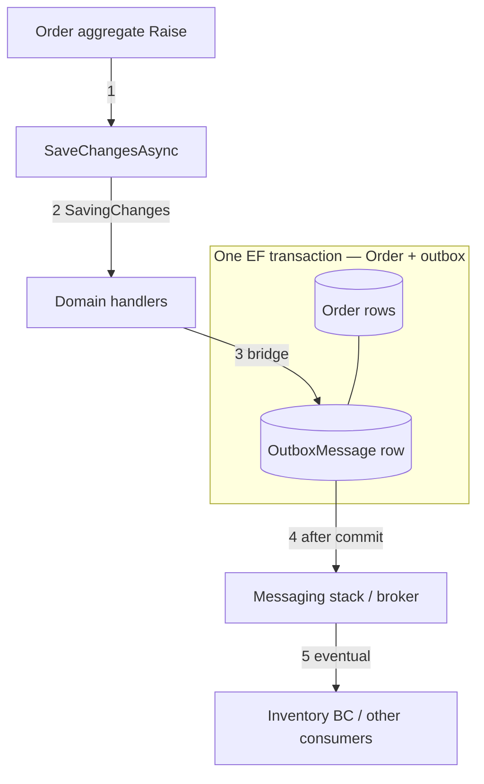
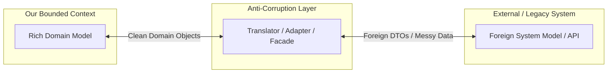

## Understanding Domain Events (Internal Events)

In a complex domain, actions often trigger secondary effects. Instead of tightly coupling these effects inside your entities (which leads to bloated, untestable code), DDD uses **Domain Events**.

A Domain Event captures the occurrence of something that *happened* in the domain. It alerts the system that an activity occurred or a state changed, allowing other parts of the application (or other Bounded Contexts) to subscribe to the "news" and react accordingly.

<Figure 
    src="/learn/ddd/domain-and-integration-events/aggregate-domain-event-handlers.png" 
    caption="Domain Events"
    alt="Domain Events"
    width="800"
/>

### Characteristics of Domain Events
*   **Represent the Past:** They are named using the past tense in your Ubiquitous Language (e.g., `AppointmentScheduled`, `PaymentReceived`, `ClientRegistered`).
*   **Immutable:** Once created, the event data should not change.
*   **Encapsulated Objects:** Each event is a full-fledged class containing only the data relevant to that specific occurrence.
*   **No Side Effects:** The event class itself holds data; it does not contain behavior or execute side effects (like sending emails).

### Identifying Domain Events

Listen to your domain experts. Domain events are usually hiding in phrases like:
*   *"**When** this happens, **then** something else should happen."*
*   *"**Notify** the user if..."*
*   *"**Inform** the billing department when..."*

> **Pro Tip (YAGNI):** Create events *as needed*, not just in case. Don't over-engineer your system with events for every minor property change.

---

### The Domain Event Workflow (Deferred Dispatch)

Only **aggregate roots** raise events. During a state-changing method the root calls `Raise(...)`, which appends to a **private in-memory list**. Handlers are **not** called from the aggregate. Infrastructure drains that list on `SaveChangesAsync` inside **`SavingChangesAsync`** (before the SQL commit) — the **deferred dispatch** pattern. A bridge handler that tracks an `OutboxMessage` on the **same scoped `AppDbContext`** joins the unit of work. EF then commits **Order + outbox** together — or rolls both back. A background worker publishes outbox rows to the broker **after** that commit (not in the same ACID transaction as the broker).

Inventory, email, and other Bounded Contexts react via **integration events** (eventual consistency). Choosing CP vs saga vs AP for multi-aggregate work is covered in [Consistency Boundaries](/learn/ddd/consistency-boundaries).

<Figure 
    src="/learn/ddd/domain-and-integration-events/domain-events.png" 
    caption="Domain Events Workflow"
    alt="Domain Events Workflow"
    width="600"
/>


### What is atomic (same DB transaction)?

| In the same `SaveChanges` / same `AppDbContext` | Outside that transaction |
| --- | --- |
| Aggregate rows (e.g. `Order`) | Broker delivery (RabbitMQ, …) |
| Outbox rows written by the bridge handler | Integration consumers (Inventory BC, email, …) |
| | HTTP / external APIs |

So: if **Order** fails to commit, the **outbox row is not committed either**. That does **not** mean Inventory rolled back with Order — Inventory should not be updated in this transaction. Use the outbox + an integration consumer instead.

The last hop (“publish outbox”) is your **messaging stack** — a custom worker, or MassTransit / Rebus / NServiceBus / Wolverine. The earlier hops (raise → interceptor → in-process handlers) stay the same regardless of which broker library you pick.

You hook into EF Core via `SaveChangesAsync`, a `SaveChangesInterceptor`, or (with Wolverine) EF transactional middleware. Timing matters:

*   **Before commit** (`SavingChangesAsync` / transactional middleware): the bridge tracks outbox rows on the **same scoped `AppDbContext`** so they join the aggregate’s DB transaction.
*   **After commit** (`SavedChangesAsync`): short transaction; a crash between save and outbox write can lose the message.

**This lesson prefers before commit** so the aggregate and outbox share one transaction. Do **not** open a new DI scope (`CreateScope`) inside the interceptor for those handlers — they must resolve the same `AppDbContext` instance as the command.



**Example:** Order insert fails → outbox is **not** committed. Inventory in another BC is untouched until an integration message is processed later — see [Consistency Boundaries](/learn/ddd/consistency-boundaries).

The Guide below follows that sequence: **command handler** starts the request, then we wire what `SaveChanges` triggers (bridge + deferred dispatch), then the **after-commit** hops (outbox worker → broker → inbox consumers).
---

## Integration Events (External Events) : Crossing Bounded Contexts 

When a Domain Event needs to be communicated *outside* of its local Bounded Context (e.g., to another microservice or external app via a Message Queue), it becomes an **Integration Event**.


<Figure 
    src="/learn/ddd/domain-and-integration-events/Gemini_Generated_Image_hm8vtnhm8vtnhm8v.jpeg" 
    caption="Domain Events and Integration Events"
    alt="Domain Events and Integration Events"
    width="900"
/>


### Rules for Integration Events

1.  **Contract Matching:** The property names and data types must match between the publishing app and the consuming app, though the class names can differ.
2.  **Avoid Chattiness:** A major pitfall is publishing an event with insufficient data (e.g., just an `OrderId`). This forces the consuming app to make synchronous API calls back to the source app to fetch the rest of the details, creating "chattiness" and tight coupling. **Include enough data in the event payload** so the consumer can process it independently.

---

## Domain Events vs. Integration Events

While semantically both represent something that occurred in the past, their **intent, scope, and transport mechanisms** are vastly different.

| Aspect | Domain Events | Integration Events |
| :--- | :--- | :--- |
| **Scope** | Stay within a single Bounded Context | Cross Bounded Context / Microservice boundaries |
| **Transport** | In-process routing (your dispatcher, or MediatR / Wolverine internals) | Message broker (RabbitMQ, Azure Service Bus, …) |
| **Timing** | Synchronous (usually same request lifecycle) | Completely Asynchronous (processed at consumer's pace) |
| **Consistency** | Strong for aggregate + outbox in one `SaveChanges`; not for broker / other BCs | Eventual Consistency |
| **Primary Use** | In-BC reactions (bridge → outbox; light same-context work) | Notifying external systems / other BCs |
| **Schema** | Internal, can reference domain types | Public contract, must use primitives & versioning |


**The Golden Rule:** 
> *Domain events stay inside the Bounded Context. Integration events go outside.*

*Note: Domain events are frequently used to **generate** integration events, acting as the bridge between internal state changes and external broadcasts.*

---

## Implementing Domain Events and Integration Events

The following diagram shows the workflow of domain events and integration events.

```mermaid
sequenceDiagram
    autonumber
    actor Client
    participant Command as PlaceOrderCommandHandler
    participant Aggregate as Order (AggregateRoot)
    participant DbContext as AppDbContext / Interceptor
    participant BridgeHandler as PublishIntegrationHandler
    participant Outbox as Outbox Store (DB)
    participant OutboxWorker as Outbox Processor / Bus
    participant Broker as Message Broker (RabbitMQ)
    participant Consumer as Inventory / Notifications Consumer
    participant Inbox as Inbox Store (DB)

    Client->>Command: PlaceOrderCommand
    Command->>Aggregate: Order.Place(...)
    Note over Aggregate: State updated to Placed<br/>Calls Raise(OrderPlacedDomainEvent)
    Command->>DbContext: SaveChangesAsync()
    
    rect rgb(46, 46, 46)
        Note over DbContext: Deferred dispatch — before SQL commit
        DbContext->>DbContext: Interceptor drains and clears Events
        DbContext->>BridgeHandler: HandleAsync(OrderPlacedDomainEvent)
        BridgeHandler->>Outbox: WriteAsync(OrderPlacedIntegrationEvent)
        DbContext->>DbContext: COMMIT (Order + OutboxMessage)
    end
    
    DbContext-->>Client: Return Order ID

    rect rgb(50, 50, 50)
        Note over OutboxWorker, Broker: After commit — not the same ACID txn
        OutboxWorker->>Outbox: Poll unprocessed messages
        OutboxWorker->>Broker: Publish(OrderPlacedIntegrationEvent)
        OutboxWorker->>Outbox: Mark as Processed
    end

    rect rgb(40, 40, 40)
        Note over Broker, Inbox: External consumption and idempotency
        Broker->>Consumer: Consume(OrderPlacedIntegrationEvent)
        Consumer->>Inbox: HasBeenProcessedAsync(EventId)
        alt Not Processed
            Consumer->>Consumer: Deduct stock / send email (own txn)
            Consumer->>Inbox: MarkAsProcessedAsync(EventId)
        else Already Processed
            Consumer-->>Consumer: Ignore duplicate
        end
    end
```



<Figure 
    src="/learn/ddd/domain-and-integration-events/Xo7fe.jpg" 
    caption="Domain Events and Integration Events"
    alt="Domain Events and Integration Events"
    width="900"
/>

Two layers, two **independent** library picks (mix-and-match):

| Layer | Guide steps | Choices | Job |
| --- | --- | --- | --- |
| **A — In-process domain routing** | 1–5 | **Custom** · **MediatR** · **Wolverine** | Drain `Raise`d events → run domain handlers (the bridge) |
| **B — Messaging / broker** | 6–7 | **Custom worker** · **MassTransit** · **Rebus** · **NServiceBus** · **Wolverine** | Durable outbox + broker delivery + consumers |

- **MediatR is only in A** (not a broker). **MassTransit / Rebus / NServiceBus are only in B** (not domain-event routers).
- **Wolverine can span A and B** in one host — that is why it appears in both step groups.
- Typical pairs: Custom+Custom · MediatR+MassTransit · Wolverine+Wolverine · Custom/MediatR+Rebus/NServiceBus.

Steps 1–3 and 5 stay the same for every B choice. **Step 4 (bridge) must match B**: custom `OutboxMessage` table **or** bus `Publish` — not both.


<Guide title="Implementing domain → integration events" numbered headingLevel={2} stepHeadingLevel={3}>
  <GuideStep title="1. Shared kernel + Order.Place (Raise in memory)">

**Sequence:** builds what the command will call. **Only Aggregate Roots** raise domain events. `Raise` appends to an in-memory list — no handlers yet.

Design constraints: **immutable** facts, **past-tense** names (`OrderPlaced`), and a deliberate **fat vs thin** payload — enough for later consumers without reloading the aggregate graph.

```csharp title="SharedKernel/Domain/Entity.cs" showLineNumbers {1}
public abstract class Entity
{
    public Guid Id { get; protected set; }

    public override bool Equals(object? obj)
    {
        if (obj is not Entity other)
            return false;

        if (ReferenceEquals(this, other))
            return true;

        if (Id == Guid.Empty || other.Id == Guid.Empty)
            return false;

        return Id == other.Id;
    }

    public override int GetHashCode() => Id.GetHashCode();
}
```

```csharp title="SharedKernel/Domain/AggregateRoot.cs" showLineNumbers {1,3-7,9-13,15,20}
public interface IAggregateRoot;

public interface IDomainEvent
{
    Guid EventId { get; }
    DateTime OccurredOnUtc { get; }
}

public interface IHasDomainEvents
{
    IReadOnlyCollection<IDomainEvent> Events { get; }
    void ClearEvents();
}

public abstract class AggregateRoot : Entity, IAggregateRoot, IHasDomainEvents
{
    private readonly List<IDomainEvent> _events = [];
    public IReadOnlyCollection<IDomainEvent> Events => _events.AsReadOnly();

    protected void Raise(IDomainEvent domainEvent) => _events.Add(domainEvent);

    public void ClearEvents() => _events.Clear();
}
```

```csharp title="Orders/Order.cs" showLineNumbers {3-11,13,27-33}
public sealed record OrderLineSnapshot(string Sku, int Quantity);

public sealed class OrderPlacedDomainEvent : IDomainEvent
{
    public Guid EventId { get; init; } = Guid.NewGuid();
    public DateTime OccurredOnUtc { get; init; } = DateTime.UtcNow;
    public Guid OrderId { get; init; }
    public Guid CustomerId { get; init; }
    public decimal TotalAmount { get; init; }
    public IReadOnlyList<OrderLineSnapshot> Lines { get; init; } = [];
}

public class Order : AggregateRoot
{
    public OrderStatus Status { get; private set; }
    public decimal TotalAmount { get; private set; }

    public static Order Place(Customer customer, List<LineItem> items)
    {
        var order = new Order
        {
            Id = Guid.NewGuid(),
            Status = OrderStatus.Placed,
            TotalAmount = items.Sum(i => i.LineTotal)
        };

        order.Raise(new OrderPlacedDomainEvent
        {
            OrderId = order.Id,
            CustomerId = customer.Id,
            TotalAmount = order.TotalAmount,
            Lines = items.Select(i => new OrderLineSnapshot(i.Sku, i.Quantity)).ToList()
        });

        return order;
    }
}
```

  </GuideStep>

  <GuideStep title="2. Command handler — the entry point">

**Sequence starts here** (`Client → PlaceOrderCommandHandler`). The application service never calls handlers, your dispatcher, or the message bus by hand. It loads what it needs, mutates the aggregate (`Place` → `Raise`), and calls `SaveChangesAsync`. Deferred dispatch happens **inside** that save.

```csharp title="Orders/PlaceOrderCommandHandler.cs" showLineNumbers {3,10-11,16}
public sealed record PlaceOrderCommand(Guid CustomerId, List<LineItemDto> Items);

public sealed class PlaceOrderCommandHandler(
    AppDbContext db,
    ICustomerDirectory customers)
{
    public async Task<Guid> HandleAsync(PlaceOrderCommand command, CancellationToken ct)
    {
        var customer = await customers.GetRequiredAsync(command.CustomerId, ct);
        var order = Order.Place(customer, command.Items.ToLineItems());
        db.Set<Order>().Add(order);
        // Layer A during SaveChanges: Custom dispatcher | MediatR Publish | Wolverine scrape
        // Layer B enrolled by the bridge: OutboxMessage | MT/Rebus/NSB/Wolverine bus outbox
        await db.SaveChangesAsync(ct);

        return order.Id;
    }
}
```

  </GuideStep>

  <GuideStep title="3. Integration event contract">

**Sequence:** the public message shape that will sit in the outbox and cross the broker. Primitives only, versionable, no domain entity types.

```csharp title="Contracts/OrderPlacedIntegrationEvent.cs" showLineNumbers {1-5,15}
public interface IIntegrationEvent
{
    Guid EventId { get; }
    DateTime OccurredOnUtc { get; }
}

public sealed record OrderLineDto(string Sku, int Quantity);

public sealed record OrderPlacedIntegrationEvent(
    Guid EventId,
    Guid OrderId,
    Guid CustomerId,
    decimal TotalAmount,
    IReadOnlyList<OrderLineDto> Lines,
    DateTime OccurredOnUtc) : IIntegrationEvent;
```

Domain events stay internal. Integration events leave the boundary (via outbox → broker).

  </GuideStep>

  <GuideStep title="4. Bridge handler — domain → outbox">

**Sequence:** runs inside deferred dispatch (`BridgeHandler → durable outbox`) **before** SQL commit. Maps `OrderPlacedDomainEvent` → `OrderPlacedIntegrationEvent`.

The bridge’s **write API depends on layer B** (messaging), not on whether you used Custom/MediatR/Wolverine for layer A:

| Layer B (messaging) | Bridge writes with | Durable store | Who publishes later |
| --- | --- | --- | --- |
| **Custom worker** | `IOutboxWriter` → your `OutboxMessage` | Your table | Your `OutboxProcessor` (step 6) |
| **MassTransit** | `IPublishEndpoint.Publish` | MT EF outbox tables | MassTransit |
| **Rebus / NServiceBus** | bus / context `Publish` | Their outbox / persistence | Their host |
| **Wolverine** | `IMessageBus.PublishAsync` | Wolverine durable outbox | Wolverine |

Do **not** keep `EfOutboxWriter` + `OutboxProcessor` **and** also `Publish` on MassTransit expecting them to share one table — they do not.

Keep the handler light. Inventory / email belong in step 7. See [Consistency Boundaries](/learn/ddd/consistency-boundaries).

**Custom messaging only** — your table (skip this type if B = MassTransit / Rebus / NServiceBus / Wolverine bus outbox):

```csharp title="Persistence/OutboxMessage.cs"
public sealed class OutboxMessage
{
    public Guid Id { get; init; }
    public string Type { get; init; } = default!;
    public string Content { get; init; } = default!;
    public DateTime OccurredOnUtc { get; init; }
    public DateTime? ProcessedOnUtc { get; set; }
}
```

```csharp title="Persistence/EfOutboxWriter.cs" showLineNumbers {1-4,9}
public interface IOutboxWriter
{
    Task WriteAsync(IIntegrationEvent integrationEvent, CancellationToken ct);
}

// Adds a tracked OutboxMessage; it commits with the Order in SaveChanges.
public sealed class EfOutboxWriter(AppDbContext db) : IOutboxWriter
{
    public Task WriteAsync(IIntegrationEvent integrationEvent, CancellationToken ct)
    {
        db.Set<OutboxMessage>().Add(new OutboxMessage
        {
            Id = integrationEvent.EventId,
            OccurredOnUtc = integrationEvent.OccurredOnUtc,
            Type = integrationEvent.GetType().AssemblyQualifiedName!,
            Content = JsonSerializer.Serialize(
                integrationEvent,
                integrationEvent.GetType())
        });

        return Task.CompletedTask;
    }
}
```

Handler shape is still layer A (Custom vs MediatR vs Wolverine). Tabs below show the **write side** paired with a typical A choice:

<CodeTabs>

```csharp title="A Custom + B Custom table"
public interface IDomainEventHandler<in TEvent> where TEvent : IDomainEvent
{
    Task HandleAsync(TEvent domainEvent, CancellationToken ct);
}

public sealed class PublishOrderPlacedIntegrationEventHandler(
    IOutboxWriter outbox) : IDomainEventHandler<OrderPlacedDomainEvent>
{
    public Task HandleAsync(OrderPlacedDomainEvent e, CancellationToken ct)
    {
        var integrationEvent = Map(e);
        return outbox.WriteAsync(integrationEvent, ct); // your OutboxMessage — step 6 Custom worker
    }

    private static OrderPlacedIntegrationEvent Map(OrderPlacedDomainEvent e) => new(
        e.EventId, e.OrderId, e.CustomerId, e.TotalAmount,
        e.Lines.Select(l => new OrderLineDto(l.Sku, l.Quantity)).ToList(),
        e.OccurredOnUtc);
}
```

```csharp title="A MediatR + B Custom table"
public interface IDomainEvent : INotification;

// Use this when messaging is also Custom (OutboxProcessor).
// If B = MassTransit, use the MassTransit tab instead (IPublishEndpoint).
public sealed class PublishOrderPlacedIntegrationEventHandler(
    IOutboxWriter outbox)
    : INotificationHandler<OrderPlacedDomainEvent>
{
    public Task Handle(OrderPlacedDomainEvent e, CancellationToken ct)
        => outbox.WriteAsync(Map(e), ct);

    private static OrderPlacedIntegrationEvent Map(OrderPlacedDomainEvent e) => new(
        e.EventId, e.OrderId, e.CustomerId, e.TotalAmount,
        e.Lines.Select(l => new OrderLineDto(l.Sku, l.Quantity)).ToList(),
        e.OccurredOnUtc);
}
```

```csharp title="A MediatR + B MassTransit"
// Same MediatR handler interface — different write API. No OutboxMessage / OutboxProcessor.
public sealed class PublishOrderPlacedIntegrationEventHandler(
    IPublishEndpoint publishEndpoint)
    : INotificationHandler<OrderPlacedDomainEvent>
{
    public Task Handle(OrderPlacedDomainEvent e, CancellationToken ct)
        => publishEndpoint.Publish(Map(e), ct); // MT EF outbox enrolls with SaveChanges

    private static OrderPlacedIntegrationEvent Map(OrderPlacedDomainEvent e) => new(
        e.EventId, e.OrderId, e.CustomerId, e.TotalAmount,
        e.Lines.Select(l => new OrderLineDto(l.Sku, l.Quantity)).ToList(),
        e.OccurredOnUtc);
}
```

```csharp title="A+B Wolverine"
// Do not also write a custom OutboxMessage row.
public static class PublishOrderPlacedIntegrationEventHandler
{
    public static Task Handle(
        OrderPlacedDomainEvent e,
        IMessageBus bus,
        CancellationToken ct)
        => bus.PublishAsync(Map(e)); // Wolverine durable outbox when policies enabled

    private static OrderPlacedIntegrationEvent Map(OrderPlacedDomainEvent e) => new(
        e.EventId, e.OrderId, e.CustomerId, e.TotalAmount,
        e.Lines.Select(l => new OrderLineDto(l.Sku, l.Quantity)).ToList(),
        e.OccurredOnUtc);
}
```

</CodeTabs>

Rebus / NServiceBus bridges look like the MassTransit tab: `Publish` through **their** bus API inside the domain handler (or unit of work), with **their** outbox enabled — still no `OutboxMessage` entity.

  </GuideStep>

  <GuideStep title="5. SaveChanges — drain Events and invoke routing">

**Sequence:** `Command → SaveChangesAsync` enters the deferred-dispatch rect. Infrastructure drains `Events` and invokes the bridge from step 4 — still **before** SQL commit — then EF commits the aggregate **plus whatever durable outbox rows the bridge tracked** (your `OutboxMessage` **or** the bus outbox tables).

This step is **layer A only** (Custom · MediatR · Wolverine). It does **not** add `AddMassTransit` / Rebus / NServiceBus — those are layer B (step 6). Choosing MassTransit never rewrites the interceptor; it only changes the bridge’s write API in step 4.

The aggregate **must not** call handlers:

```csharp
// ❌ Broken — Order knows every side effect
public void Place(...)
{
    Status = OrderStatus.Placed;
    new PublishIntegrationHandler(outbox).HandleAsync(...);
}
```

| Role | Responsibility |
| :--- | :--- |
| **Aggregate** | State + `Raise` only |
| **Handler** | React to one event type (the bridge) |
| **Routing** | Resolve handlers and invoke them (you **or** a library) |

**Who implements routing?**

*   **Custom:** `SaveChangesInterceptor` + your `IDomainEventDispatcher`
*   **MediatR:** interceptor only **triggers** `IPublisher.Publish` — MediatR runs the handler loop
*   **Wolverine:** host config scrape — **no** interceptor / dispatcher class

Never `CreateScope` inside the interceptor for this path — handlers must share the command’s `AppDbContext`.

<CodeTabs>

```csharp title="Custom — dispatcher + interceptor" showLineNumbers {1-4,6,8,12-23,27-28,31,37,39,44-59}
public interface IDomainEventDispatcher
{
    Task DispatchAsync(IEnumerable<IDomainEvent> events, CancellationToken ct);
}

public sealed class DomainEventDispatcher(IServiceProvider sp) : IDomainEventDispatcher
{
    public async Task DispatchAsync(
        IEnumerable<IDomainEvent> events,
        CancellationToken ct)
    {
        foreach (var domainEvent in events)
        {
            var handlerType = typeof(IDomainEventHandler<>)
                .MakeGenericType(domainEvent.GetType());

            foreach (var handler in sp.GetServices(handlerType))
            {
                await (Task)handlerType
                    .GetMethod(nameof(IDomainEventHandler<IDomainEvent>.HandleAsync))!
                    .Invoke(handler, [domainEvent, ct])!;
            }
        }
    }
}

public sealed class DispatchDomainEventsInterceptor(
    IDomainEventDispatcher dispatcher) : SaveChangesInterceptor
{
    // Same scope as AppDbContext — do not CreateScope here.
    public override async ValueTask<InterceptionResult<int>> SavingChangesAsync(
        DbContextEventData eventData,
        InterceptionResult<int> result,
        CancellationToken cancellationToken = default)
    {
        if (eventData.Context is { } db)
            await DispatchDomainEventsAsync(db, cancellationToken);

        return await base.SavingChangesAsync(eventData, result, cancellationToken);
    }

    private async Task DispatchDomainEventsAsync(DbContext context, CancellationToken ct)
    {
        var domainEvents = context.ChangeTracker
            .Entries()
            .Select(e => e.Entity)
            .OfType<IHasDomainEvents>()
            .SelectMany(entity =>
            {
                var events = entity.Events.ToList();
                entity.ClearEvents();
                return events;
            })
            .ToList();

        if (domainEvents.Count == 0)
            return;

        await dispatcher.DispatchAsync(domainEvents, ct);
        // Bridge has tracked OutboxMessage rows on the same context.
    }
}
```

```csharp title="MediatR — interceptor trigger" showLineNumbers {2-3,5,12-13,16} 
// You did not implement the handler loop — Publish enters MediatR.
public sealed class DispatchDomainEventsInterceptor(
    IPublisher publisher) : SaveChangesInterceptor
{
    public override async ValueTask<InterceptionResult<int>> SavingChangesAsync(
        DbContextEventData eventData,
        InterceptionResult<int> result,
        CancellationToken cancellationToken = default)
    {
        if (eventData.Context is { } db)
        {
            foreach (var domainEvent in CollectAndClear(db))
                await publisher.Publish(domainEvent, cancellationToken);
        }

        return await base.SavingChangesAsync(eventData, result, cancellationToken);
    }

    private static List<IDomainEvent> CollectAndClear(DbContext context)
    {
        return context.ChangeTracker
            .Entries()
            .Select(e => e.Entity)
            .OfType<IHasDomainEvents>()
            .SelectMany(entity =>
            {
                var events = entity.Events.ToList();
                entity.ClearEvents();
                return events;
            })
            .ToList();
    }
}

// DI: services.AddMediatR(cfg => cfg.RegisterServicesFromAssembly(typeof(Order).Assembly));
```

```csharp title="Wolverine — config not interceptor" showLineNumbers {1,3-5} 
builder.Host.UseWolverine(opts =>
{
    opts.UseEntityFrameworkCoreTransactions();
    opts.PublishDomainEventsFromEntityFrameworkCore<AggregateRoot>(
        root => root.Events);
    opts.Discovery.IncludeAssembly(typeof(Order).Assembly);
    opts.Policies.UseDurableLocalQueues(); // optional
});

// Command path unchanged: mutate → SaveChanges. Middleware scrapes Events; bus invokes Handle.
```

</CodeTabs>

**Call chain (matches the sequence diagram):**

1. `PlaceOrderCommandHandler` → `Order.Place` → `Raise`  
2. `SaveChangesAsync`  
3. Drain + route → bridge enrolls durable outbox work  
4. COMMIT aggregate + durable outbox rows  
5. Return Order ID to client  

  </GuideStep>

  <GuideStep title="6. Outbox publish — after commit">

**Sequence:** deliver to the broker **after** the business commit — **not** the same ACID hop as RabbitMQ itself.

This is **layer B**. Tabs are **not** alternate implementations of `OutboxProcessor` reading your `OutboxMessage` table.

| Tab | Reads your `OutboxMessage`? | What it actually does |
| --- | --- | --- |
| **Custom — your worker** | **Yes** — only this path | Poll `OutboxMessage` → `IMessageBroker` |
| **MassTransit** | **No** | MT’s own EF outbox + delivery; requires bridge `IPublishEndpoint.Publish` (step 4) |
| **Rebus / NServiceBus** | **No** | Their outbox / host; bridge `Publish`es through their API |
| **Wolverine** | **No** | Durable outbox policies; bridge already used `IMessageBus.PublishAsync` |

If B = MassTransit, **omit** `EfOutboxWriter`, `OutboxMessage`, and `OutboxProcessor` entirely.

<Callout variant="warning" title="CodeTabs ≠ same pipeline">
  Sitting next to each other does **not** mean MassTransit polls `OutboxMessage`. Shared idea only: persist outbound intent with the business transaction, publish later.
</Callout>

<CodeTabs>

```csharp title="Custom — your worker"
// Only when step 4 used IOutboxWriter → OutboxMessage.
public interface IMessageBroker
{
    Task PublishAsync(string type, string content, CancellationToken ct);
}

public sealed class OutboxProcessor(
    IServiceScopeFactory scopeFactory,
    IMessageBroker broker) : BackgroundService
{
    protected override async Task ExecuteAsync(CancellationToken stoppingToken)
    {
        while (!stoppingToken.IsCancellationRequested)
        {
            using var scope = scopeFactory.CreateScope();
            var db = scope.ServiceProvider.GetRequiredService<AppDbContext>();

            var batch = await db.Set<OutboxMessage>()
                .Where(m => m.ProcessedOnUtc == null)
                .OrderBy(m => m.OccurredOnUtc)
                .Take(20)
                .ToListAsync(stoppingToken);

            foreach (var message in batch)
            {
                await broker.PublishAsync(message.Type, message.Content, stoppingToken);
                message.ProcessedOnUtc = DateTime.UtcNow;
            }

            if (batch.Count > 0)
                await db.SaveChangesAsync(stoppingToken);

            await Task.Delay(TimeSpan.FromSeconds(2), stoppingToken);
        }
    }
}
```

```csharp title="MassTransit — bus outbox (not OutboxMessage)"
// Does NOT query OutboxMessage. Pair with step 4 "A MediatR + B MassTransit" (or Custom A + same Publish bridge).
services.AddMassTransit(x =>
{
    x.AddEntityFrameworkOutbox<AppDbContext>(o =>
    {
        o.UseSqlServer();
        o.UseBusOutbox();
    });

    x.UsingRabbitMq((context, cfg) => cfg.ConfigureEndpoints(context));
});

// Already called from the bridge during SaveChanges — shown here for clarity:
// await publishEndpoint.Publish(integrationEvent, ct);
```

```csharp title="Rebus — bus Publish (not OutboxMessage)"
services.AddRebus(configure => configure
    .Transport(t => t.UseRabbitMq(connectionString, "orders"))
    .Options(o => o.EnableOutgoingMessageIdHeader()));
// + Rebus outbox package as needed. Bridge: await bus.Publish(integrationEvent);
```

```csharp title="NServiceBus — EnableOutbox (not OutboxMessage)"
endpointConfiguration.EnableOutbox();
endpointConfiguration.UsePersistence<SqlPersistence>();
// Bridge / handler: await context.Publish(integrationEvent);
```

```csharp title="Wolverine — durable outbox (not OutboxMessage)"
// Complements step 4–5 Wolverine scrape; still not OutboxProcessor.
opts.Services.AddDbContextWithWolverineIntegration<AppDbContext>(…);
opts.UseRabbitMq(…).AutoProvision();
opts.Policies.UseDurableOutboxOnAllSendingEndpoints();
// Bridge Handle already called bus.PublishAsync(integrationEvent).
```

</CodeTabs>

  </GuideStep>

  <GuideStep title="7. Inbox / consumers — after broker delivery">

**Sequence:** `Broker → Consumer → Inbox` (own transaction per BC). Shared **idea**: idempotent consume. Custom builds a subscriber + `IIntegrationEventHandler<T>`; buses use `IConsumer` / `IHandleMessages` / convention `Handle`.

**MediatR is not listed here** — it is not a broker consumer.

**Common inbox store** (Custom path; other hosts may use the bus’s idempotency features or the same table):

```csharp title="Persistence/InboxMessage.cs"
public sealed class InboxMessage
{
    public Guid MessageId { get; init; }
    public DateTime ProcessedOnUtc { get; init; }
}

public interface IInboxStore
{
    Task<bool> HasBeenProcessedAsync(Guid messageId, CancellationToken ct);
    Task MarkAsProcessedAsync(Guid messageId, CancellationToken ct);
}

public sealed class EfInboxStore(AppDbContext db) : IInboxStore
{
    public Task<bool> HasBeenProcessedAsync(Guid messageId, CancellationToken ct)
        => db.Set<InboxMessage>().AnyAsync(m => m.MessageId == messageId, ct);

    public async Task MarkAsProcessedAsync(Guid messageId, CancellationToken ct)
    {
        db.Set<InboxMessage>().Add(new InboxMessage
        {
            MessageId = messageId,
            ProcessedOnUtc = DateTime.UtcNow
        });
        await db.SaveChangesAsync(ct);
    }
}
```

<CodeTabs>

```csharp title="Custom"
public interface IIntegrationEventHandler<in TEvent> where TEvent : IIntegrationEvent
{
    Task HandleAsync(TEvent integrationEvent, Guid messageId, CancellationToken ct);
}

public sealed class IntegrationEventSubscriber(IServiceScopeFactory scopeFactory)
{
    public async Task OnMessageAsync(string type, string content, CancellationToken ct)
    {
        var eventType = Type.GetType(type, throwOnError: true)!;
        var integrationEvent = (IIntegrationEvent)JsonSerializer.Deserialize(content, eventType)!;

        using var scope = scopeFactory.CreateScope();
        var handlerType = typeof(IIntegrationEventHandler<>).MakeGenericType(eventType);

        foreach (var handler in scope.ServiceProvider.GetServices(handlerType))
        {
            await (Task)handlerType
                .GetMethod(nameof(IIntegrationEventHandler<IIntegrationEvent>.HandleAsync))!
                .Invoke(handler, [integrationEvent, integrationEvent.EventId, ct])!;
        }
    }
}

public sealed class SendOrderConfirmationHandler(
    IInboxStore inbox,
    IEmailService email) : IIntegrationEventHandler<OrderPlacedIntegrationEvent>
{
    public async Task HandleAsync(
        OrderPlacedIntegrationEvent e,
        Guid messageId,
        CancellationToken ct)
    {
        if (await inbox.HasBeenProcessedAsync(messageId, ct))
            return;

        await email.SendOrderConfirmationAsync(e.CustomerId, e.OrderId, ct);
        await inbox.MarkAsProcessedAsync(messageId, ct);
    }
}

// Inventory BC — separate DbContext / transaction (eventual consistency)
public sealed class DeductInventoryHandler(
    IInboxStore inbox,
    IInventoryRepository inventory) : IIntegrationEventHandler<OrderPlacedIntegrationEvent>
{
    public async Task HandleAsync(
        OrderPlacedIntegrationEvent e,
        Guid messageId,
        CancellationToken ct)
    {
        if (await inbox.HasBeenProcessedAsync(messageId, ct))
            return;

        foreach (var line in e.Lines)
            await inventory.DeductAsync(line.Sku, line.Quantity, ct);

        await inbox.MarkAsProcessedAsync(messageId, ct);
    }
}
```
```csharp title="MassTransit"
public sealed class SendOrderConfirmationConsumer(
    IInboxStore inbox,
    IEmailService email) : IConsumer<OrderPlacedIntegrationEvent>
{
    public async Task Consume(ConsumeContext<OrderPlacedIntegrationEvent> context)
    {
        var messageId = context.MessageId ?? context.Message.EventId;
        if (await inbox.HasBeenProcessedAsync(messageId, context.CancellationToken))
            return;

        await email.SendOrderConfirmationAsync(
            context.Message.CustomerId, context.Message.OrderId, context.CancellationToken);
        await inbox.MarkAsProcessedAsync(messageId, context.CancellationToken);
    }
}
```

```csharp title="Rebus"
public sealed class SendOrderConfirmationHandler(
    IInboxStore inbox,
    IEmailService email) : IHandleMessages<OrderPlacedIntegrationEvent>
{
    public async Task Handle(OrderPlacedIntegrationEvent message)
    {
        if (await inbox.HasBeenProcessedAsync(message.EventId, CancellationToken.None))
            return;

        await email.SendOrderConfirmationAsync(message.CustomerId, message.OrderId, default);
        await inbox.MarkAsProcessedAsync(message.EventId, default);
    }
}
```

```csharp title="NServiceBus"
public sealed class SendOrderConfirmationHandler(
    IInboxStore inbox,
    IEmailService email) : IHandleMessages<OrderPlacedIntegrationEvent>
{
    public async Task Handle(
        OrderPlacedIntegrationEvent message,
        IMessageHandlerContext context)
    {
        if (await inbox.HasBeenProcessedAsync(message.EventId, context.CancellationToken))
            return;

        await email.SendOrderConfirmationAsync(
            message.CustomerId, message.OrderId, context.CancellationToken);
        await inbox.MarkAsProcessedAsync(message.EventId, context.CancellationToken);
    }
}
```

```csharp title="Wolverine"
public static class SendOrderConfirmationHandler
{
    public static async Task Handle(
        OrderPlacedIntegrationEvent e,
        IInboxStore inbox,
        IEmailService email,
        CancellationToken ct)
    {
        if (await inbox.HasBeenProcessedAsync(e.EventId, ct))
            return;

        await email.SendOrderConfirmationAsync(e.CustomerId, e.OrderId, ct);
        await inbox.MarkAsProcessedAsync(e.EventId, ct);
    }
}
```

</CodeTabs>

  </GuideStep>

  <GuideStep title="8. DI registration — wire the pipeline">

**Pick one from A and one from B** (they can differ). Register the bridge that matches B.

| Example pair | In-process (A) | Messaging (B) | Bridge write |
| --- | --- | --- | --- |
| Full custom | Custom dispatcher | `OutboxProcessor` | `IOutboxWriter` |
| Common mix | MediatR | MassTransit | `IPublishEndpoint` |
| All Wolverine | Wolverine scrape | Wolverine Rabbit + durable outbox | `IMessageBus.PublishAsync` |

```csharp title="Common — EF (Custom / MediatR A only)"
// Skip AddInterceptors when A = Wolverine scrape.
services.AddDbContext<AppDbContext>((sp, options) =>
    options
        .UseSqlServer(connectionString)
        .AddInterceptors(sp.GetRequiredService<DispatchDomainEventsInterceptor>()));
```

<CodeTabs>

```csharp title="In-process Custom"
services.AddScoped<IDomainEventDispatcher, DomainEventDispatcher>();
services.AddScoped<DispatchDomainEventsInterceptor>();
// Bridge registration depends on B — see messaging tabs / step 4.
```

```csharp title="In-process MediatR"
services.AddMediatR(cfg => cfg.RegisterServicesFromAssembly(typeof(Order).Assembly));
services.AddScoped<DispatchDomainEventsInterceptor>(); // IPublisher trigger only
// Register the bridge handler that matches B (IOutboxWriter vs IPublishEndpoint).
```

```csharp title="In-process Wolverine"
builder.Host.UseWolverine(opts =>
{
    opts.UseEntityFrameworkCoreTransactions();
    opts.PublishDomainEventsFromEntityFrameworkCore<AggregateRoot>(
        root => root.Events);
    opts.Discovery.IncludeAssembly(typeof(Order).Assembly);
});
// AddDbContextWithWolverineIntegration — no DispatchDomainEventsInterceptor.
```

</CodeTabs>

<CodeTabs>

```csharp title="Messaging Custom"
services.AddScoped<IOutboxWriter, EfOutboxWriter>();
services.AddScoped<IDomainEventHandler<OrderPlacedDomainEvent>, PublishOrderPlacedIntegrationEventHandler>();
// MediatR A: register INotificationHandler<...> that uses IOutboxWriter instead.
services.AddScoped<IInboxStore, EfInboxStore>();
services.AddScoped<IIntegrationEventHandler<OrderPlacedIntegrationEvent>, SendOrderConfirmationHandler>();
services.AddScoped<IIntegrationEventHandler<OrderPlacedIntegrationEvent>, DeductInventoryHandler>();
services.AddSingleton<IMessageBroker, FakeMessageBroker>();
services.AddHostedService<OutboxProcessor>();
services.AddSingleton<IntegrationEventSubscriber>();
```

```csharp title="Messaging MassTransit"
// No IOutboxWriter / OutboxProcessor / OutboxMessage.
services.AddScoped<INotificationHandler<OrderPlacedDomainEvent>, PublishOrderPlacedIntegrationEventHandler>();
// Handler injects IPublishEndpoint — see step 4 "A MediatR + B MassTransit".
services.AddMassTransit(x =>
{
    x.AddConsumer<SendOrderConfirmationConsumer>();
    x.AddEntityFrameworkOutbox<AppDbContext>(o =>
    {
        o.UseSqlServer();
        o.UseBusOutbox();
    });
    x.UsingRabbitMq((context, cfg) => cfg.ConfigureEndpoints(context));
});
services.AddScoped<IInboxStore, EfInboxStore>();
```

```csharp title="Messaging Rebus"
services.AddRebus(configure => configure
    .Transport(t => t.UseRabbitMq(connectionString, "notifications"))
    .Routing(r => r.TypeBased().MapAssemblyOf<OrderPlacedIntegrationEvent>("orders")));
services.AutoRegisterHandlersFromAssemblyOf<SendOrderConfirmationHandler>();
services.AddScoped<IInboxStore, EfInboxStore>();
// Bridge: Publish via Rebus bus — not EfOutboxWriter.
```

```csharp title="Messaging NServiceBus"
endpointConfiguration.EnableOutbox();
endpointConfiguration.UseTransport</* RabbitMQ */>();
endpointConfiguration.UsePersistence<SqlPersistence>();
services.AddScoped<IInboxStore, EfInboxStore>();
```

```csharp title="Messaging Wolverine"
// Often one UseWolverine block with A + B together:
builder.Host.UseWolverine(opts =>
{
    opts.UseEntityFrameworkCoreTransactions();
    opts.PublishDomainEventsFromEntityFrameworkCore<AggregateRoot>(root => root.Events);
    opts.Discovery.IncludeAssembly(typeof(Order).Assembly);
    opts.UseRabbitMq(…).AutoProvision();
    opts.Policies.UseDurableOutboxOnAllSendingEndpoints();
});
opts.Services.AddDbContextWithWolverineIntegration<AppDbContext>(…);
services.AddScoped<IInboxStore, EfInboxStore>();
```

</CodeTabs>

For **Custom / MediatR**, `DispatchDomainEventsInterceptor` and handlers must share the **same scoped `AppDbContext`** as the command handler so Order and outbox rows join one unit of work. Do **not** `CreateScope` inside the interceptor for that path. For **Wolverine**, use `AddDbContextWithWolverineIntegration` and skip the custom interceptor.

  </GuideStep>

</Guide>

---

## Common Pitfalls to Avoid

*   **Updating Inventory (or Payment) inside Order’s `SaveChanges`:** One transaction should not span unrelated aggregates or BCs. Use outbox + integration consumers, or a [saga](/learn/ddd/consistency-boundaries) in the same BC.
*   **`CreateScope` inside the domain-event interceptor:** Handlers that write outbox rows must use the command’s `AppDbContext`. A new scope starts a different context and breaks atomicity.
*   **Treating outbox as a deferred domain-event bus:** Persist **integration** (or mapped) messages for the broker; keep in-process domain handlers for same-process reactions.
*   **Publishing integration events synchronously:** Prefer a message broker over direct HTTP for cross-boundary reactions — avoid temporal coupling.
*   **Leaking domain types:** Integration events use primitives. Never ship an `Order` entity across the wire.
*   **Ignoring dispatch timing:** Before vs after `SaveChanges` is the difference between atomic outbox writes and lost messages on crash. Deferred dispatch runs in `SavingChangesAsync`, not “after commit.”
*   **Calling handlers (or routing) from the aggregate or command handler:** Keep `Raise` on the root; drain via interceptor or Wolverine scrape so every `SaveChanges` path behaves the same.
*   **Treating `IPublisher.Publish` or Wolverine scrape options as “your dispatcher”:** Those are triggers/config into **library-internal** routing. Only Custom owns a `DomainEventDispatcher` class.
*   **Using MediatR as a message broker:** MediatR is in-process only. Cross-BC delivery needs Custom / MassTransit / Rebus / NServiceBus / Wolverine messaging.
*   **Using MassTransit/Rebus/NServiceBus as your only domain-event bus:** They can publish messages, but for same-BC immediate handlers prefer Custom / MediatR / Wolverine in-process — keep the two layers distinct.

---

## Shielding Your Domain: Anti-Corruption Layers (ACL)

Your Bounded Context rarely exists in a vacuum. It often needs to interact with external APIs, third-party services, or legacy systems. 

> *"Even when the other system is well designed, it is not based on the same model as the client. And often the other system is not well designed."* — **Eric Evans**

If you allow external models to leak into your domain, your Ubiquitous Language will be corrupted by foreign concepts, and your domain logic will become tangled with external technical concerns.

### What is an Anti-Corruption Layer?

An ACL is a protective boundary that **insulates your Bounded Context from foreign systems**. It acts as a translator between the external system's model and your own domain model.

*   **It is not a specific design pattern**, but rather a conceptual layer that *employs* patterns like **Adapters**, **Facades**, or custom translation classes.
*   **Its Job:** Translate incoming foreign data (DTOs, XML, JSON) into rich Domain Objects, and translate outgoing Domain Objects into the format the foreign system expects.



By using an ACL, your domain model remains pure, persistence-ignorant, and entirely focused on the business problem, regardless of how messy the external systems are.

---

## Chapter Summary & Key Terms

*   **Deferred dispatch:** Aggregate `Raise`s into memory; infrastructure drains events on `SavingChangesAsync` before SQL commit.
*   **Domain Events** are internal facts used to decouple side effects within a Bounded Context — raised via `AggregateRoot.Raise`, drained via `IHasDomainEvents`.
*   **Integration Events** are public contracts delivered asynchronously over a message broker.
*   **Hollywood Principle:** *"Don't call us, we'll call you."* Aggregates raise events instead of calling infrastructure directly.
*   **Outbox:** Persist outgoing **integration** intent in the **same EF transaction** as the aggregate — either your `OutboxMessage` table **or** a bus outbox (MassTransit / Rebus / NServiceBus / Wolverine). Broker delivery is later. Do not mix both writers for the same event.
*   **Two library axes:** A = Custom/MediatR/Wolverine (domain routing). B = Custom worker/MassTransit/Rebus/NServiceBus/Wolverine (messaging). Bridge must match B.
*   **Inbox:** Deduplicate at-least-once deliveries so consumers stay idempotent.
*   **Anti-Corruption Layer (ACL):** Translates foreign models so they cannot corrupt your Ubiquitous Language.
*   **Consistency choices (CP / saga / AP):** See [Consistency Boundaries](/learn/ddd/consistency-boundaries). This lesson focuses on deferred dispatch + outbox mechanics (AP across BCs).
*   **In-process:** you always write **handlers**. **Routing** is either your `DomainEventDispatcher` (Custom) or **MediatR / Wolverine internals** (you register + trigger/configure only).
*   **Messaging:** Custom worker/subscriber, or MassTransit / Rebus / NServiceBus / Wolverine outbox + consumers — shared idea, different artifacts. MediatR is not in this group.
*   You can mix layers (e.g. MediatR in-process + MassTransit for integration). Domain model and command/`SaveChanges` stay common.

### Final Thoughts

Domain Events keep Aggregates focused on state and invariants while safely triggering system-wide workflows. Pair them with Outbox/Inbox and ACLs so the core domain stays pure and resilient across process boundaries.

***

**Next Up:** [Consistency Boundaries](/learn/ddd/consistency-boundaries) — CAP, one aggregate / one transaction, sagas, and eventual consistency across BCs.

## References

- [How to use domain events to build loosely coupled systems](https://milanjovanovic.tech/blog/how-to-use-domain-events-to-build-loosely-coupled-systems)
- [Domain Events vs. Integration Events](https://milanjovanovic.tech/blog/domain-events-vs-integration-events)
- [The Outbox Pattern](https://microservices.io/patterns/data/transactional-outbox.html)
- [How to use EF Core interceptors](https://milanjovanovic.tech/blog/how-to-use-ef-core-interceptors)
