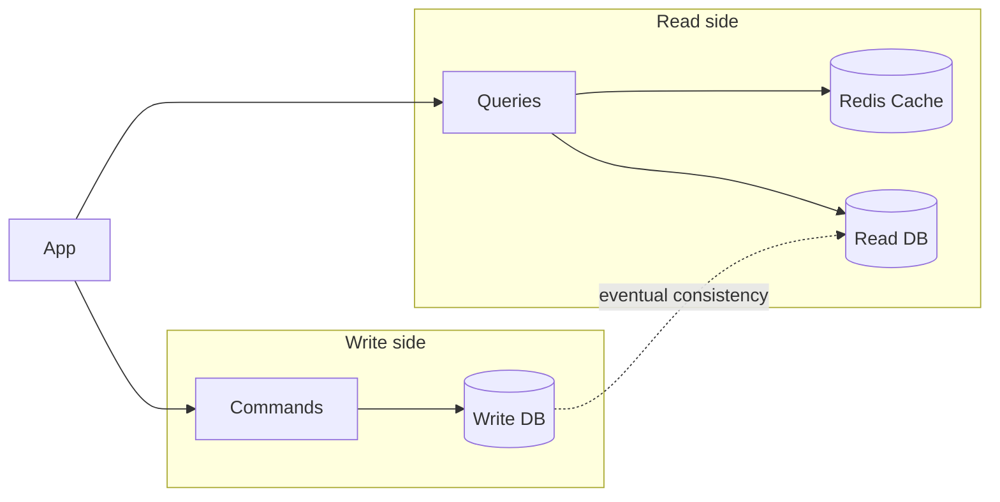

## Minimal API: Custom CQRS and Mediator Pattern


### What is CQRS?

**CQRS** stands for **Command Query Responsibility Segregation**.

It is an architectural pattern that separates **read operations** from **write operations**.

* **Command** → changes application state
* **Query** → reads application state

Instead of putting all application operations into the same service, CQRS encourages us to organize them into focused commands and queries.

<Figure
  src="/learn/dotnet-api/02-cqrs-and-mediator-pattern/Gemini_Generated_Image_e.jpeg"
  alt="CQRS"
  caption="Fig 1. CQRS architecture"
  width="500"
  priority
/>


### Why use CQRS?

CQRS can be useful when an application has a strong need for **separation of concerns**, **single responsibility**, or independent scaling of reads and writes.

For example, if an application performs many more reads than writes, the read side can be optimized independently.



Possible benefits:

* Clear separation between reads and writes
* Smaller, focused handlers
* Independent optimization of read and write operations
* Read-side caching, such as Redis
* Easier scaling of read-heavy systems

#### Trade-offs

CQRS also introduces additional complexity:

* More classes and files
* More infrastructure
* Possible synchronization between read and write databases
* Eventual consistency may need to be handled
* More complicated debugging and deployment

**CQRS should therefore be driven by the application's requirements, not used automatically.**

---

### CQRS and the Mediator Pattern

CQRS enforces the separation of concerns by creating focused handlers instead of having one large <Mark type="underline">**God Service**</Mark>, <Mark type="strike-through" color="danger">`ProductService`</Mark> containing every product operation.

So instread of :

```csharp
public class ProductService{
    public void CreateProduct(Product product)  {}
    public void UpdateProduct(Product product) {}
    public void DeleteProduct(Product product) {}
    public Product GetProduct(int id) {}
    public List<Product> GetProducts() {}
}
```

We have the following handlers:

```csharp
public class CreateProductCommandHandler{
    public void Handle(CreateProductCommand command) {}
}
public class UpdateProductCommandHandler{
    public void Handle(UpdateProductCommand command) {}
}
public class DeleteProductCommandHandler{
    public void Handle(DeleteProductCommand command) {}
}
public class GetProductQueryHandler{
    public void Handle(GetProductQuery query) {}
}
public class GetProductsQueryHandler{
    public void Handle(GetProductsQuery query) {}
}
```
    

However, another problem appears:

> Too many dependencies in the controller!!!

---

#### The problem without Mediator


Without a mediator, a controller may need to depend on many handlers:

```csharp
public ProductController(
    CreateProductHandler createHandler,
    UpdateProductHandler updateHandler,
    DeleteProductHandler deleteHandler,
    RateProductHandler rateHandler,
    GetProductHandler getProductHandler,
    GetProductsHandler getProductsHandler)
{
    _createHandler = createHandler;
    _updateHandler = updateHandler;
    _deleteHandler = deleteHandler;
    _rateHandler = rateHandler;
    _getProductHandler = getProductHandler;
    _getProductsHandler = getProductsHandler;
}
```

As the number of commands and queries grows, controllers accumulate dependencies.

This also creates more manual dependency-registration work.

---

#### What does Mediator solve?

The **Mediator Pattern** provides a central communication mechanism between the caller and the appropriate handler.

<Figure
  src="/learn/dotnet-api/02-cqrs-and-mediator-pattern/Gemini_Generated_Image_3sac3a3sac3a3sac.jpeg"
  alt="Handler registration"
  caption="Fig 2. With or without Mediator pattern"
  width="900"
/>

With a mediator such as **MediatR**, the controller only needs one dependency:

```csharp
public ProductController(IMediator mediator)
{
    _mediator = mediator;
}
```

The controller sends a request:

```csharp
await _mediator.Send(
    new CreateProductCommand(...)
);
```

The mediator locates the appropriate handler and dispatches the request.


With handler registration or assembly scanning, handlers can also be discovered automatically.


### Key Takeaway

**CQRS separates responsibilities.**

**Mediator simplifies communication with those responsibilities.**

Together they can keep:

* Controllers **thin**
* Handlers **focused**
* Dependencies **manageable**
* Application behavior **well organized**

However, **Mediator is not required for CQRS**. CQRS can be implemented without MediatR or any mediator library; the mediator is an additional pattern that helps with request dispatching and dependency management.

## Custom Mediator Pattern: 1. Command and Query Requests

<Guide numbered stepHeadingLevel={3}>
<GuideStep title="The Architecture: Interfaces">

The public API is intentionally shape-compatible with MediatR 12. 

```
backend/src/Shared/Mediator/
├── Mediator.csproj
├── Contracts/
│   ├── IRequest.cs
│   ├── IRequestHandler.cs
│   ├── IPipelineBehavior.cs
│   └── IMediator.cs
└── Dispatcher/
    ├── DispatcherRegistry.cs
    ├── RequestHandlerWrapper.cs
    ├── Dispatcher.cs
    └── DispatcherRegistration.cs
```
Create the **Mediator class library**, add it to the solution, and reference it from
the API (from `MyApp/backend/`, the solution root):

```bash
# from MyApp/backend/  (the solution root)

dotnet new classlib -n Mediator -o src/Shared/Mediator --framework net10.0
dotnet sln MyApp.slnx add src/Shared/Mediator/Mediator.csproj
dotnet add src/Services/MyApp.Api/MyApp.Api.csproj reference src/Shared/Mediator/Mediator.csproj

# DI abstractions for IServiceCollection / GetRequiredService
dotnet add src/Shared/Mediator package Microsoft.Extensions.DependencyInjection.Abstractions

# Dir & files:
rm -f src/Shared/Mediator/Class1.cs
mkdir -p src/Shared/Mediator/Contracts
mkdir -p src/Shared/Mediator/Dispatcher
touch src/Shared/Mediator/Contracts/IRequest.cs
touch src/Shared/Mediator/Contracts/IRequestHandler.cs
touch src/Shared/Mediator/Contracts/IPipelineBehavior.cs
touch src/Shared/Mediator/Contracts/IMediator.cs
touch src/Shared/Mediator/Dispatcher/DispatcherRegistry.cs
touch src/Shared/Mediator/Dispatcher/RequestHandlerWrapper.cs
touch src/Shared/Mediator/Dispatcher/Dispatcher.cs
touch src/Shared/Mediator/Dispatcher/DispatcherRegistration.cs
```

Mediator <Mark type="underline" color="tip">sends</Mark> a <Mark type="underline" color="default">request or message</Mark><Mark type="underline" color="tip">from a caller to a handler</Mark>. For this to work, we need to define the request and handler interfaces:

```csharp title="src/Shared/Mediator/Contracts/IRequest.cs"
namespace Mediator;

// Marker for any request that returns a response
public interface IRequest<out TResponse>;
// Void-equivalent for commands with no return value
public interface IRequest : IRequest<Unit>;
public readonly struct Unit
{
    public static readonly Unit Value = default;
}
```

Usage:

<CodeTabs>

```csharp title="Products/CreateProduct/CreateProductCommand.cs"
public sealed record CreateProductCommand(
    string Name,
    string Category,
    decimal Price,
    int Stock) : IRequest<Guid>;
```

```csharp title="Products/GetProduct/GetProductQuery.cs"
public sealed record GetProductQuery(Guid Id) : IRequest<ProductDto?>;
```

```csharp title="Products/GetProducts/GetProductsQuery.cs"
public sealed record GetProductsQuery() : IRequest<List<ProductDto>>;
```
</CodeTabs>

Mediator interface defines the `Send` method that takes the request of Type `TRequest` and returns a response of Type `TResponse`:


```csharp title="src/Shared/Mediator/Contracts/IMediator.cs"
namespace Mediator;

public interface IMediator
{
    ValueTask<TResponse> Send<TResponse>(
        IRequest<TResponse> request,
        CancellationToken cancellationToken = default);
}
```

So the the client we can send a request to the mediator which then dispatches the request to the appropriate handler.

<CodeTabs>

```csharp title="Products/GetProduct/GetProductEndpoint.cs" showLineNumbers {15}
public class GetProductEndpoint : ICarterModule
{
    public void AddRoutes(IEndpointRouteBuilder app)
    {
        app.MapGet("/products/{id:guid}", HandleAsync)
            .WithName("GetProduct")
            .WithTags("Products");
    }

    private async Task<Results<Ok<ProductDto>, NotFound>> HandleAsync(
        Guid id,
        IMediator mediator,
        CancellationToken ct)
    {
        var product = await mediator.Send(new GetProductQuery(id), ct);
        return product is null ? TypedResults.NotFound() : TypedResults.Ok(product);
    }
}
```


```csharp title="Products/GetProducts/GetProductsEndpoint.cs" showLineNumbers {15}
public class GetProductsEndpoint : ICarterModule
{
    public void AddRoutes(IEndpointRouteBuilder app)
    {
        app.MapGet("/products", HandleAsync)
            .WithName("GetProducts")
            .WithTags("Products")
            .Produces<List<ProductDto>>(StatusCodes.Status200OK);
    }

    private async Task<Ok<List<ProductDto>>> HandleAsync(
        IMediator mediator,
        CancellationToken ct)
    {
        var products = await mediator.Send(new GetProductsQuery(), ct);
        return TypedResults.Ok(products);
    }
}
```

```csharp title="MyApp.Api/Features/Products/CreateProduct/CreateProductEndpoint.cs" showLineNumbers {14}
public class CreateProductEndpoint : ICarterModule
{
    public void AddRoutes(IEndpointRouteBuilder app)
    {
        app.MapPost("/products", HandleAsync)
            .WithName("CreateProduct")
            .WithTags("Products");
    }
    private async Task<Created<Guid>> HandleAsync(
        CreateProductCommand command,
        IMediator mediator,
        CancellationToken ct)
    {
        var id = await mediator.Send(command, ct); // note we can pass the command directly without creating a new instance unlike query requests
        return TypedResults.Created($"/products/{id}", id);
    }
}

```

</CodeTabs>


<Figure
  src="/learn/dotnet-api/02-cqrs-and-mediator-pattern/endpoint-mediator-message.png"
  alt="Mediator Sending a Message"
  caption="Fig 2. Mediator Sending a Message"
  width="900"
/>


Now we need to define the handlers for <Mark type="underline" color="tip">each requests message</Mark>. The `IRequestHandler` must be same as the <Mark type="underline" color="tip">request type and the response type</Mark> of the <Mark type="circle" note=": IRequest<TResponse>" noteLayout="floating" noteSide="right">request message</Mark> as shown below:


```csharp title="src/Shared/Mediator/Contracts/IRequestHandler.cs" showLineNumbers {4}
namespace Mediator;

public interface IRequestHandler<in TRequest, TResponse>
    where TRequest : IRequest<TResponse>
{
    ValueTask<TResponse> Handle(TRequest request, CancellationToken cancellationToken);
}
```

The one MediatR-incompatible decision: <Mark type="box" color="info">`ValueTask<TResponse>`</Mark> instead of `Task<TResponse>`. `ValueTask<T>` avoids the heap allocation when a handler completes synchronously — a measurable win for cached queries and trivial commands. The cost is that callers cannot await a `ValueTask` more than once, which is rarely a problem in practice.

Usage:


<CodeTabs>

```csharp title="Products/GetProduct/GetProductsQueryHandler.cs" 
internal sealed class GetProductsQueryHandler(AppDbContext dbContext)
    : IRequestHandler<GetProductsQuery, List<ProductDto>>
{
    public async ValueTask<List<ProductDto>> Handle(
        GetProductsQuery query,
        CancellationToken cancellationToken)
    {
        return await dbContext.Products
            .AsNoTracking()
            .OrderByDescending(p => p.CreatedAt) // Newest first
            .Select(p => new ProductDto(
                p.Id,
                p.Name,
                p.Category,
                p.Price,
                p.Stock))
            .ToListAsync(cancellationToken);
    }
}
```

```csharp title="Products/CreateProduct/CreateProductCommandHandler.cs" 
internal sealed class CreateProductCommandHandler(
    AppDbContext dbContext,
    ILogger<CreateProductCommandHandler> logger)
    : IRequestHandler<CreateProductCommand, Guid>
{
    public async ValueTask<Guid> Handle(
        CreateProductCommand command,
        CancellationToken cancellationToken)
    {
        var product = new Product
        {
            Id = Guid.NewGuid(),
            Name = command.Name,
            Category = command.Category,
            Price = command.Price,
            Stock = command.Stock,
            CreatedAt = DateTime.UtcNow
        };
        dbContext.Products.Add(product);

        // SaveChanges is now handled directly inside the command handler
        await dbContext.SaveChangesAsync(cancellationToken);

        logger.LogInformation("Product {ProductId} created", product.Id);
        return product.Id;
    }
}
```

```csharp title="Products/UpdateProduct/GetProductQueryHandler.cs" 
internal sealed class GetProductQueryHandler(
    AppDbContext dbContext)
    : IRequestHandler<GetProductQuery, ProductDto?>
{
    public async ValueTask<ProductDto?> Handle(
        GetProductQuery query,
        CancellationToken cancellationToken)
    {
        var product = await dbContext.Products
            .AsNoTracking()
            .FirstOrDefaultAsync(p => p.Id == query.Id, cancellationToken);

        return product is null
            ? null
            : new ProductDto(
                product.Id,
                product.Name,
                product.Category,
                product.Price,
                product.Stock);
    }
}
```

</CodeTabs>

<Figure
  src="/learn/dotnet-api/02-cqrs-and-mediator-pattern/handler.png"
  alt="Handler receiving a message from the mediator"
  caption="Fig 2. Handler receiving a message from the mediator and returning a response"
  width="900"
/>

The figure shows the it receives the request message from the mediator and returns the response.


</GuideStep>
<GuideStep title="The Dispatcher: FrozenDictionary + Typed Wrappers">

The core idea: at startup, scan the assembly for every `IRequestHandler<TRequest, TResponse>` implementation. For each one, build a strongly-typed `RequestHandlerWrapper<TRequest, TResponse>` instance. Store all wrappers in a `FrozenDictionary<Type, RequestHandlerBase>` keyed by the concrete request type. At dispatch time, look up the wrapper and call into it. <Mark type="underline">No per-call reflection. No per-call `MakeGenericType`.</Mark>


<Guide stepHeadingLevel={4}>
<GuideStep title="DI Registration: One Extension Method">

```csharp title="src/Shared/Mediator/MediatorRegistration.cs"
// MediatorRegistration.cs
using System.Collections.Frozen;
using System.Reflection;
using Microsoft.Extensions.DependencyInjection;

namespace Mediator;

public static class MediatorRegistration
{
    public static void RegisterRequestHandlers(this IServiceCollection services,
        params Assembly[] assemblies)
    {
        var requestWrappers = new Dictionary<Type, RequestHandlerBase>();
        foreach (var assembly in assemblies)
        {
            foreach (var type in assembly.GetTypes())
            {
                if (type.IsAbstract || type.IsInterface)
                    continue;
                foreach (var iface in type.GetInterfaces())
                {
                    if (!iface.IsGenericType)
                        continue;
                    var genericDef = iface.GetGenericTypeDefinition();
                    if (genericDef != typeof(IRequestHandler<,>)) continue;
                    // Register handler in DI
                    services.AddScoped(iface, type);
                    // Build wrapper once at startup
                    var args = iface.GetGenericArguments();
                    var requestType = args[0];
                    var responseType = args[1];
                    if (requestWrappers.ContainsKey(requestType)) continue;
                    var wrapperType = typeof(RequestHandlerWrapper<,>)
                        .MakeGenericType(requestType, responseType);
                    requestWrappers[requestType] =
                        (RequestHandlerBase)Activator.CreateInstance(wrapperType)!;
                }
            }
        }
        var registry = new MediatorRegistry(requestWrappers.ToFrozenDictionary());
        services.AddSingleton(registry);
        services.AddScoped<Mediator>();
        services.AddScoped<IMediator>(sp => sp.GetRequiredService<Mediator>());
    }
}

```
  The `MakeGenericType` and `Activator.CreateInstance` calls <Mark type="underline" color="default">happen once per handler type at startup</Mark> and all the <Mark type="highlight" color="accent">handlers are stored in a frozen lookup table</Mark>. The hot dispatch path <Mark type="underline" color="tip">never touches reflection again</Mark>. This is the crucial design decision: pay the reflection cost once, when types are known, and store the result in a frozen lookup table.


Call the `RegisterRequestHandlers` via extension method for `IServiceCollection` in the `DependencyInjection.cs` file:

```csharp title="src/Services/MyApp.Api/Application/DependencyInjection.cs"
public static class ApplicationServiceCollectionExtensions
{
// [!code focus:2]
    public static IServiceCollection AddApplication(
        this IServiceCollection services)
    {

// [!code focus:2]
        // Mediator - discovers all handlers in this assembly
        services.RegisterRequestHandlers(Assembly.GetExecutingAssembly());

        // ..... other services registration .....
        return services;
    }
}
```

The `RegisterRequestHandlers` extension method scans the assembly, registers the handlers and builds the frozen lookup table.


<Figure
  src="/learn/dotnet-api/02-cqrs-and-mediator-pattern/registration.png"
  alt="Mediator Registration in action"
  caption="Fig 2. Mediator Registration in action"
  width="900"
  priority
/>

The dispatch path is one dictionary lookup, one reference cast, one virtual call. FrozenDictionary shipped in .NET and is purpose-built for read-heavy lookup tables that are frozen after construction.

</GuideStep>


  <GuideStep title="The Wrapper Hierarchy">
  
```csharp title="src/Shared/Mediator/RequestHandlerWrapper.cs"
// RequestHandlerWrapper.cs

using Microsoft.Extensions.DependencyInjection;

namespace Mediator;

internal abstract class RequestHandlerBase;

internal abstract class RequestHandlerBase<TResponse> : RequestHandlerBase
{
    public abstract ValueTask<TResponse> Handle(
        IRequest<TResponse> request,
        IServiceProvider provider,
        CancellationToken cancellationToken);
}

internal sealed class RequestHandlerWrapper<TRequest, TResponse> : RequestHandlerBase<TResponse>
    where TRequest : IRequest<TResponse>
{
    public override ValueTask<TResponse> Handle(
        IRequest<TResponse> request,
        IServiceProvider provider,
        CancellationToken cancellationToken)
    {
        var typed = (TRequest)request;
        // Resolve handler from DI and invoke directly
        var handler = provider.GetRequiredService<IRequestHandler<TRequest, TResponse>>();
        return handler.Handle(typed, cancellationToken);
    }
}

```

  </GuideStep>
  <GuideStep title="The Mediator">

```csharp title="src/Shared/Mediator/Dispatcher/DispatcherRegistry.cs"
// Mediator.cs
namespace Mediator;

internal sealed class Mediator(
    IServiceProvider provider,
    MediatorRegistry registry) : IMediator
{
    public ValueTask<TResponse> Send<TResponse>(
        IRequest<TResponse> request,
        CancellationToken cancellationToken = default)
    {
        ArgumentNullException.ThrowIfNull(request);
        if (!registry.RequestWrappers.TryGetValue(request.GetType(), out var wrapper))
        {
            throw new InvalidOperationException(
                $"No handler registered for request type '{request.GetType().FullName}'. " +
                $"Ensure the handler implements IRequestHandler<{request.GetType().Name}, TResponse> " +
                $"and that RegisterRequestHandlers scanned the correct assembly.");
        }
        // Reference-type cast - cheap, no boxing
        return ((RequestHandlerBase<TResponse>)wrapper).Handle(request, provider, cancellationToken);
    }
}
```

<Figure
  src="/learn/dotnet-api/02-cqrs-and-mediator-pattern/request-handler.png"
  alt="Mediator in action"
  caption="Fig 2. Mediator in action"
  width="900"
/>

<Figure
  src="/learn/dotnet-api/02-cqrs-and-mediator-pattern/request-handler-wrapper.png"
  alt="Request Handler Wrapper in action"
  caption="Request Handler Wrapper gets the handler from the DI container and invokes it according to the request type sent by the mediator"
  width="900"
/>

In the figures we can see the mediator is sending a message to the request handler wrapper which then gets the handler from the DI container and invokes it according to the request type sent by the mediator.

</GuideStep>
  

</Guide>


Why this design works:

- **Startup reflection cost is paid once.** `RegisterRequestHandlers` scans the assembly,
  calls `MakeGenericType` per handler, and stores the result in a `FrozenDictionary`.
  The hot dispatch path is a dictionary lookup + a virtual method call.
- **`ValueTask<T>` instead of `Task<T>`** avoids a heap allocation when the handler
  completes synchronously (cached queries, trivial commands).
- **Behaviors compose in registration order.** The reverse iteration in the wrapper
  makes the first registered behavior run outermost — same semantics as MediatR.

</GuideStep>
</Guide>

## Custom Mediator Pattern: 2. Behaviors Pipelines

Apart from the command and query requests, we can also add behaviors to the mediator pattern. Behaviors are a way to add additional functionality to the request pipeline. They are similar to middleware in ASP.NET Core. We can add behaviors to the request pipeline to add additional functionality to the request pipeline. For example, we can add logging to the request pipeline to log the request and response. We can add validation to the request pipeline to validate the request. We can add authorization to the request pipeline to authorize the request. We can add caching to the request pipeline to cache the response. We can add error handling to the request pipeline to handle errors.

<Figure
  src="/learn/dotnet-api/02-cqrs-and-mediator-pattern/Gemini_Generated_Image_hauiwthauiwthaui.jpeg"
  alt="Pipeline Behaviors: iterating in reverse wraps the core handler inside nested delegates, driving requests inward and responses outward through next()"
  caption="How Mediator constructs and executes pipeline behaviors: iterating in reverse wraps the core handler inside nested delegates, driving requests inward and responses outward through next()"
  width="900"
/>


<Guide numbered stepHeadingLevel={3}>

<GuideStep title="Pipelines Interfaces Definition">

```csharp title="src/Shared/Mediator/Contracts/IPipelineBehavior.cs"
namespace Mediator;

public delegate ValueTask<TResponse> RequestHandlerDelegate<TResponse>(
    CancellationToken cancellationToken = default);

public interface IPipelineBehavior<in TRequest, TResponse>
    where TRequest : IRequest<TResponse>
{
    ValueTask<TResponse> Handle(
        TRequest request,
        RequestHandlerDelegate<TResponse> next,
        CancellationToken cancellationToken);
}

```
</GuideStep>

The `RequestHandlerDelegate<TResponse>` is a delegate that represents the next handler in the pipeline. It is used to invoke the next handler in the pipeline. The `IPipelineBehavior<TRequest, TResponse>` is a interface that represents a pipeline behavior. It is used to add additional functionality to the request pipeline.


<GuideStep title="Update in The Wrapper Hierarchy">

```csharp title="src/Shared/Mediator/Contracts/IPipelineBehavior.cs" showLineNumbers {12-22}
internal sealed class RequestHandlerWrapper<TRequest, TResponse> : RequestHandlerBase<TResponse>
    where TRequest : IRequest<TResponse>
{
    public override ValueTask<TResponse> Handle(
        IRequest<TResponse> request,
        IServiceProvider provider,
        CancellationToken cancellationToken)
    {
        var typed = (TRequest)request;
        // Resolve handler from DI and invoke directly
        var handler = provider.GetRequiredService<IRequestHandler<TRequest, TResponse>>();
        var behaviors = provider.GetServices<IPipelineBehavior<TRequest, TResponse>>();
        // Build the pipeline: handler at the core, behaviors wrapped outside.
        // Iterating in reverse means the first registered behavior runs outermost.
        RequestHandlerDelegate<TResponse> pipeline = ct => handler.Handle(typed, ct);
        foreach (var behavior in behaviors.Reverse())
        {
            var next = pipeline;
            var current = behavior;
            pipeline = ct => current.Handle(typed, next, ct);
        }
        return pipeline(cancellationToken);
    }
}

```
</GuideStep>

In this step we are updating the request handler wrapper to include the behaviors. We are getting the behaviors from the DI container and building the pipeline. We are iterating in reverse so the first registered behavior runs outermost.

<GuideStep title="AddPipelineBehavior Extension Method">

```csharp title="src/Shared/Mediator/MediatorPipelineBehaviorExtension.cs"
using Microsoft.Extensions.DependencyInjection;

namespace Mediator;

public static class MediatorPipelineBehaviorExtension
{
    public static IServiceCollection AddPipelineBehavior(
        this IServiceCollection services,
        Type openGenericBehaviorType)
    {
        services.AddScoped(typeof(IPipelineBehavior<,>), openGenericBehaviorType);
        return services;
    }
}
```


<Mark type="underline" color="default">Why not do this like auto-registration we did for the request handlers</Mark>?

Because we need to add the behaviors to the request pipeline at runtime. We can't do this at compile time like we did for the request handlers. Also we need to control the order of the behaviors in the request pipeline, for example:

Now we need to add the behaviors to the request pipeline at runtime. We can do this by calling the `AddPipelineBehavior` extension method for `IServiceCollection` in the `DependencyInjection.cs` file:

```csharp title="src/Services/MyApp.Api/Application/DependencyInjection.cs"
public static class ApplicationServiceCollectionExtensions
{
    public static IServiceCollection AddApplication(
        this IServiceCollection services)
    {

// [!code focus:8]
        // Mediator - discovers all handlers in this assembly
        services.RegisterRequestHandlers(Assembly.GetExecutingAssembly());
        // Behaviors compose in registration order
        // LoggingBehavior is outermost - sees request first, response last
        services.AddPipelineBehavior(typeof(LoggingBehavior<,>));
        services.AddPipelineBehavior(typeof(ValidationBehavior<,>));
        services.AddPipelineBehavior(typeof(CachingBehavior<,>));
        services.AddPipelineBehavior(typeof(TransactionBehavior<,>));

        // ..... other services registration .....
        return services;
    }
}
```
</GuideStep>

In this step we are adding the behaviors to the request pipeline. We are iterating in reverse so the first registered behavior runs outermost.

<Guide title="Defining Common Pipeline Behaviors" numbered headingLevel={3} stepHeadingLevel={4}>

Real pipeline behaviors are cross-cutting, composable, and open-generic so they apply to every handler without per-command wiring.

For this We need to create a project in `Shared` called `Application` that will contain the common pipeline behaviors.
 
```bash
# from MyApp/backend/  (the solution root)
 
dotnet new classlib -n Shared.Application -o src/Shared/Application
dotnet sln MyApp.slnx add src/Shared/Application/Shared.Application.csproj
dotnet add src/Services/MyApp.Api/MyApp.Api.csproj reference src/Shared/Application/Shared.Application.csproj

# add mediator reference
dotnet add src/Shared/Application/Shared.Application.csproj reference src/Shared/Mediator/Mediator.csproj

# Dir & files:
rm -f  src/Shared/Application/Class1.cs
mkdir -p src/Shared/Application/Behaviors
touch src/Shared/Application/Behaviors/BehaviorRegistration.cs
touch src/Shared/Application/Behaviors/ValidationBehavior.cs
touch src/Shared/Application/Behaviors/LoggingBehavior.cs
touch src/Shared/Application/Behaviors/CachingBehavior.cs
touch src/Shared/Application/Behaviors/TransactionBehavior.cs

```

Now let's define the behaviors in the `Behaviors` folder.

<GuideStep title="1. Logging Behavior">

```csharp title="src/Shared/Application/Behaviors/LoggingBehavior.cs"
// Behaviors/LoggingBehavior.cs
using System.Diagnostics;
using Mediator;
using Microsoft.Extensions.Logging;

namespace Shared.Application.Behaviors;

public sealed class LoggingBehavior<TRequest, TResponse>(
    ILogger<LoggingBehavior<TRequest, TResponse>> logger)
    : IPipelineBehavior<TRequest, TResponse>
    where TRequest : IRequest<TResponse>
{
    public async ValueTask<TResponse> Handle(
        TRequest request,
        RequestHandlerDelegate<TResponse> next,
        CancellationToken cancellationToken)
    {
        var requestName = typeof(TRequest).Name;
        logger.LogInformation("→ {RequestName} started", requestName);
        var stopwatch = Stopwatch.StartNew();
        try
        {
            var response = await next(cancellationToken);
            stopwatch.Stop();
            logger.LogInformation(
                "← {RequestName} completed in {ElapsedMs}ms",
                requestName,
                stopwatch.ElapsedMilliseconds);
            return response;
        }
        catch (Exception ex)
        {
            stopwatch.Stop();
            logger.LogError(
                ex,
                "✕ {RequestName} failed after {ElapsedMs}ms",
                requestName,
                stopwatch.ElapsedMilliseconds);
            throw;
        }
    }
}
```


</GuideStep>


<GuideStep title="2. ValidationBehavior with FluentValidation">


Required installations:

```bash
dotnet add src/Shared/Application/Shared.Application.csproj package Microsoft.Extensions.Caching.Hybrid
dotnet add src/Shared/Application/Shared.Application.csproj package FluentValidation
```

```csharp title="src/Shared/Application/Behaviors/ValidationBehavior.cs"
using FluentValidation;
using Mediator;

namespace Shared.Application.Behaviors;

public sealed class ValidationBehavior<TRequest, TResponse>(
    IEnumerable<IValidator<TRequest>> validators)
    : IPipelineBehavior<TRequest, TResponse>
    where TRequest : IRequest<TResponse>
{
    public async ValueTask<TResponse> Handle(
        TRequest request,
        RequestHandlerDelegate<TResponse> next,
        CancellationToken cancellationToken)
    {
        if (!validators.Any())
            return await next(cancellationToken);
        var context = new ValidationContext<TRequest>(request);
        var validationResults = await Task.WhenAll(
            validators.Select(v => v.ValidateAsync(context, cancellationToken)));
        var failures = validationResults
            .SelectMany(r => r.Errors)
            .Where(f => f is not null)
            .ToList();
        if (failures.Count != 0)
            throw new ValidationException(failures);
        return await next(cancellationToken);
    }
}
```       

Now let's define validator for product creation request:

```csharp title="/Features/Products/CreateProduct/CreateProductValidator.cs"
using FluentValidation;

namespace MyApp.Features.Products.CreateProduct;

public sealed class CreateProductValidator : AbstractValidator<CreateProductCommand>
{
    public CreateProductValidator()
    {
        RuleFor(x => x.Name).MinimumLength(3).MaximumLength(100);
        RuleFor(x => x.Category).MinimumLength(3).MaximumLength(50);
        RuleFor(x => x.Price).GreaterThan(0);
        RuleFor(x => x.Stock).GreaterThanOrEqualTo(0);
    }
}
```
</GuideStep>

<GuideStep title="3. Caching Behavior">

```bash
dotnet add src/Shared/Application/Shared.Application.csproj package Microsoft.Extensions.Caching.Hybrid
```

```csharp title="src/Shared/Application/Behaviors/CachingBehavior.cs"
// Behaviors/ICacheable.cs

using Mediator;
using Microsoft.Extensions.Caching.Hybrid;
using Microsoft.Extensions.Logging;

namespace Shared.Application.Behaviors;

public interface ICacheable
{
    string CacheKey { get; }
    TimeSpan? Expiration => null;
}

// Behaviors/CachingBehavior.cs
public sealed class CachingBehavior<TRequest, TResponse>(
    HybridCache cache,
    ILogger<CachingBehavior<TRequest, TResponse>> logger)
    : IPipelineBehavior<TRequest, TResponse>
    where TRequest : IRequest<TResponse>
{
    public async ValueTask<TResponse> Handle(
        TRequest request,
        RequestHandlerDelegate<TResponse> next,
        CancellationToken cancellationToken)
    {
        if (request is not ICacheable cacheable)
            return await next(cancellationToken);

        var options = cacheable.Expiration is { } expiration
            ? new HybridCacheEntryOptions { Expiration = expiration }
            : null;

        var miss = false;

        var result = await cache.GetOrCreateAsync(
            cacheable.CacheKey,
            async ct =>
            {
                miss = true;
                logger.LogInformation("Cache miss for {Key}", cacheable.CacheKey);
                return await next(ct);
            },
            options,
            cancellationToken: cancellationToken);

        if (!miss)
            logger.LogInformation("Cache hit for {Key}", cacheable.CacheKey);

        return result;
    }
}

```

Add HybridCache to the `DependencyInjection.cs` file:

```csharp title="src/Services/MyApp.Api/Application/DependencyInjection.cs"
public static class ApplicationServiceCollectionExtensions
{
    public static IServiceCollection AddApplication(
        this IServiceCollection services)
    {

        // Mediator - discovers all handlers in this assembly
        services.RegisterRequestHandlers(Assembly.GetExecutingAssembly());
// [!code focus]
        services.AddHybridCache();
        // Behaviors compose in registration order
        // LoggingBehavior is outermost - sees request first, response last
        services.AddPipelineBehavior(typeof(LoggingBehavior<,>));
        services.AddPipelineBehavior(typeof(ValidationBehavior<,>));
// [!code focus]
        services.AddPipelineBehavior(typeof(CachingBehavior<,>));
        //,.....
    }
}
```

Required Changes:

Implement `ICacheable` interface in the query:

```csharp title="/Features/Products/GetProduct/GetProductQuery.cs"
public sealed record GetProductQuery(Guid Id) : IRequest<ProductDto?>, ICacheable
{
    public string CacheKey => $"product:{Id}";
    public TimeSpan? Expiration => TimeSpan.FromMinutes(5);
}
```
</GuideStep>


<GuideStep title="4. (Optional) Transaction Behavior">
    
Since transaction requires dbcontext, we will define it in the `Infrastructure` project.

```csharp title="src/Services/MyApp.Api/Persistence/TransactionBehavior.cs"
namespace MyApp.Persistence;

// Behaviors/TransactionBehavior.cs
public sealed class TransactionBehavior<TRequest, TResponse>(
    AppDbContext dbContext,
    ILogger<TransactionBehavior<TRequest, TResponse>> logger)
    : IPipelineBehavior<TRequest, TResponse>
    where TRequest : IRequest<TResponse>
{
    public async ValueTask<TResponse> Handle(
        TRequest request,
        RequestHandlerDelegate<TResponse> next,
        CancellationToken cancellationToken)
    {
        // Only wrap commands, not queries
        if (typeof(TRequest).Name.EndsWith("Query"))
            return await next(cancellationToken);
        await using var transaction = await dbContext.Database
            .BeginTransactionAsync(cancellationToken);
        try
        {
            var response = await next(cancellationToken);
            await dbContext.SaveChangesAsync(cancellationToken);
            await transaction.CommitAsync(cancellationToken);
            return response;
        }
        catch
        {
            await transaction.RollbackAsync(cancellationToken);
            throw;
        }
    }
}
```

Now we no longer need to call `SaveChangesAsync` in the handler.

```csharp title="/Features/Products/CreateProduct/CreateProductCommandHandler.cs"
internal sealed class CreateProductCommandHandler() : IRequestHandler<CreateProductCommand, Guid>
{
    public ValueTask<Guid> Handle()
    {
        try
        {
            var product = new Product
            {
                Id = Guid.NewGuid(),
                Name = command.Name,
                Category = command.Category,
                Price = command.Price,
                Stock = command.Stock,
                CreatedAt = DateTime.UtcNow
            };
            dbContext.Products.Add(product);

            // SaveChanges is now handled directly inside the command handler
            await dbContext.SaveChangesAsync(cancellationToken); // [!code --]
            // SaveChanges is handled by TransactionBehavior
            // No need to call it here
            logger.LogInformation("Product {ProductId} created", product.Id);
            return ValueTask.FromResult(product.Id);
        }
        catch (Exception exception)
        {
            return ValueTask.FromException<Guid>(exception);
        }
    }
}
```

</GuideStep>
    
</Guide>
</Guide>
