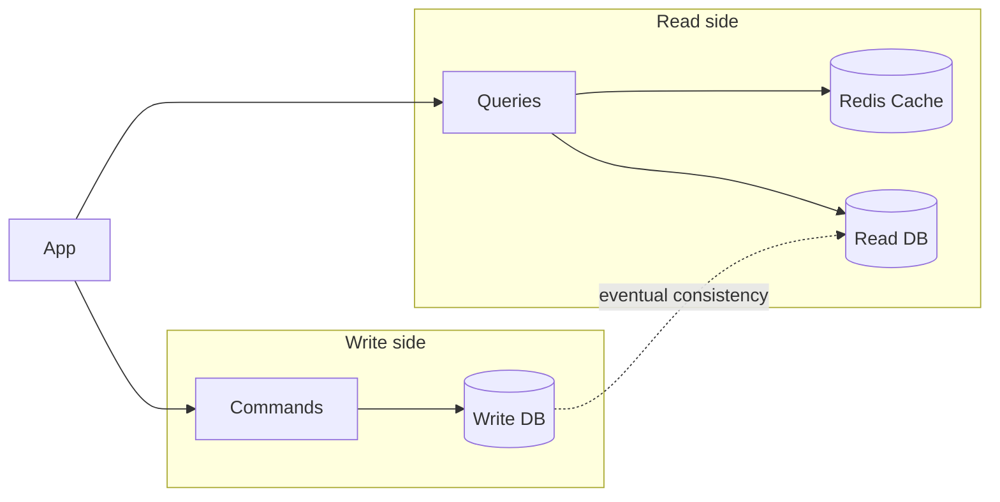

## Minimal API: Custom CQRS and Mediator Pattern


### What is CQRS?

**CQRS** stands for **Command Query Responsibility Segregation**.

It is an architectural pattern that separates **read operations** from **write operations**.

* **Command** → changes application state
* **Query** → reads application state

Instead of putting all application operations into the same service, CQRS encourages us to organize them into focused commands and queries.

<Figure
  src="/learn/dotnet-api/02-cqrs-and-mediator-pattern/Gemini_Generated_Image_e.jpeg"
  alt="CQRS"
  caption="Fig 1. CQRS architecture"
  width="500"
  priority
/>


### Why use CQRS?

CQRS can be useful when an application has a strong need for **separation of concerns**, **single responsibility**, or independent scaling of reads and writes.

For example, if an application performs many more reads than writes, the read side can be optimized independently.



Possible benefits:

* Clear separation between reads and writes
* Smaller, focused handlers
* Independent optimization of read and write operations
* Read-side caching, such as Redis
* Easier scaling of read-heavy systems

#### Trade-offs

CQRS also introduces additional complexity:

* More classes and files
* More infrastructure
* Possible synchronization between read and write databases
* Eventual consistency may need to be handled
* More complicated debugging and deployment

**CQRS should therefore be driven by the application's requirements, not used automatically.**

---

### CQRS and the Mediator Pattern

CQRS enforces the separation of concerns by creating focused handlers instead of having one large <Mark type="underline">**God Service**</Mark>, <Mark type="strike-through" color="danger">`ProductService`</Mark> containing every product operation.

So instread of :

```csharp
public class ProductService{
    public void CreateProduct(Product product)  {}
    public void UpdateProduct(Product product) {}
    public void DeleteProduct(Product product) {}
    public Product GetProduct(int id) {}
    public List<Product> GetProducts() {}
}
```

We have the following handlers:

```csharp
public class CreateProductCommandHandler{
    public void Handle(CreateProductCommand command) {}
}
public class UpdateProductCommandHandler{
    public void Handle(UpdateProductCommand command) {}
}
public class DeleteProductCommandHandler{
    public void Handle(DeleteProductCommand command) {}
}
public class GetProductQueryHandler{
    public void Handle(GetProductQuery query) {}
}
public class GetProductsQueryHandler{
    public void Handle(GetProductsQuery query) {}
}
```
    

However, another problem appears:

> Too many dependencies in the controller!!!

---

#### The problem without Mediator


Without a mediator, a controller may need to depend on many handlers:

```csharp
public ProductController(
    CreateProductHandler createHandler,
    UpdateProductHandler updateHandler,
    DeleteProductHandler deleteHandler,
    RateProductHandler rateHandler,
    GetProductHandler getProductHandler,
    GetProductsHandler getProductsHandler)
{
    _createHandler = createHandler;
    _updateHandler = updateHandler;
    _deleteHandler = deleteHandler;
    _rateHandler = rateHandler;
    _getProductHandler = getProductHandler;
    _getProductsHandler = getProductsHandler;
}
```

As the number of commands and queries grows, controllers accumulate dependencies.

This also creates more manual dependency-registration work.

---

#### What does Mediator solve?

The **Mediator Pattern** provides a central communication mechanism between the caller and the appropriate handler.

<Figure
  src="/learn/dotnet-api/02-cqrs-and-mediator-pattern/Gemini_Generated_Image_3sac3a3sac3a3sac.jpeg"
  alt="Handler registration"
  caption="Fig 2. With or without Mediator pattern"
  width="900"
/>

With a mediator such as **MediatR**, the controller only needs one dependency:

```csharp
public ProductController(IMediator mediator)
{
    _mediator = mediator;
}
```

The controller sends a request:

```csharp
await _mediator.Send(
    new CreateProductCommand(...)
);
```

The mediator locates the appropriate handler and dispatches the request.


With handler registration or assembly scanning, handlers can also be discovered automatically.


### Key Takeaway

**CQRS separates responsibilities.**

**Mediator simplifies communication with those responsibilities.**

Together they can keep:

* Controllers **thin**
* Handlers **focused**
* Dependencies **manageable**
* Application behavior **well organized**

However, **Mediator is not required for CQRS**. CQRS can be implemented without MediatR or any mediator library; the mediator is an additional pattern that helps with request dispatching and dependency management.

## Custom Mediator Pattern: 1. Command and Query Requests

<Guide numbered stepHeadingLevel={3}>
<GuideStep title="The Architecture: Interfaces">

The public API is intentionally shape-compatible with MediatR 12. 

```
backend/src/Shared/Mediator/
├── Mediator.csproj
├── Contracts/
│   ├── IRequest.cs
│   ├── IRequestHandler.cs
│   ├── IPipelineBehavior.cs
│   └── IMediator.cs
└── Dispatcher/
    ├── DispatcherRegistry.cs
    ├── RequestHandlerWrapper.cs
    ├── Dispatcher.cs
    └── DispatcherRegistration.cs
```
Create the **Mediator class library**, add it to the solution, and reference it from
the API (from `MyApp/backend/`, the solution root):

```bash
# from MyApp/backend/  (the solution root)

dotnet new classlib -n Mediator -o src/Shared/Mediator --framework net10.0
dotnet sln MyApp.slnx add src/Shared/Mediator/Mediator.csproj
dotnet add src/Services/MyApp.Api/MyApp.Api.csproj reference src/Shared/Mediator/Mediator.csproj

# DI abstractions for IServiceCollection / GetRequiredService
dotnet add src/Shared/Mediator package Microsoft.Extensions.DependencyInjection.Abstractions

# Dir & files:
rm -f src/Shared/Mediator/Class1.cs
mkdir -p src/Shared/Mediator/Contracts
mkdir -p src/Shared/Mediator/Dispatcher
touch src/Shared/Mediator/Contracts/IRequest.cs
touch src/Shared/Mediator/Contracts/IRequestHandler.cs
touch src/Shared/Mediator/Contracts/IPipelineBehavior.cs
touch src/Shared/Mediator/Contracts/IMediator.cs
touch src/Shared/Mediator/Dispatcher/DispatcherRegistry.cs
touch src/Shared/Mediator/Dispatcher/RequestHandlerWrapper.cs
touch src/Shared/Mediator/Dispatcher/Dispatcher.cs
touch src/Shared/Mediator/Dispatcher/DispatcherRegistration.cs
```

Mediator <Mark type="underline" color="tip">sends</Mark> a <Mark type="underline" color="default">request or message</Mark><Mark type="underline" color="tip">from a caller to a handler</Mark>. For this to work, we need to define the request and handler interfaces:

```csharp title="src/Shared/Mediator/Contracts/IRequest.cs"
namespace Mediator;

// Marker for any request that returns a response
public interface IRequest<out TResponse>;
// Void-equivalent for commands with no return value
public interface IRequest : IRequest<Unit>;
public readonly struct Unit
{
    public static readonly Unit Value = default;
}
```

Usage:

<CodeTabs>

```csharp title="Products/CreateProduct/CreateProductCommand.cs"
public sealed record CreateProductCommand(
    string Name,
    string Category,
    decimal Price,
    int Stock) : IRequest<Guid>;
```

```csharp title="Products/GetProduct/GetProductQuery.cs"
public sealed record GetProductQuery(Guid Id) : IRequest<ProductDto?>;
```

```csharp title="Products/GetProducts/GetProductsQuery.cs"
public sealed record GetProductsQuery() : IRequest<List<ProductDto>>;
```
</CodeTabs>

Mediator interface defines the `Send` method that takes the request of Type `TRequest` and returns a response of Type `TResponse`:


```csharp title="src/Shared/Mediator/Contracts/IMediator.cs"
namespace Mediator;

public interface IMediator
{
    ValueTask<TResponse> Send<TResponse>(
        IRequest<TResponse> request,
        CancellationToken cancellationToken = default);
}
```

So the the client we can send a request to the mediator which then dispatches the request to the appropriate handler.

<CodeTabs>

```csharp title="Products/GetProduct/GetProductEndpoint.cs" showLineNumbers {15}
public class GetProductEndpoint : ICarterModule
{
    public void AddRoutes(IEndpointRouteBuilder app)
    {
        app.MapGet("/products/{id:guid}", HandleAsync)
            .WithName("GetProduct")
            .WithTags("Products");
    }

    private async Task<Results<Ok<ProductDto>, NotFound>> HandleAsync(
        Guid id,
        IMediator mediator,
        CancellationToken ct)
    {
        var product = await mediator.Send(new GetProductQuery(id), ct);
        return product is null ? TypedResults.NotFound() : TypedResults.Ok(product);
    }
}
```


```csharp title="Products/GetProducts/GetProductsEndpoint.cs" showLineNumbers {15}
public class GetProductsEndpoint : ICarterModule
{
    public void AddRoutes(IEndpointRouteBuilder app)
    {
        app.MapGet("/products", HandleAsync)
            .WithName("GetProducts")
            .WithTags("Products")
            .Produces<List<ProductDto>>(StatusCodes.Status200OK);
    }

    private async Task<Ok<List<ProductDto>>> HandleAsync(
        IMediator mediator,
        CancellationToken ct)
    {
        var products = await mediator.Send(new GetProductsQuery(), ct);
        return TypedResults.Ok(products);
    }
}
```

```csharp title="MyApp.Api/Features/Products/CreateProduct/CreateProductEndpoint.cs" showLineNumbers {14}
public class CreateProductEndpoint : ICarterModule
{
    public void AddRoutes(IEndpointRouteBuilder app)
    {
        app.MapPost("/products", HandleAsync)
            .WithName("CreateProduct")
            .WithTags("Products");
    }
    private async Task<Created<Guid>> HandleAsync(
        CreateProductCommand command,
        IMediator mediator,
        CancellationToken ct)
    {
        var id = await mediator.Send(command, ct); // note we can pass the command directly without creating a new instance unlike query requests
        return TypedResults.Created($"/products/{id}", id);
    }
}

```

</CodeTabs>


<Figure
  src="/learn/dotnet-api/02-cqrs-and-mediator-pattern/endpoint-mediator-message.png"
  alt="Mediator Sending a Message"
  caption="Fig 2. Mediator Sending a Message"
  width="900"
/>


Now we need to define the handlers for <Mark type="underline" color="tip">each requests message</Mark>. The `IRequestHandler` must be same as the <Mark type="underline" color="tip">request type and the response type</Mark> of the <Mark type="circle" note=": IRequest<TResponse>" noteLayout="floating" noteSide="right">request message</Mark> as shown below:


```csharp title="src/Shared/Mediator/Contracts/IRequestHandler.cs" showLineNumbers {4}
namespace Mediator;

public interface IRequestHandler<in TRequest, TResponse>
    where TRequest : IRequest<TResponse>
{
    ValueTask<TResponse> Handle(TRequest request, CancellationToken cancellationToken);
}
```

The one MediatR-incompatible decision: <Mark type="box" color="info">`ValueTask<TResponse>`</Mark> instead of `Task<TResponse>`. `ValueTask<T>` avoids the heap allocation when a handler completes synchronously — a measurable win for cached queries and trivial commands. The cost is that callers cannot await a `ValueTask` more than once, which is rarely a problem in practice.

Usage:


<CodeTabs>

```csharp title="Products/GetProduct/GetProductsQueryHandler.cs" 
internal sealed class GetProductsQueryHandler(AppDbContext dbContext)
    : IRequestHandler<GetProductsQuery, List<ProductDto>>
{
    public async ValueTask<List<ProductDto>> Handle(
        GetProductsQuery query,
        CancellationToken cancellationToken)
    {
        return await dbContext.Products
            .AsNoTracking()
            .OrderByDescending(p => p.CreatedAt) // Newest first
            .Select(p => new ProductDto(
                p.Id,
                p.Name,
                p.Category,
                p.Price,
                p.Stock))
            .ToListAsync(cancellationToken);
    }
}
```

```csharp title="Products/CreateProduct/CreateProductCommandHandler.cs" 
internal sealed class CreateProductCommandHandler(
    AppDbContext dbContext,
    ILogger<CreateProductCommandHandler> logger)
    : IRequestHandler<CreateProductCommand, Guid>
{
    public async ValueTask<Guid> Handle(
        CreateProductCommand command,
        CancellationToken cancellationToken)
    {
        var product = new Product
        {
            Id = Guid.NewGuid(),
            Name = command.Name,
            Category = command.Category,
            Price = command.Price,
            Stock = command.Stock,
            CreatedAt = DateTime.UtcNow
        };
        dbContext.Products.Add(product);

        // SaveChanges is now handled directly inside the command handler
        await dbContext.SaveChangesAsync(cancellationToken);

        logger.LogInformation("Product {ProductId} created", product.Id);
        return product.Id;
    }
}
```

```csharp title="Products/UpdateProduct/GetProductQueryHandler.cs" 
internal sealed class GetProductQueryHandler(
    AppDbContext dbContext)
    : IRequestHandler<GetProductQuery, ProductDto?>
{
    public async ValueTask<ProductDto?> Handle(
        GetProductQuery query,
        CancellationToken cancellationToken)
    {
        var product = await dbContext.Products
            .AsNoTracking()
            .FirstOrDefaultAsync(p => p.Id == query.Id, cancellationToken);

        return product is null
            ? null
            : new ProductDto(
                product.Id,
                product.Name,
                product.Category,
                product.Price,
                product.Stock);
    }
}
```

</CodeTabs>

<Figure
  src="/learn/dotnet-api/02-cqrs-and-mediator-pattern/handler.png"
  alt="Handler receiving a message from the mediator"
  caption="Fig 2. Handler receiving a message from the mediator and returning a response"
  width="900"
/>

The figure shows the it receives the request message from the mediator and returns the response.


</GuideStep>
<GuideStep title="The Dispatcher: FrozenDictionary + Typed Wrappers">

The core idea: at startup, scan the assembly for every `IRequestHandler<TRequest, TResponse>` implementation. For each one, build a strongly-typed `RequestHandlerWrapper<TRequest, TResponse>` instance. Store all wrappers in a `FrozenDictionary<Type, RequestHandlerBase>` keyed by the concrete request type. At dispatch time, look up the wrapper and call into it. <Mark type="underline">No per-call reflection. No per-call `MakeGenericType`.</Mark>


<Guide stepHeadingLevel={4}>
<GuideStep title="DI Registration: One Extension Method">

```csharp title="src/Shared/Mediator/MediatorRegistration.cs"
// MediatorRegistration.cs
using System.Collections.Frozen;
using System.Reflection;
using Microsoft.Extensions.DependencyInjection;

namespace Mediator;

public static class MediatorRegistration
{
    public static void AddDispatcher(this IServiceCollection services,
        params Assembly[] assemblies)
    {
        var requestWrappers = new Dictionary<Type, RequestHandlerBase>();
        foreach (var assembly in assemblies)
        {
            foreach (var type in assembly.GetTypes())
            {
                if (type.IsAbstract || type.IsInterface)
                    continue;
                foreach (var iface in type.GetInterfaces())
                {
                    if (!iface.IsGenericType)
                        continue;
                    var genericDef = iface.GetGenericTypeDefinition();
                    if (genericDef != typeof(IRequestHandler<,>)) continue;
                    // Register handler in DI
                    services.AddScoped(iface, type);
                    // Build wrapper once at startup
                    var args = iface.GetGenericArguments();
                    var requestType = args[0];
                    var responseType = args[1];
                    if (requestWrappers.ContainsKey(requestType)) continue;
                    var wrapperType = typeof(RequestHandlerWrapper<,>)
                        .MakeGenericType(requestType, responseType);
                    requestWrappers[requestType] =
                        (RequestHandlerBase)Activator.CreateInstance(wrapperType)!;
                }
            }
        }
        var registry = new MediatorRegistry(requestWrappers.ToFrozenDictionary());
        services.AddSingleton(registry);
        services.AddScoped<Mediator>();
        services.AddScoped<IMediator>(sp => sp.GetRequiredService<Mediator>());
    }
}

```
  The `MakeGenericType` and `Activator.CreateInstance` calls <Mark type="underline" color="default">happen once per handler type at startup</Mark> and all the <Mark type="highlight" color="accent">handlers are stored in a frozen lookup table</Mark>. The hot dispatch path <Mark type="underline" color="tip">never touches reflection again</Mark>. This is the crucial design decision: pay the reflection cost once, when types are known, and store the result in a frozen lookup table.

<Figure
  src="/learn/dotnet-api/02-cqrs-and-mediator-pattern/registration.png"
  alt="Mediator Registration in action"
  caption="Fig 2. Mediator Registration in action"
  width="900"
  priority
/>

The dispatch path is one dictionary lookup, one reference cast, one virtual call. FrozenDictionary shipped in .NET and is purpose-built for read-heavy lookup tables that are frozen after construction.

</GuideStep>


  <GuideStep title="The Wrapper Hierarchy">
  
```csharp title="src/Shared/Mediator/RequestHandlerWrapper.cs"
// RequestHandlerWrapper.cs

using Microsoft.Extensions.DependencyInjection;

namespace Mediator;

internal abstract class RequestHandlerBase;

internal abstract class RequestHandlerBase<TResponse> : RequestHandlerBase
{
    public abstract ValueTask<TResponse> Handle(
        IRequest<TResponse> request,
        IServiceProvider provider,
        CancellationToken cancellationToken);
}

internal sealed class RequestHandlerWrapper<TRequest, TResponse> : RequestHandlerBase<TResponse>
    where TRequest : IRequest<TResponse>
{
    public override ValueTask<TResponse> Handle(
        IRequest<TResponse> request,
        IServiceProvider provider,
        CancellationToken cancellationToken)
    {
        var typed = (TRequest)request;
        // Resolve handler from DI and invoke directly
        var handler = provider.GetRequiredService<IRequestHandler<TRequest, TResponse>>();
        return handler.Handle(typed, cancellationToken);
    }
}

```

  </GuideStep>
  <GuideStep title="The Mediator">

```csharp title="src/Shared/Mediator/Dispatcher/DispatcherRegistry.cs"
// Mediator.cs
namespace Mediator;

internal sealed class Mediator(
    IServiceProvider provider,
    MediatorRegistry registry) : IMediator
{
    public ValueTask<TResponse> Send<TResponse>(
        IRequest<TResponse> request,
        CancellationToken cancellationToken = default)
    {
        ArgumentNullException.ThrowIfNull(request);
        if (!registry.RequestWrappers.TryGetValue(request.GetType(), out var wrapper))
        {
            throw new InvalidOperationException(
                $"No handler registered for request type '{request.GetType().FullName}'. " +
                $"Ensure the handler implements IRequestHandler<{request.GetType().Name}, TResponse> " +
                $"and that AddDispatcher scanned the correct assembly.");
        }
        // Reference-type cast - cheap, no boxing
        return ((RequestHandlerBase<TResponse>)wrapper).Handle(request, provider, cancellationToken);
    }
}
```

<Figure
  src="/learn/dotnet-api/02-cqrs-and-mediator-pattern/request-handler.png"
  alt="Mediator in action"
  caption="Fig 2. Mediator in action"
  width="900"
/>

<Figure
  src="/learn/dotnet-api/02-cqrs-and-mediator-pattern/request-handler-wrapper.png"
  alt="Request Handler Wrapper in action"
  caption="Request Handler Wrapper gets the handler from the DI container and invokes it according to the request type sent by the mediator"
  width="900"
/>

In the figures we can see the mediator is sending a message to the request handler wrapper which then gets the handler from the DI container and invokes it according to the request type sent by the mediator.

</GuideStep>
  

</Guide>


Why this design works:

- **Startup reflection cost is paid once.** `AddDispatcher` scans the assembly,
  calls `MakeGenericType` per handler, and stores the result in a `FrozenDictionary`.
  The hot dispatch path is a dictionary lookup + a virtual method call.
- **`ValueTask<T>` instead of `Task<T>`** avoids a heap allocation when the handler
  completes synchronously (cached queries, trivial commands).
- **Behaviors compose in registration order.** The reverse iteration in the wrapper
  makes the first registered behavior run outermost — same semantics as MediatR.

</GuideStep>


</Guide>

## Custom Mediator Pattern: 2. Behaviors Pipelines


<Guide numbered stepHeadingLevel={3}>

<GuideStep title="Step 11 — Build the Common folder (Result, Error, exceptions, queryable extensions)">

The `Common/` folder holds types that are shared across multiple slices but have
nothing to do with HTTP: the Result pattern, the exception hierarchy, and the
reusable `IQueryable` extensions for filtering / sorting / pagination.

```bash
mkdir -p src/Services/MyApp.Api/Common/Exceptions
```

Create `src/Services/MyApp.Api/Common/Error.cs`:

```csharp
namespace MyApp.Common;

public sealed record Error(string Code, string Message, string? Uri = null)
{
    public static Error NotFound(string entity, object key) =>
        new($"{entity}.NotFound", $"{entity} with key '{key}' was not found.",
            $"/errors/{entity.ToLowerInvariant()}-not-found");

    public static Error Conflict(string message) =>
        new("Conflict", message, "/errors/conflict");

    public static Error BusinessRule(string code, string message) =>
        new(code, message, "/errors/business-rule");
}
```

Create `src/Services/MyApp.Api/Common/Result.cs`:

```csharp
namespace MyApp.Common;

public class Result
{
    public bool IsSuccess { get; }
    public bool IsFailure => !IsSuccess;
    public IReadOnlyList<Error> Errors { get; }

    protected Result(bool isSuccess, IReadOnlyList<Error> errors)
    {
        IsSuccess = isSuccess;
        Errors = errors;
    }

    public static Result Success() => new(true, Array.Empty<Error>());
    public static Result Failure(params Error[] errors) => new(false, errors);
}

public sealed class Result<T> : Result
{
    public T? Value { get; }

    private Result(bool isSuccess, IReadOnlyList<Error> errors, T? value)
        : base(isSuccess, errors) => Value = value;

    public static Result<T> Success(T value) => new(true, Array.Empty<Error>(), value);
    public new static Result<T> Failure(params Error[] errors) => new(false, errors, default);
}
```

Create `src/Services/MyApp.Api/Common/Exceptions/AppException.cs`:

```csharp
namespace MyApp.Common.Exceptions;

public abstract class AppException : Exception
{
    public int StatusCode { get; }
    public string ErrorType { get; }
    public string? Title { get; }

    protected AppException(string message, int statusCode, string errorType, string? title = null)
        : base(message)
    {
        StatusCode = statusCode;
        ErrorType = errorType;
        Title = title ?? message;
    }
}
```

Create `src/Services/MyApp.Api/Common/Exceptions/AppExceptions.cs`:

```csharp
using System.Net;

namespace MyApp.Common.Exceptions;

public sealed class NotFoundException : AppException
{
    public string EntityName { get; }
    public object Key { get; }

    public NotFoundException(string entityName, object key)
        : base($"{entityName} with key '{key}' was not found.",
            (int)HttpStatusCode.NotFound,
            $"https://api.ecomapi.com/errors/{entityName.ToLowerInvariant()}-not-found",
            $"{entityName}.NotFound")
    {
        EntityName = entityName;
        Key = key;
    }
}

public sealed class ConflictException : AppException
{
    public ConflictException(string message)
        : base(message, (int)HttpStatusCode.Conflict,
            "https://api.ecomapi.com/errors/conflict", "Conflict") { }
}

public sealed class BusinessRuleException : AppException
{
    public BusinessRuleException(string message)
        : base(message, (int)HttpStatusCode.UnprocessableEntity,
            "https://api.ecomapi.com/errors/business-rule",
            "Business Rule Violation") { }
}

public sealed class ForbiddenException : AppException
{
    public ForbiddenException(string message)
        : base(message, (int)HttpStatusCode.Forbidden,
            "https://api.ecomapi.com/errors/forbidden", "Forbidden") { }
}
```

Create `src/Services/MyApp.Api/Common/PagedResponse.cs`:

```csharp
namespace MyApp.Common;

public sealed class PagedResponse<T>
{
    public IReadOnlyList<T> Data { get; init; } = [];
    public int PageNumber { get; init; }
    public int PageSize { get; init; }
    public int TotalPages { get; init; }
    public int TotalRecords { get; init; }
    public bool HasNextPage => PageNumber < TotalPages;
    public bool HasPreviousPage => PageNumber > 1;
}
```

Create `src/Services/MyApp.Api/Common/QueryableExtensions.cs` — the filtering, sorting,
and pagination helpers. The sort method uses a property whitelist so attackers
cannot inject arbitrary SQL via the `sortBy` query parameter.

```csharp
using System.Linq.Dynamic.Core;
using System.Linq.Expressions;
using System.Reflection;

namespace MyApp.Common;

public static class QueryableExtensions
{
    public static IQueryable<T> ApplyPagination<T>(
        this IQueryable<T> query, int pageNumber, int pageSize)
    {
        if (pageNumber < 1) pageNumber = 1;
        if (pageSize < 1) pageSize = 10;
        return query.Skip((pageNumber - 1) * pageSize).Take(pageSize);
    }

    public static IQueryable<T> ApplySort<T>(this IQueryable<T> query, string? sortBy)
        where T : class
    {
        if (string.IsNullOrWhiteSpace(sortBy)) return query;

        var allowedProperties = typeof(T)
            .GetProperties(BindingFlags.Public | BindingFlags.Instance)
            .Where(p => p.PropertyType.IsPrimitive
                || p.PropertyType == typeof(string)
                || p.PropertyType == typeof(DateTime)
                || p.PropertyType == typeof(decimal)
                || p.PropertyType == typeof(Guid)
                || Nullable.GetUnderlyingType(p.PropertyType) is { } ut
                    && (ut.IsPrimitive || ut == typeof(DateTime)))
            .Select(p => p.Name)
            .ToHashSet(StringComparer.OrdinalIgnoreCase);

        var sortExpressions = new List<string>();
        foreach (var part in sortBy.Split(',',
            StringSplitOptions.RemoveEmptyEntries | StringSplitOptions.TrimEntries))
        {
            var tokens = part.Split(' ', StringSplitOptions.RemoveEmptyEntries);
            if (tokens.Length == 0 || !allowedProperties.Contains(tokens[0])) continue;

            var direction = tokens.Length > 1
                && tokens[1].Equals("desc", StringComparison.OrdinalIgnoreCase)
                    ? "descending"
                    : "ascending";
            sortExpressions.Add($"{tokens[0]} {direction}");
        }

        return sortExpressions.Count > 0
            ? query.OrderBy(string.Join(", ", sortExpressions))
            : query;
    }

    public static IQueryable<T> ApplySearch<T>(
        this IQueryable<T> query,
        string? searchTerm,
        params string[] searchProperties) where T : class
    {
        if (string.IsNullOrWhiteSpace(searchTerm) || searchProperties.Length == 0)
            return query;

        var lowerSearch = searchTerm.ToLowerInvariant();
        var parameter = Expression.Parameter(typeof(T), "x");
        Expression? combined = null;

        foreach (var propName in searchProperties)
        {
            var property = Expression.Property(parameter, propName);
            var toLower = Expression.Call(property,
                typeof(string).GetMethod("ToLower", Type.EmptyTypes)!);
            var contains = Expression.Call(toLower,
                typeof(string).GetMethod("Contains", [typeof(string)])!,
                Expression.Constant(lowerSearch));
            combined = combined is null ? contains : Expression.OrElse(combined, contains);
        }

        if (combined is null) return query;
        var lambda = Expression.Lambda<Func<T, bool>>(combined, parameter);
        return query.Where(lambda);
    }
}
```

</GuideStep>
<GuideStep title="Step 12 — Build the Infrastructure folder (entities, DbContext, behaviors, exception handlers)">

```bash
mkdir -p src/Services/MyApp.Api/Infrastructure/Persistence/Entities
mkdir -p src/Services/MyApp.Api/Infrastructure/Behaviors
mkdir -p src/Services/MyApp.Api/Infrastructure/ExceptionHandlers
```

Create the entities in `src/Services/MyApp.Api/Infrastructure/Persistence/Entities/`.
Each entity is a plain anemic class — public setters, no domain invariants — and
each carries its own `IEntityTypeConfiguration` so EF Core mapping lives next to
the entity rather than in a giant `OnModelCreating` override. See the existing
`Product.cs`, `Customer.cs`, and `Order.cs` files in this repo for the full
source — copy them verbatim.

Create `src/Services/MyApp.Api/Infrastructure/Persistence/AppDbContext.cs`:

```csharp
using MyApp.Infrastructure.Persistence.Entities;
using Microsoft.EntityFrameworkCore;

namespace MyApp.Infrastructure.Persistence;

public sealed class AppDbContext : DbContext
{
    public AppDbContext(DbContextOptions<AppDbContext> options) : base(options) { }

    public DbSet<Product> Products => Set<Product>();
    public DbSet<Customer> Customers => Set<Customer>();
    public DbSet<Order> Orders => Set<Order>();
    public DbSet<OrderItem> OrderItems => Set<OrderItem>();

    protected override void OnModelCreating(ModelBuilder modelBuilder)
    {
        modelBuilder.ApplyConfigurationsFromAssembly(typeof(AppDbContext).Assembly);
        base.OnModelCreating(modelBuilder);
    }
}
```

Create the three pipeline behaviors. The order they are *registered* in `Program.cs`
determines execution order — first registered runs outermost.

`src/Services/MyApp.Api/Infrastructure/Behaviors/LoggingBehavior.cs` — outermost:

```csharp
using System.Diagnostics;
using Mediator;
using Microsoft.Extensions.Logging;

namespace MyApp.Infrastructure.Behaviors;

public sealed class LoggingBehavior<TRequest, TResponse>(
    ILogger<LoggingBehavior<TRequest, TResponse>> logger)
    : IPipelineBehavior<TRequest, TResponse>
    where TRequest : IRequest<TResponse>
{
    public async ValueTask<TResponse> Handle(
        TRequest request, RequestHandlerDelegate<TResponse> next,
        CancellationToken cancellationToken)
    {
        var requestName = typeof(TRequest).Name;
        logger.LogInformation("--> Handling {RequestName}", requestName);
        var sw = Stopwatch.StartNew();
        try
        {
            var response = await next(cancellationToken);
            sw.Stop();
            logger.LogInformation("<-- Handled {RequestName} in {ElapsedMs}ms",
                requestName, sw.ElapsedMilliseconds);
            return response;
        }
        catch (Exception ex)
        {
            sw.Stop();
            logger.LogError(ex, "!! {RequestName} FAILED after {ElapsedMs}ms",
                requestName, sw.ElapsedMilliseconds);
            throw;
        }
    }
}
```

`src/Services/MyApp.Api/Infrastructure/Behaviors/ValidationBehavior.cs` — middle:

```csharp
using Mediator;
using FluentValidation;

namespace MyApp.Infrastructure.Behaviors;

public sealed class ValidationBehavior<TRequest, TResponse>(
    IEnumerable<IValidator<TRequest>> validators)
    : IPipelineBehavior<TRequest, TResponse>
    where TRequest : IRequest<TResponse>
{
    public async ValueTask<TResponse> Handle(
        TRequest request, RequestHandlerDelegate<TResponse> next,
        CancellationToken cancellationToken)
    {
        if (!validators.Any()) return await next(cancellationToken);

        var context = new ValidationContext<TRequest>(request);
        var results = await Task.WhenAll(
            validators.Select(v => v.ValidateAsync(context, cancellationToken)));
        var failures = results.SelectMany(r => r.Errors).Where(f => f is not null).ToList();

        if (failures.Count > 0) throw new ValidationException(failures);
        return await next(cancellationToken);
    }
}
```

`src/Services/MyApp.Api/Infrastructure/Behaviors/TransactionBehavior.cs` — innermost,
wraps commands only (queries skip it because their name ends in `Query`):

```csharp
using Mediator;
using MyApp.Infrastructure.Persistence;
using Microsoft.Extensions.Logging;

namespace MyApp.Infrastructure.Behaviors;

public sealed class TransactionBehavior<TRequest, TResponse>(
    AppDbContext dbContext,
    ILogger<TransactionBehavior<TRequest, TResponse>> logger)
    : IPipelineBehavior<TRequest, TResponse>
    where TRequest : IRequest<TResponse>
{
    public async ValueTask<TResponse> Handle(
        TRequest request, RequestHandlerDelegate<TResponse> next,
        CancellationToken cancellationToken)
    {
        if (typeof(TRequest).Name.EndsWith("Query", StringComparison.Ordinal))
            return await next(cancellationToken);

        await using var tx = await dbContext.Database
            .BeginTransactionAsync(cancellationToken);
        try
        {
            var response = await next(cancellationToken);
            await dbContext.SaveChangesAsync(cancellationToken);
            await tx.CommitAsync(cancellationToken);
            return response;
        }
        catch
        {
            await tx.RollbackAsync(cancellationToken);
            throw;
        }
    }
}
```

Create the four exception handlers in
`src/Services/MyApp.Api/Infrastructure/ExceptionHandlers/`. Each implements
`IExceptionHandler` and returns `true` if it handled the exception, `false`
otherwise — the framework tries them in registration order. See
`ValidationExceptionHandler.cs`, `NotFoundExceptionHandler.cs`,
`BusinessExceptionHandler.cs`, and `GlobalExceptionHandler.cs` in this repo.

</GuideStep>
<GuideStep title="Step 13 — Build the OpenAPI transformers">

```bash
mkdir -p src/Services/MyApp.Api/OpenApi
```

Create `DocumentTransformer.cs`, `OperationTransformer.cs`, and
`SchemaTransformer.cs`. They implement `IOpenApiDocumentTransformer`,
`IOpenApiOperationTransformer`, and `IOpenApiSchemaTransformer` respectively —
the three extension points the .NET 10 OpenAPI generator offers. See the files
in this repo for the full source.

</GuideStep>
<GuideStep title="Step 14 — Build the first slice (Products)">

This is where Vertical Slice Architecture shines. Every use case lives in its
own folder with everything it needs: the endpoint (Carter module), the command
or query, the handler, the validator, and the wire request DTO.

```bash
mkdir -p Products/{CreateProduct,GetProduct,ListProducts,UpdateProduct,DeleteProduct}
```

Create the files in this order (each one references the previous):

1. `Features/Products/ProductResponse.cs` — shared read DTO for the slice
2. `Features/Products/CreateProduct/CreateProductCommand.cs`
3. `Features/Products/CreateProduct/CreateProductHandler.cs`
4. `Features/Products/CreateProduct/CreateProductValidator.cs`
5. `Features/Products/CreateProduct/CreateProductRequest.cs`
6. `Features/Products/GetProduct/GetProductQuery.cs`
7. `Features/Products/GetProduct/GetProductHandler.cs`
8. `Features/Products/ListProducts/ListProductsQuery.cs` — includes `ProductQueryFilter`
9. `Features/Products/ListProducts/ListProductsHandler.cs` — filtering + sorting + pagination
10. `Features/Products/UpdateProduct/...`
11. `Features/Products/DeleteProduct/...`
12. `Features/Products/ProductsModule.cs` — the `ICarterModule` that wires every endpoint

The Carter module is the *only* file that knows about HTTP. Everything else is
plain C# that can be unit-tested without a web server.

</GuideStep>
<GuideStep title="Step 15 — Wire everything in `Program.cs`">

Replace `src/Services/MyApp.Api/Program.cs` with the composition root. The final file
is ~150 lines and does nothing but wiring — no business logic, no `if` branches
on feature flags, just registration and middleware order. See the file in this
repo for the full source.

The critical ordering rules:

1. `AddApiVersioning` → `AddApiExplorer` → `AddOpenApi` — the chained
   `AddOpenApi` from `Asp.Versioning.Mvc.ApiExplorer` is what produces
   per-version OpenAPI documents. Calling `AddOpenApi` standalone instead
   would generate a single unversioned document.
2. `AddDispatcher` before `AddPipelineBehavior` — behaviors are decorators
   around the dispatcher, they must be registered after.
3. `AddProblemDetails` before `AddExceptionHandler` — the handlers depend
   on `IProblemDetailsService` being in the container.
4. `UseExceptionHandler` with `SuppressDiagnosticsCallback` — .NET 10
   feature that stops the framework from logging expected business
   exceptions at Error level.

</GuideStep>
<GuideStep title="Step 16 — Add `appsettings.json` and `appsettings.Development.json`">

```bash
cat > src/Services/MyApp.Api/appsettings.json << 'EOF'
{
  "ConnectionStrings": {
    "DefaultConnection": "Data Source=ecomapi.db"
  },
  "Logging": {
    "LogLevel": {
      "Default": "Information",
      "Microsoft.AspNetCore": "Warning",
      "Microsoft.EntityFrameworkCore": "Warning"
    }
  },
  "AllowedHosts": "*"
}
EOF
```

</GuideStep>
<GuideStep title="Step 17 — Run it and verify">

```bash
cd src/Services/MyApp.Api
dotnet run
```

Open http://localhost:5000/scalar — you should see the Scalar UI with three
tag groups (Products, Orders, Customers) and a single v1 API version. Hit
http://localhost:5000/api/v1/products?pageSize=5 with curl to confirm the
SQLite database was seeded:

```bash
curl -s http://localhost:5000/api/v1/products?pageSize=3 | jq .
```

</GuideStep>
<GuideStep title="Step 18 — Add the Orders slice (incremental feature)">

To prove the architecture scales, add the Orders feature. The pattern is
identical to Products — one folder per use case, one Carter module per feature.

```bash
mkdir -p Orders/{CreateOrder,GetOrder,ListOrders}
```

Create `OrderResponse.cs`, `OrdersModule.cs`, and the three sub-slices. The
`CreateOrderHandler` is interesting because it mixes both error strategies:
it returns `Result.Failure` for "customer not found" (expected, caller-facing)
but throws `ConflictException` for "insufficient stock" (the global handler
turns it into a 409). Both end up as RFC 9457 Problem Details — the
difference is whether the handler short-circuits or lets the pipeline run.

You do **not** need to touch `Program.cs`. Carter auto-discovers the new
module on `app.MapCarter()`, the dispatcher auto-discovers the new handlers
on `AddDispatcher(...)`, and FluentValidation auto-discovers the new
validators on `AddValidatorsFromAssembly(...)`.

</GuideStep>
<GuideStep title="Step 19 — Add the Customers slice">

Same pattern again:

```bash
mkdir -p Customers/{CreateCustomer,GetCustomer,ListCustomers,UpdateCustomer,DeleteCustomer}
```

The `DeleteCustomerHandler` shows a third error strategy: it returns
`Result.Failure(Error.NotFound(...))` for missing customers, but throws
`ConflictException` for customers that have orders (because the database
FK constraint would fail otherwise).

</GuideStep>
<GuideStep title="Step 20 — Add integration tests">

```bash
mkdir -p tests/MyApp.Tests/Features/Products
```

Create `tests/MyApp.Tests/Features/Products/ProductEndpointsTests.cs`. The
test class inherits from `IClassFixture<WebApplicationFactory<Program>>`,
swaps the SQLite DbContext for an in-memory one, seeds it via
`DatabaseSeeder`, and exercises the HTTP pipeline end-to-end. See the file
in this repo for the full source.

Run the tests:

```bash
dotnet test
```

</GuideStep>
<GuideStep title="Step 21 — (Optional) Add EF Core migrations">

The demo uses `EnsureCreatedAsync` + `DatabaseSeeder` so the API works
zero-config. For a real project, switch to migrations:

```bash
cd src/Services/MyApp.Api
dotnet ef migrations add InitialCreate
dotnet ef database update
```

Then replace `db.Database.EnsureCreatedAsync()` in `Program.cs` with
`db.Database.MigrateAsync()`.

</GuideStep>

</Guide>

## 3. Solution layout

The folder layout is designed to **match the future target** (modular monolith + standalone microservices + Aspire orchestration + Next.js BFF + Python ML service) **with zero breaking moves**. Today only the gateway API project actually contains code; everything else is either a stub or a `.gitkeep`'d placeholder. When we promote a slice to its own microservice, the code lands in a folder that already exists.

```
MyApp/                                  ← repo root — repo-wide files only
├── global.json                           ← pins .NET 10 SDK + roll-forward policy
├── aspire.config.json                    ← Aspire run config (placeholder until AppHost is wired)
├── docker-compose.yml                    ← local dev orchestration (build context = repo root)
├── .editorconfig                         ← code style as law (Roslyn analyzer severity overrides)
├── .gitignore
├── README.md                             ← this file
│
├── frontend/                             ← future Next.js BFF clients
│   ├── client/                           ←   consumer web (Aspire: AddNextJsApp("client-web"))
│   └── admin/                            ←   admin web (reserved)
│
├── mobile/                               ← reserved for future clients (React Native / Flutter)
│
└── backend/                              ← .NET solution lives here
    ├── MyApp.slnx                      ← new XML solution format (human-readable, merge-friendly)
    ├── Directory.Packages.props          ← Central Package Management (one source of truth for NuGet versions)
    ├── Directory.Build.props             ← solution-wide MSBuild settings (analyzers, nullable, etc.)
    │
    ├── src/
    │   ├── AppHost/                      ← Aspire orchestration entry point (STUB)
    │   │   └── MyApp.AppHost.csproj      ← `aspire start` here — never `dotnet run` the Api directly once wired
    │   │
    │   ├── ServiceDefaults/              ← shared OTel + health + service discovery extension (STUB)
    │   │   └── MyApp.ServiceDefaults.csproj
    │   │
    │   ├── Shared/               ← cross-cutting code shared by every backend service
    │   │   └── MyApp.Shared/
    │   │       ├── MyApp.Shared.csproj
    │   │       ├── Cqrs/                 ← custom MediatR replacement (~150 LOC)
    │   │       │   ├── Contracts/        ← IRequest, IRequestHandler, IPipelineBehavior, IMediator
    │   │       │   └── Dispatcher/       ← Dispatcher, DispatcherRegistry (FrozenDictionary), Wrapper, Registration
    │   │       ├── Common/               ← Result, Error, QueryableExtensions (sort/search/pagination), PagedResponse
    │   │       │   └── Exceptions/       ← AppException + NotFound / Conflict / BusinessRule / Forbidden
    │   │       ├── Infrastructure/
    │   │       │   ├── Persistence/      ← AppDbContext + DatabaseSeeder + Entities (Product, Customer, Order)
    │   │       │   ├── Behaviors/        ← LoggingBehavior → ValidationBehavior → TransactionBehavior
    │   │       │   └── ExceptionHandlers/← IExceptionHandler chain (Validation → NotFound → Business → Global)
    │   │       └── OpenApi/              ← Document / Operation / Schema transformers
    │   │
    │   ├── Modules/                      ← vertical slices (future modular monolith)
    │   │   └── MyApp.Modules/
    │   │       ├── MyApp.Modules.csproj
    │   │       ├── Products/             ← /api/v1/products — full CRUD + filtering + sorting + pagination
    │   │       │   ├── ProductsModule.cs ← ICarterModule (auto-discovered by MapCarter)
    │   │       │   ├── ProductResponse.cs
    │   │       │   └── {Create,Get,List,Update,Delete}Product/
    │   │       ├── Orders/               ← /api/v1/orders — CreateOrder demonstrates exception-based control flow
    │   │       │   ├── OrdersModule.cs
    │   │       │   ├── OrderResponse.cs
    │   │       │   └── {Create,Get,List}Order/
    │   │       └── Customers/            ← /api/v1/customers — CRUD with conflict-on-orders delete guard
    │   │           ├── CustomersModule.cs
    │   │           ├── CustomerResponse.cs
    │   │           └── {Create,Get,List,Update,Delete}Customer/
    │   │
    │   └── Services/                     ← deployable services (gateway + future microservices)
    │       ├── MyApp.Api/              ← gateway host (modules + YARP edge + Scalar) — THE entry point today
    │       │   ├── MyApp.Api.csproj    ← composition root only — references Shared + Modules
    │       │   ├── Dockerfile            ← multi-stage build, CO-LOCATED with the csproj (one Dockerfile per service)
    │       │   ├── Program.cs            ← ~150 lines: DI wiring + middleware pipeline
    │       │   ├── appsettings.json
    │       │   ├── appsettings.Development.json
    │       │   └── Properties/launchSettings.json
    │       ├── NotificationService/      ← STUB — Inbox-pattern event consumer (future)
    │       ├── ReportingService/         ← STUB — saga + reporting microservice (future)
    │       └── ml-diagnosis-service/     ← STUB — Python / FastAPI (non-.NET, outside slnx)
    │
    ├── tests/
    │   ├── MyApp.Tests.Unit/           ← STUB — pure-logic tests for handlers, validators, Result, QueryableExtensions
    │   ├── MyApp.Tests.Integration/    ← WebApplicationFactory<Program> + InMemory DB
    │   │   └── Features/Products/ProductEndpointsTests.cs
    │   └── MyApp.Tests.Architecture/   ← STUB — NetArchTest rules (Modules ↔ Shared boundaries)
    │
    └── k8s/                              ← manual kubectl apply -k (Aspire publish/deploy = future)
```

### How the layout evolves (no breaking moves)

| Today | Tomorrow |
|-------|----------|
| `Modules/MyApp.Modules/` is one project with three slices | Each slice becomes its own project: `Modules/MyApp.Modules.Products/`, `…Orders/`, `…Customers/`. Folder names stay the same; only the `.csproj` files split. |
| `Services/MyApp.Api/` is the only deployable | `Services/NotificationService/` and `Services/ReportingService/` become their own .NET projects. They were already in the tree as stubs. |
| `AppHost/` and `ServiceDefaults/` are stubs | `AppHost/` references Aspire.Hosting and orchestrates everything; `ServiceDefaults/` is referenced by every backend project. |
| SQLite, single `AppDbContext` | Postgres + per-module schemas; `AppDbContext` becomes a composite of `IModuleDbContext` interfaces. |
| `frontend/client/` is empty | Becomes a Next.js project (`pnpm` + `output: "standalone"` for Aspire). |
| `ml-diagnosis-service/` is empty | Becomes a Python FastAPI project, containerised, orchestrated by Aspire as `AddContainer(...)`. |
| `k8s/` is empty | Holds kustomize manifests. Aspire publish/deploy is the long-term goal; manual kubectl is the interim. |

---

## 4. Custom CQRS dispatcher (no MediatR)

The `Shared/Cqrs/` folder is a ~150-line MediatR replacement with shape-compatible interfaces:

- `IRequest<TResponse>` / `IRequest` (= `IRequest<Unit>`)
- `IRequestHandler<in TRequest, TResponse>` — returns `ValueTask<TResponse>` (no allocation when sync)
- `IPipelineBehavior<in TRequest, TResponse>` — pipeline composition
- `IMediator` — what endpoints inject

### Why ValueTask

`ValueTask<T>` avoids a heap allocation when the handler completes synchronously
(cached queries, trivial commands). The trade-off: callers can't await it twice —
rarely a problem in real handlers.

### Hot-path performance

- At startup, `AddDispatcher(Assembly.GetExecutingAssembly())` scans every type, registers
  handlers in DI as scoped, and builds a `FrozenDictionary<Type, RequestHandlerBase>`.
- On every dispatch, the wrapper looks up the typed wrapper and calls into it. **Zero
  per-call reflection** — no `MakeGenericType`, no `GetMethod().Invoke()`.
- Behaviors are resolved per-dispatch from the current DI scope, then composed into a
  delegate chain via reverse iteration (so the first registered behavior runs outermost).

### Registration

```csharp
// Program.cs (excerpt)
builder.Services.AddDispatcher(Assembly.GetExecutingAssembly());

// Order = execution order. First registered runs OUTERMOST.
builder.Services.AddPipelineBehavior(typeof(LoggingBehavior<,>));     // sees request first
builder.Services.AddPipelineBehavior(typeof(ValidationBehavior<,>));  // validate before tx
builder.Services.AddPipelineBehavior(typeof(TransactionBehavior<,>)); // wraps handler innermost
```

---

## 5. Result pattern + Exception handling

The codebase uses **two complementary strategies**:

### Result pattern — for *expected* failures

```csharp
public async ValueTask<Result<ProductResponse>> Handle(GetProductQuery q, CancellationToken ct)
{
    var product = await db.Products.FirstOrDefaultAsync(...);
    if (product is null)
    {
        return Result<ProductResponse>.Failure(Error.NotFound("Product", q.Id));
    }
    return Result<ProductResponse>.Success(Map(product));
}
```

Endpoints translate `Result` to HTTP via `ResultExtensions.ToHttpResult()`:

```csharp
v1.MapGet("/{id:guid}", async (Guid id, IMediator sender, CancellationToken ct) =>
{
    var result = await sender.Send(new GetProductQuery(id), ct);
    return result.ToHttpResult();  // 200 OK or 404 Problem Details
});
```

### Exceptions — for *exceptional* failures + cross-cutting validation

`CreateOrderHandler` throws `ConflictException` when stock is insufficient — the global
`BusinessExceptionHandler` translates it to a 409 Problem Details response.

The handler chain (registered most-specific first):

```
ValidationExceptionHandler  → 400 (FluentValidation failures)
NotFoundExceptionHandler    → 404 (entity not found)
BusinessExceptionHandler    → 409 / 422 / 403 (Conflict / BusinessRule / Forbidden)
GlobalExceptionHandler      → 500 (catch-all, hides details in Production)
```

`.NET 10` introduces `SuppressDiagnosticsCallback` — wired in `Program.cs` to silence the
"unhandled exception" log noise for expected business exceptions.

---

## 6. Filtering, sorting, pagination

The `Common/QueryableExtensions.cs` file gives you three composable `IQueryable<T>` extensions:

```csharp
var items = await db.Products
    .AsNoTracking()
    .ApplySearch(filter.Search, "Name", "Description")  // case-insensitive Contains
    .ApplySort(filter.SortBy ?? "CreatedAt desc")        // property-whitelist-validated
    .ApplyPagination(pageNumber, pageSize)               // Skip + Take
    .ToListAsync(ct);
```

**Sort syntax**: `"name asc, price desc"` — comma-separated, with direction.
**Sort safety**: only properties that actually exist on the entity are accepted. Anything
else is silently ignored — no SQL injection via sort column.

**Query example**:

```
GET /api/v1/products?pageSize=5&sortBy=price desc&category=Peripherals&inStock=true&search=keyboard
```

Returns a `PagedResponse<ProductResponse>` with `Data`, `PageNumber`, `PageSize`,
`TotalRecords`, `TotalPages`, `HasNextPage`, `HasPreviousPage`.

---

## 7. OpenAPI in .NET 10

The stack is the **2026 Microsoft-recommended combination**:

| Component | Package | Purpose |
|-----------|---------|---------|
| OpenAPI generator | `Microsoft.AspNetCore.OpenApi` (built into .NET 10) | Generates `/openapi/v1.json` |
| Versioning | `Asp.Versioning.Mvc` + `.ApiExplorer` | URL-segment versioning: `/api/v{version}/...` |
| UI | `Scalar.AspNetCore` | Modern API reference UI (replaces Swagger UI) |

### Transformers

```csharp
builder.Services.AddApiVersioning(...)
    .AddApiExplorer(o => o.GroupNameFormat = "'v'VVV")
    .AddOpenApi(options =>
    {
        options.OpenApiVersion = OpenApiSpecVersion.OpenApi3_1;
        options.AddDocumentTransformer<DocumentTransformer>();   // info, license, security scheme
        options.AddOperationTransformer<OperationTransformer>(); // adds 500/429 to every op
        options.AddSchemaTransformer<SchemaTransformer>();       // example values
    });
```

### Per-version docs

```csharp
app.MapOpenApi().WithDocumentPerVersion(); // generates /openapi/v1.json, /openapi/v2.json, ...
```

---

## 8. Tests

```bash
dotnet test
```

`ProductEndpointsTests` exercises the full HTTP pipeline via `WebApplicationFactory<Program>`:

- Carter routing → CQRS dispatcher → behaviors → handler → AppDbContext (in-memory)
- Verifies 200/201/400/404 paths
- Verifies filtering by category actually filters

---

## 9. Adding a new slice

1. Pick a feature, e.g. `Reviews`.
2. `mkdir -p backend/src/Modules/MyApp.Modules/Reviews/CreateReview`
3. Create `CreateReviewCommand.cs`, `CreateReviewHandler.cs`, `CreateReviewValidator.cs`,
   `CreateReviewRequest.cs` in that folder.
4. Create `Reviews/ReviewsModule.cs` implementing `ICarterModule`.
5. **Done.** Carter auto-discovers the module on `app.MapCarter()`. The dispatcher
   auto-discovers the handler on `AddDispatcher(...)`. FluentValidation auto-discovers
   the validator. You don't touch `Program.cs`.

This is the whole point of Vertical Slice Architecture — **adding a feature touches one folder.**

---

## 10. Migrations

```bash
cd backend/src/Services/MyApp.Api
dotnet ef migrations add InitialCreate
dotnet ef database update
```

For the demo we use `EnsureCreatedAsync` + `DatabaseSeeder` so migrations are optional.

---

## 11. References

The patterns in this repo are based on the .NET 10 production guide articles:

- *The .NET Project Setup Every Senior Dev Uses in 2026*
- *Vertical Slice Architecture: The .NET 10 Project Setup That Cut Our PRs in Half*
- *I Removed MediatR — Building Your Own CQRS Handlers in .NET 10*
- *Adding Filtering, Sorting And Pagination To a REST API | .NET 10*
- *Production OpenAPI in .NET 10: Contracts, Scalar, and Versioned Minimal APIs*
- *The New Global Error Handling in ASP.NET Core 10*
- *Get Rid of Exceptions in Your Code With the Result Pattern*

All adapted to a single Vertical-Slice project (no separate Domain/Application/Infrastructure
assemblies) — the simplest setup that still scales.

