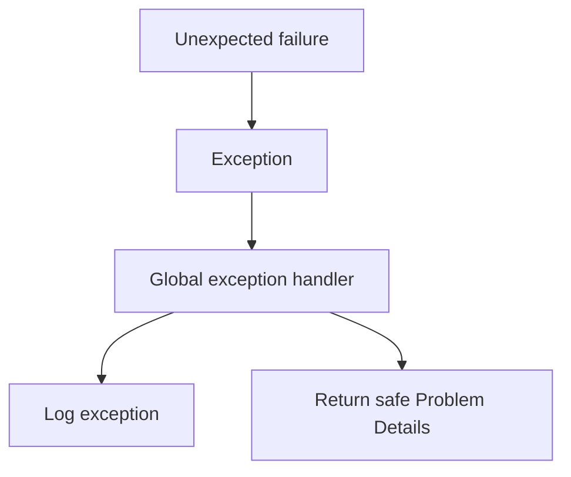
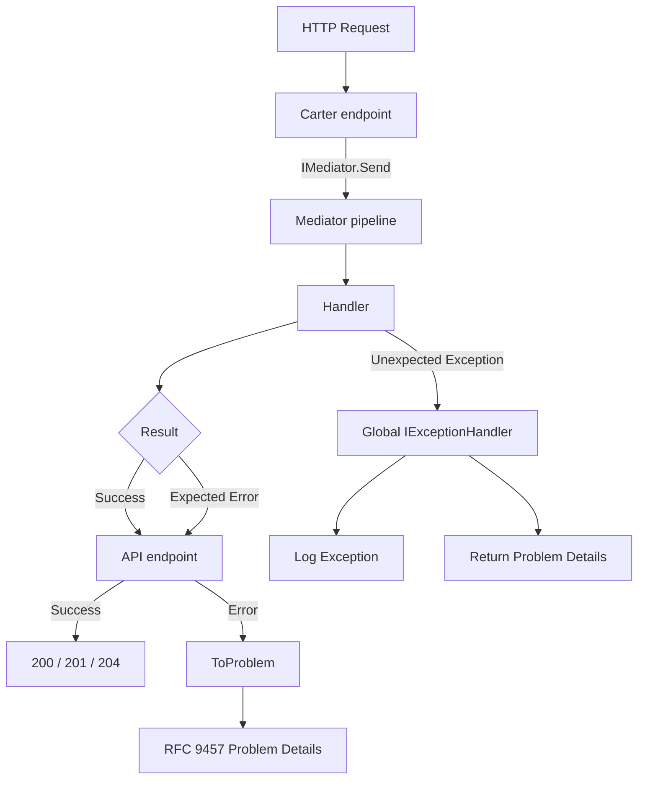

## Big picture

### The problem this whole guide solves

An HTTP API has to turn two very different kinds of failure into a response:

1. **Expected failures** — invalid input, missing resource, business rule violations such as "insufficient stock". These are normal outcomes of application logic, not programming errors.
2. **Unexpected failures** — database outages, null reference exceptions, dependency failures, timeouts, or other errors that the application cannot reasonably handle as part of its normal flow.

These two categories should not be handled in the same way.

If exceptions are used for both:

* **Cost** — routine 400/404 responses unnecessarily create exceptions and stack traces.
* **Signal loss** — operational monitoring cannot easily distinguish normal business failures from genuine application or infrastructure failures.
* **Coupling** — application logic becomes concerned with exception types and HTTP error handling.
* **Inconsistent responses** — different parts of the application may handle failures differently.

The approach used in this guide is therefore:

> **Expected failures are returned as values using `ErrorOr<T>`. Unexpected failures are thrown as exceptions and handled once by the global exception pipeline.**

---

## What is the Result Pattern?

The **Result Pattern** is a way of representing the outcome of an operation explicitly as a value.

Instead of throwing an exception when an expected business or application-level failure occurs, the operation returns a result that contains either:

* a **successful value**, or
* one or more **errors** describing why the operation failed.

In this application, the Result Pattern is implemented using `ErrorOr<T>`.

Conceptually:

```text
Operation
   │
   ├── Success → T
   │
   └── Failure → Error / List<Error>
```

### Why use a Result instead of exceptions?

Expected failures are part of normal application behavior.

For example:

```text
CreateOrder
    ├── Validation failed
    ├── Product not found
    ├── Insufficient stock
    ├── Order already exists
    └── Success
```

These outcomes are not necessarily exceptional situations. They are valid outcomes that the caller should be able to handle explicitly.

Using `ErrorOr<T>` makes this visible in the method signature:

```csharp
ErrorOr<Order> CreateOrder(...);
```

The return type tells the caller:

> "This operation can succeed with an `Order`, or it can fail with one or more expected errors."

This is preferable to requiring the caller to discover possible exceptions by reading implementation details or documentation.

---

## Two failure channels, one rule

The application uses two different mechanisms because expected and unexpected failures have different meanings.

| Channel                   | Use for                                                                               | Mechanism           | HTTP representation                                |
| ------------------------- | ------------------------------------------------------------------------------------- | ------------------- | -------------------------------------------------- |
| **Result** (`ErrorOr<T>`) | Expected failures: validation, not found, conflict, forbidden, business-rule failures | Returned as a value | RFC 9457 Problem Details via `ToProblem`           |
| **Exception**             | Unexpected failures: bugs, infrastructure failures, unhandled dependency failures     | `throw`             | Problem Details via one global `IExceptionHandler` |


### Expected failures are values and HTTP error response conversion

Examples of expected failures include:

* Request validation failures
* Resource not found
* Duplicate resource
* Conflict with the current state
* Forbidden operation
* Business-rule violations
* Invalid state transitions

These should normally be represented as `ErrorOr<T>`:

```csharp
public async Task<ErrorOr<Order>> CreateOrder(
    CreateOrderCommand command,
    CancellationToken cancellationToken)
{
    if (command.Items.Count == 0)
    {
        return Error.Validation(
            "Order.Empty",
            "An order must contain at least one item.");
    }

    var product = await repository.GetByIdAsync(
        command.ProductId,
        cancellationToken);

    if (product is null)
    {
        return Error.NotFound(
            "Product.NotFound",
            "The requested product was not found.");
    }

    // ...

    return order;
}
```


One of the benefits of this approach is that `ErrorOr<T>` does not need to know about HTTP.

Application code can return:

```csharp
Error.NotFound(
    "Product.NotFound",
    "The product was not found.");
```

It does not need to construct:

```http
HTTP/1.1 404 Not Found
Content-Type: application/problem+json
```

That responsibility belongs to the API boundary.

The flow is therefore:

```text
Application layer
    │
    │ ErrorOr<T>
    ▼
API boundary
    │
    │ ToProblem()
    ▼
HTTP response
    │
    ▼
RFC 9457 Problem Details
```

Example response, `GET /api/patients/{unknown-id} (404)`:

```json
{
  "type": "https://httpstatuses.io/404",
  "title": "Not Found",
  "status": 404,
  "detail": "Patient 3f2a… was not found.",
  "instance": "/api/patients/3f2a…",
  "traceId": "0HN7…",
  "errorCode": "PATIENT.NOT_FOUND",
  "errorType": "NotFound"
}
```

Example response, `POST /api/products (400)`:

```json
{
  "type": "https://httpstatuses.io/400",
  "title": "One or more validation errors occurred.",
  "status": 400,
  "instance": "/products/9cf8d1db-ea2a-4f07-b9d3-0b2ef04d690f",
  "errors": {
    "Name": [
      "The length of 'Name' must be at least 3 characters. You entered 0 characters."
    ],
    "Category": [
      "The length of 'Category' must be at least 3 characters. You entered 0 characters."
    ]
  },
  "traceId": "0HNOR9K7B825R:00000004",
  "errorCode": "VALIDATION",
  "errorType": "Validation"
}
```

This keeps the application logic independent of HTTP-specific concerns while still giving API consumers a consistent error format.

---

### Unexpected failures remain exceptions

Not every failure should be converted into an `Error`.

Unexpected failures should remain exceptions.

For example:

```csharp
await dbContext.SaveChangesAsync(cancellationToken);
```

If the database becomes unavailable and the operation cannot recover from it, that failure is not necessarily an expected business outcome.

Likewise, programming errors such as:

```csharp
NullReferenceException
```

should not normally be converted into:

```csharp
return Error.Failure(...);
```

Doing so can hide programming defects and make operational problems harder to diagnose.

Instead:



The global exception handler becomes the single place responsible for converting unexpected exceptions into an HTTP error response.

---


### Big-picture request flow

The complete request flow looks like this:



The key architectural rule is therefore simple:

> **Use `ErrorOr<T>` for failures the application expects and can describe. Use exceptions for failures that are unexpected and should be handled by the global exception pipeline.**

---

## Result Pattern

<Guide numbered stepHeadingLevel={3}>

<GuideStep title="Create Common Project">

```bash
# from MyApp/backend/  (the solution root)

dotnet new classlib -n Shared.Common -o src/Shared/Common --framework net10.0
dotnet sln MyApp.slnx add src/Shared/Common/Shared.Common.csproj

dotnet add src/Services/MyApp.Api/MyApp.Api.csproj reference src/Shared/Common/Shared.Common.csproj
dotnet add src/Shared/Application/Shared.Application.csproj reference src/Shared/Common/Shared.Common.csproj
```
</GuideStep>

<GuideStep title="The `ErrorType` enum">

```csharp title="src/Shared/Common/Errors/ErrorType.cs"
public enum ErrorType
{
    Failure,             // generic 400 — malformed input that isn't a FluentValidation rule
    Validation,          // 400 — a specific field failed a rule
    Unauthorized,        // 401 — no/invalid credentials
    Forbidden,           // 403 — valid credentials, not allowed to do this
    NotFound,            // 404
    Conflict,            // 409 — current state disallows the action (includes business-rule violations)
    ServiceUnavailable,  // 503 — a dependency is down; retry later
    Unexpected,          // 500 — anything else; never describe the cause to the caller
}
```
Each member maps to one HTTP status in `ErrorExtensions.MapStatusCode`.
    
</GuideStep>

<GuideStep title="The `Error` type">
    
    
Immutable `readonly struct` with private ctor + factories (`Error.NotFound(...)`, `Error.ValidationField(...)`, …). See `Shared.Common/Errors/Error.cs` — matches the factories listed in `ErrorType`.


```csharp title="src/Shared/Common/Errors/Error.cs"
namespace Shared.Common.Errors;

public readonly struct Error : IEquatable<Error>
{
    public const string ServiceUnavailableDefaultCode = "SERVICE_UNAVAILABLE";

    public string Code { get; }
    public string Description { get; }
    public ErrorType Type { get; }
    public IReadOnlyDictionary<string, object>? Metadata { get; }

    private Error(string code, string description, ErrorType type, IReadOnlyDictionary<string, object>? metadata)
    {
        // Fail fast: an error with no code can't be told apart from any other error of
        // the same Type once it reaches a log line or a client integration test.
        ArgumentException.ThrowIfNullOrWhiteSpace(code);
        ArgumentException.ThrowIfNullOrWhiteSpace(description);

        Code = code;
        Description = description;
        Type = type;
        Metadata = metadata;
    }

    public static Error Failure(string code, string description, IReadOnlyDictionary<string, object>? m = null) =>
        new(code, description, ErrorType.Failure, m);

    public static Error Validation(string code, string description, IReadOnlyDictionary<string, object>? m = null) =>
        new(code, description, ErrorType.Validation, m);

    public static Error Unauthorized(string code, string description, IReadOnlyDictionary<string, object>? m = null) =>
        new(code, description, ErrorType.Unauthorized, m);

    public static Error Forbidden(string code, string description, IReadOnlyDictionary<string, object>? m = null) =>
        new(code, description, ErrorType.Forbidden, m);

    public static Error NotFound(string code, string description, IReadOnlyDictionary<string, object>? m = null) =>
        new(code, description, ErrorType.NotFound, m);

    public static Error Conflict(string code, string description, IReadOnlyDictionary<string, object>? m = null) =>
        new(code, description, ErrorType.Conflict, m);

    public static Error ServiceUnavailable(string description, string code = ServiceUnavailableDefaultCode) =>
        new(code, description, ErrorType.ServiceUnavailable, null);

    public static Error Unexpected(string code, string description, IReadOnlyDictionary<string, object>? m = null) =>
        new(code, description, ErrorType.Unexpected, m);

    // Convenience for "this one field failed one rule" — code and field name are the same string,
    // which is exactly what FluentValidation's PropertyName gives you (section 4).
    public static Error ValidationField(string propertyName, string message) =>
        Validation(propertyName, message);

    public bool Equals(Error other) => Code == other.Code && Type == other.Type && Description == other.Description;
    public override bool Equals(object? obj) => obj is Error e && Equals(e);
    public override int GetHashCode() => HashCode.Combine(Code, Type, Description);
    public override string ToString() => $"{Type} {Code}: {Description}";

    public static bool operator ==(Error left, Error right)
    {
        return left.Equals(right);
    }

    public static bool operator !=(Error left, Error right)
    {
        return !(left == right);
    }
}

```
</GuideStep>


<GuideStep title="`ErrorOr<T>` — the type itself">
    

*What it's for:* either a value or a list of errors, never both. Every command/query returns this.

*Why several errors?* FluentValidation can fail multiple fields; one round trip should show all of them (part 3–4).

*Why implicit conversions?* Handlers stay linear:

```csharp
return productDto;
return Error.NotFound("PRODUCT.NOT_FOUND", $"Product '{id}' was not found.");
```

*Why `.Value` throws when `IsError`?* Misuse is loud. Prefer `.Match(...)`.

```csharp title="src/Shared/Common/Errors/ErrorOr.cs"
namespace Shared.Common.Errors;

public readonly record struct Success;   // marker for ErrorOr<Success> void return types

public readonly struct ErrorOr<TValue>
{
    private readonly TValue? _value;
    private readonly List<Error>? _errors;

    public bool IsError => _errors is not null;

    // Only meaningful when IsError is false. Throws otherwise — see the "why" above.
    public TValue Value => IsError
        ? throw new InvalidOperationException(
            "Cannot access Value on a failed ErrorOr. Check IsError first, or use Match.")
        : _value!;

    // Only meaningful when IsError is true. Empty list otherwise, never null,
    // so callers can safely foreach without a null check.
    public IReadOnlyList<Error> Errors => _errors ?? [];

    // First error only — a convenience for call sites that only care about one,
    // e.g. logging "the request failed because {FirstError}".
    public Error FirstError => _errors is { Count: > 0 } list
        ? list[0]
        : throw new InvalidOperationException("ErrorOr has no errors; check IsError first.");

    private ErrorOr(TValue value) => _value = value;
    private ErrorOr(List<Error> errors) => _errors = errors;

    public static ErrorOr<TValue> From(List<Error> errors) => new(errors);

    public static implicit operator ErrorOr<TValue>(TValue value) => new(value);
    public static implicit operator ErrorOr<TValue>(Error error) => new(new List<Error> { error });
    public static implicit operator ErrorOr<TValue>(List<Error> errors) => From(errors);

    // The safe way to read an ErrorOr: supply a function for each branch, and the
    // compiler-checked return type of both branches must agree. There is no way to
    // "forget" to handle the error case, unlike checking .IsError and then reading .Value.
    public TResult Match<TResult>(Func<TValue, TResult> onValue, Func<IReadOnlyList<Error>, TResult> onError) =>
        IsError ? onError(Errors) : onValue(Value);

    public async Task<TResult> MatchAsync<TResult>(
        Func<TValue, Task<TResult>> onValue, Func<IReadOnlyList<Error>, Task<TResult>> onError) =>
        IsError ? await onError(Errors) : await onValue(Value);

    // Chbody: run `next` only on success, short-circuiting on the first failure.
    // This is what lets several fallible steps compose without nested if(IsError) checks.
    public ErrorOr<TNext> Then<TNext>(Func<TValue, ErrorOr<TNext>> next) =>
        IsError ? Errors.ToList() : next(Value);

    public async Task<ErrorOr<TNext>> ThenAsync<TNext>(Func<TValue, Task<ErrorOr<TNext>>> next) =>
        IsError ? Errors.ToList() : await next(Value);
}
```

`From` / implicits are also what `ErrorOrFactory` uses from pipeline behaviors (part 4).
</GuideStep>


<GuideStep title="Explicit command and query contracts">
    
```csharp
// Shared.Application/Abstractions/Commands/ICommand.cs
public interface ICommand<TResponse> : IRequest<ErrorOr<TResponse>> { }
public interface ICommand : IRequest<ErrorOr<Success>> { }

// Shared.Application/Abstractions/Queries/IQuery.cs
public interface IQuery<TResponse> : IRequest<ErrorOr<TResponse>> { }
```

`IRequest<TResponse>` comes from `Shared.Mediator`. Wrapping it in `ICommand` / `IQuery` locks every request into returning `ErrorOr<T>`, so handlers and behaviors share one shape.

**Implication for handlers:** implement `IRequestHandler<TRequest, ErrorOr<TResponse>>`, not `IRequestHandler<TRequest, TResponse>`. Example: `CreateProductCommand : ICommand<Guid>` ⇒ handler returns `ErrorOr<Guid>`.


</GuideStep>

</Guide>


