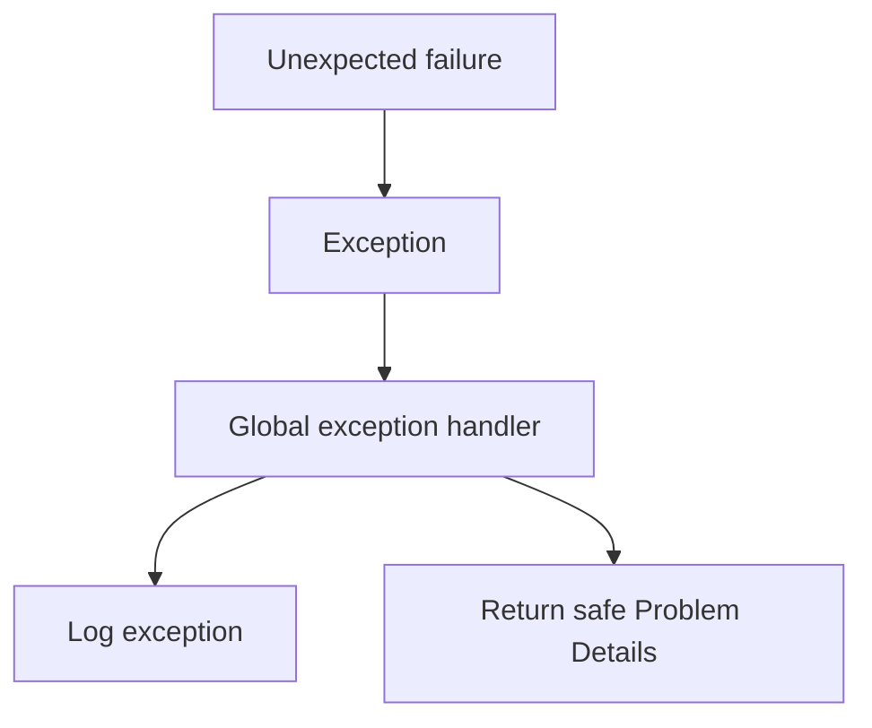
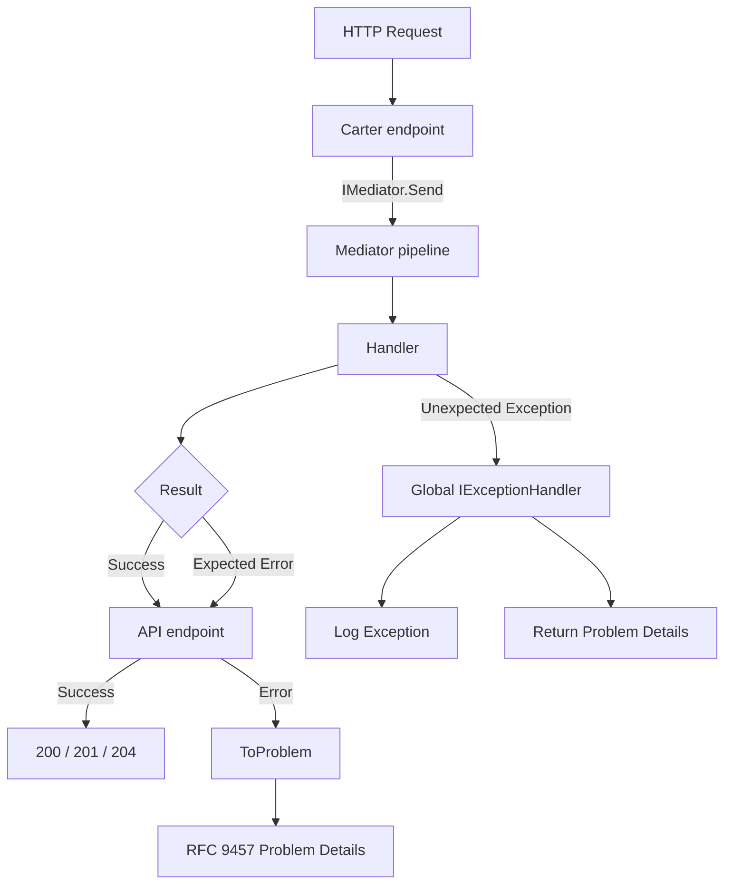
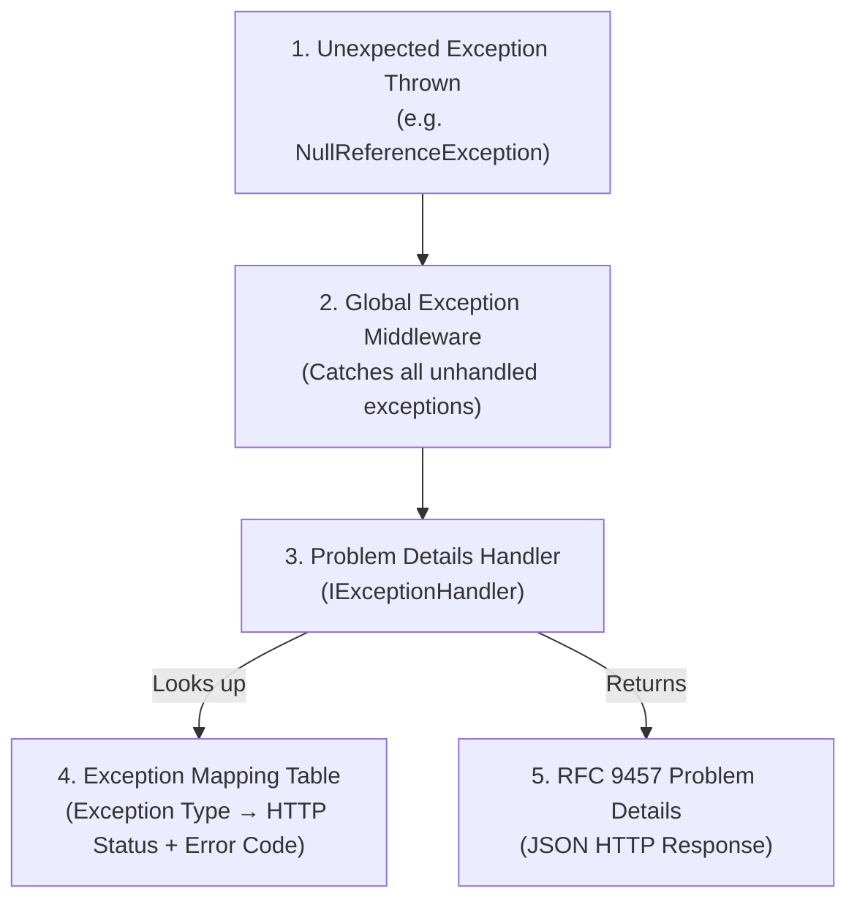

## Big picture

### The problem this whole guide solves

An HTTP API has to turn two very different kinds of failure into a response:

1. **Expected failures** — invalid input, missing resource, business rule violations such as "insufficient stock". These are normal outcomes of application logic, not programming errors.
2. **Unexpected failures** — database outages, null reference exceptions, dependency failures, timeouts, or other errors that the application cannot reasonably handle as part of its normal flow.

These two categories should not be handled in the same way.

### Why Exceptions Fail Us in Expected Failures

Expected failures are part of normal application behavior. 

Exceptions violate a core principle of software design: make invalid states unrepresentable. Consider this typical C# service method:

```csharp
public User GetUser(int id)
{
    var user = _db.Users.Find(id);
    if (user == null)
        throw new UserNotFoundException($"User {id} not found");

    if (!user.IsActive)
        throw new UserInactiveException($"User {id} is inactive");

    return user;
}
```

The caller is forced into a defensive posture:

```csharp
try
{
    var user = GetUser(42);
    // 20 lines later...
    var orders = GetOrders(user.Id); // What if user was null?
}
catch (UserNotFoundException ex) { /* ... */ }
catch (UserInactiveException ex) { /* ... */ }
catch (Exception ex) { /* Did I miss one? */ }
```

Instead of throwing an exception, we should return a result that contains the errors.

## What is the Result Pattern?

The Result Pattern models operations that can succeed or fail as a discriminated union (or equivalent). Instead of throwing, you return a value that explicitly carries either:

* Success → the expected payload
* Failure → structured error information

In this application, the Result Pattern is implemented using `ErrorOr<T>`.

Conceptually:

```text
Operation
   │
   ├── Success → T
   │
   └── Failure → Error / List<Error>
```

**Why exactly `ErrorOr`?**
* **Implicit Conversions:** `return user;` and `return Error.NotFound(...)` work seamlessly without wrapper methods.
* **Struct-based:** Allocated on the stack, avoiding GC pressure.
* **Functional:** Built-in `.Match()` and `.Then()` for clean composition.


### Why use a Result instead of exceptions?

Expected failures are part of normal application behavior.

For example:

```text
CreateOrder
    ├── Validation failed
    ├── Product not found
    ├── Insufficient stock
    ├── Order already exists
    └── Success
```

These outcomes are not necessarily exceptional situations. They are valid outcomes that the caller should be able to handle explicitly.

Using `ErrorOr<T>` makes this visible in the method signature:

```csharp
ErrorOr<Order> CreateOrder(...);
```

The return type tells the caller:

> "This operation can succeed with an `Order`, or it can fail with one or more expected errors."

This is preferable to requiring the caller to discover possible exceptions by reading implementation details or documentation.

---

## Two failure channels, one rule

The application uses two different mechanisms because expected and unexpected failures have different meanings.

| Channel | Use For | Mechanism | HTTP Response |
| :--- | :--- | :--- | :--- |
| **Result** (`ErrorOr<T>`) | Expected business/validation failures | Returned as value | RFC 9457 Problem Details via `ToProblem()` |
| **Exception** | Bugs, infrastructure crashes | `throw` | Global `IExceptionHandler` |


### Expected failures are values and HTTP error response conversion

Examples of expected failures include:

* Request validation failures
* Resource not found
* Duplicate resource
* Conflict with the current state
* Forbidden operation
* Business-rule violations
* Invalid state transitions

These should normally be represented as `ErrorOr<T>`:

```csharp
public async Task<ErrorOr<Order>> CreateOrder(
    CreateOrderCommand command,
    CancellationToken cancellationToken)
{
    if (command.Items.Count == 0)
    {
        return Error.Validation(
            "Order.Empty",
            "An order must contain at least one item.");
    }

    var product = await repository.GetByIdAsync(
        command.ProductId,
        cancellationToken);

    if (product is null)
    {
        return Error.NotFound(
            "Product.NotFound",
            "The requested product was not found.");
    }

    // ...

    return order;
}
```


One of the benefits of this approach is that `ErrorOr<T>` does not need to know about HTTP.

Application code can return:

```csharp
Error.NotFound(
    "Product.NotFound",
    "The product was not found.");
```

It does not need to construct:

```http
HTTP/1.1 404 Not Found
Content-Type: application/problem+json
```

That responsibility belongs to the API boundary.

The flow is therefore:

```text
Application layer
    │
    │ ErrorOr<T>
    ▼
API boundary
    │
    │ ToProblem()
    ▼
HTTP response
    │
    ▼
RFC 9457 Problem Details
```

Example response, `GET /api/patients/{unknown-id} (404)`:

```json
{
  "type": "https://httpstatuses.io/404",
  "title": "Not Found",
  "status": 404,
  "detail": "Patient 3f2a… was not found.",
  "instance": "/api/patients/3f2a…",
  "traceId": "0HN7…",
  "errorCode": "PATIENT.NOT_FOUND",
  "errorType": "NotFound"
}
```

Example response, `POST /api/products (400)`:

```json
{
  "type": "https://httpstatuses.io/400",
  "title": "One or more validation errors occurred.",
  "status": 400,
  "instance": "/products/9cf8d1db-ea2a-4f07-b9d3-0b2ef04d690f",
  "errors": {
    "Name": [
      "The length of 'Name' must be at least 3 characters. You entered 0 characters."
    ],
    "Category": [
      "The length of 'Category' must be at least 3 characters. You entered 0 characters."
    ]
  },
  "traceId": "0HNOR9K7B825R:00000004",
  "errorCode": "VALIDATION",
  "errorType": "Validation"
}
```

This keeps the application logic independent of HTTP-specific concerns while still giving API consumers a consistent error format.

---

### Unexpected failures remain exceptions

Not every failure should be converted into an `Error`.

Unexpected failures should remain exceptions.

For example:

```csharp
await dbContext.SaveChangesAsync(cancellationToken);
```

If the database becomes unavailable and the operation cannot recover from it, that failure is not necessarily an expected business outcome.

Likewise, programming errors such as:

```csharp
NullReferenceException
```

should not normally be converted into:

```csharp
return Error.Failure(...);
```

Doing so can hide programming defects and make operational problems harder to diagnose.

Instead:



The global exception handler becomes the single place responsible for converting unexpected exceptions into an HTTP error response.

---


### Big-picture request flow

The complete request flow looks like this:



The key architectural rule is therefore simple:

> **Use `ErrorOr<T>` for failures the application expects and can describe. Use exceptions for failures that are unexpected and should be handled by the global exception pipeline.**

---

## Result Pattern

<Guide numbered stepHeadingLevel={3}>

<GuideStep title="Create Common Project">

```bash
# from MyApp/backend/  (the solution root)

dotnet new classlib -n Shared.Common -o src/Shared/Common --framework net10.0
dotnet sln MyApp.slnx add src/Shared/Common/Shared.Common.csproj

dotnet add src/Services/MyApp.Api/MyApp.Api.csproj reference src/Shared/Common/Shared.Common.csproj
dotnet add src/Shared/Application/Shared.Application.csproj reference src/Shared/Common/Shared.Common.csproj
```

`Shared.Common` needs a FrameworkReference so `Errors/Http` can use `HttpContext` / `IResult` / `ProblemDetails` / `TypedResults` (no NuGet package required):

```xml title="src/Shared/Common/Shared.Common.csproj"
<ItemGroup>
  <FrameworkReference Include="Microsoft.AspNetCore.App" />
</ItemGroup>
```

</GuideStep>

<GuideStep title="The `ErrorType` enum">

```csharp title="src/Shared/Common/Errors/ErrorType.cs"
public enum ErrorType
{
    Failure,             // generic 400 — malformed input that isn't a FluentValidation rule
    Validation,          // 400 — a specific field failed a rule
    Unauthorized,        // 401 — no/invalid credentials
    Forbidden,           // 403 — valid credentials, not allowed to do this
    NotFound,            // 404
    Conflict,            // 409 — current state disallows the action (includes business-rule violations)
    ServiceUnavailable,  // 503 — a dependency is down; retry later
    Unexpected,          // 500 — anything else; never describe the cause to the caller
}
```
Each member maps to one HTTP status in `ErrorExtensions.MapStatusCode`.
    
</GuideStep>

<GuideStep title="The `Error` type">
    
    
Immutable `readonly struct` with private ctor + factories (`Error.NotFound(...)`, `Error.ValidationField(...)`, …). See `Shared.Common/Errors/Error.cs` — matches the factories listed in `ErrorType`.


```csharp title="src/Shared/Common/Errors/Error.cs"
namespace Shared.Common.Errors;

public readonly struct Error : IEquatable<Error>
{
    public const string ServiceUnavailableDefaultCode = "SERVICE_UNAVAILABLE";

    public string Code { get; }
    public string Description { get; }
    public ErrorType Type { get; }
    public IReadOnlyDictionary<string, object>? Metadata { get; }

    private Error(string code, string description, ErrorType type, IReadOnlyDictionary<string, object>? metadata)
    {
        // Fail fast: an error with no code can't be told apart from any other error of
        // the same Type once it reaches a log line or a client integration test.
        ArgumentException.ThrowIfNullOrWhiteSpace(code);
        ArgumentException.ThrowIfNullOrWhiteSpace(description);

        Code = code;
        Description = description;
        Type = type;
        Metadata = metadata;
    }

    public static Error Failure(string code, string description, IReadOnlyDictionary<string, object>? m = null) =>
        new(code, description, ErrorType.Failure, m);

    public static Error Validation(string code, string description, IReadOnlyDictionary<string, object>? m = null) =>
        new(code, description, ErrorType.Validation, m);

    public static Error Unauthorized(string code, string description, IReadOnlyDictionary<string, object>? m = null) =>
        new(code, description, ErrorType.Unauthorized, m);

    public static Error Forbidden(string code, string description, IReadOnlyDictionary<string, object>? m = null) =>
        new(code, description, ErrorType.Forbidden, m);

    public static Error NotFound(string code, string description, IReadOnlyDictionary<string, object>? m = null) =>
        new(code, description, ErrorType.NotFound, m);

    public static Error Conflict(string code, string description, IReadOnlyDictionary<string, object>? m = null) =>
        new(code, description, ErrorType.Conflict, m);

    public static Error ServiceUnavailable(string description, string code = ServiceUnavailableDefaultCode) =>
        new(code, description, ErrorType.ServiceUnavailable, null);

    public static Error Unexpected(string code, string description, IReadOnlyDictionary<string, object>? m = null) =>
        new(code, description, ErrorType.Unexpected, m);

    // Convenience for "this one field failed one rule" — code and field name are the same string,
    // which is exactly what FluentValidation's PropertyName gives you (section 4).
    public static Error ValidationField(string propertyName, string message) =>
        Validation(propertyName, message);

    public bool Equals(Error other) => Code == other.Code && Type == other.Type && Description == other.Description;
    public override bool Equals(object? obj) => obj is Error e && Equals(e);
    public override int GetHashCode() => HashCode.Combine(Code, Type, Description);
    public override string ToString() => $"{Type} {Code}: {Description}";

    public static bool operator ==(Error left, Error right)
    {
        return left.Equals(right);
    }

    public static bool operator !=(Error left, Error right)
    {
        return !(left == right);
    }
}

```
</GuideStep>


<GuideStep title="`ErrorOr<T>` — the type itself">
    

*What it's for:* either a value or a list of errors, never both. Every command/query returns this.

*Why several errors?* FluentValidation can fail multiple fields; one round trip should show all of them (part 3–4).

*Why implicit conversions?* Handlers stay linear:

```csharp
return productDto;
return Error.NotFound("PRODUCT.NOT_FOUND", $"Product '{id}' was not found.");
```

*Why `.Value` throws when `IsError`?* Misuse is loud. Prefer `.Match(...)`.

```csharp title="src/Shared/Common/Errors/ErrorOr.cs"
namespace Shared.Common.Errors;

public readonly record struct Success;   // marker for ErrorOr<Success> void return types

/// <summary>Non-generic view so pipeline behaviors can detect ErrorOr failures without reflection.</summary>
public interface IErrorOr
{
    bool IsError { get; }
}

public readonly struct ErrorOr<TValue> : IErrorOr
{
    private readonly TValue? _value;
    private readonly List<Error>? _errors;

    public bool IsError => _errors is not null;

    // Only meaningful when IsError is false. Throws otherwise — see the "why" above.
    public TValue Value => IsError
        ? throw new InvalidOperationException(
            "Cannot access Value on a failed ErrorOr. Check IsError first, or use Match.")
        : _value!;

    // Only meaningful when IsError is true. Empty list otherwise, never null,
    // so callers can safely foreach without a null check.
    public IReadOnlyList<Error> Errors => _errors ?? [];

    // First error only — a convenience for call sites that only care about one,
    // e.g. logging "the request failed because {FirstError}".
    public Error FirstError => _errors is { Count: > 0 } list
        ? list[0]
        : throw new InvalidOperationException("ErrorOr has no errors; check IsError first.");

    private ErrorOr(TValue value) => _value = value;
    private ErrorOr(List<Error> errors) => _errors = errors;

    public static ErrorOr<TValue> From(List<Error> errors) => new(errors);

    public static implicit operator ErrorOr<TValue>(TValue value) => new(value);
    public static implicit operator ErrorOr<TValue>(Error error) => new(new List<Error> { error });
    public static implicit operator ErrorOr<TValue>(List<Error> errors) => From(errors);

    // The safe way to read an ErrorOr: supply a function for each branch, and the
    // compiler-checked return type of both branches must agree. There is no way to
    // "forget" to handle the error case, unlike checking .IsError and then reading .Value.
    public TResult Match<TResult>(Func<TValue, TResult> onValue, Func<IReadOnlyList<Error>, TResult> onError) =>
        IsError ? onError(Errors) : onValue(Value);

    public async Task<TResult> MatchAsync<TResult>(
        Func<TValue, Task<TResult>> onValue, Func<IReadOnlyList<Error>, Task<TResult>> onError) =>
        IsError ? await onError(Errors) : await onValue(Value);

    // Then: run `next` only on success, short-circuiting on the first failure.
    // This is what lets several fallible steps compose without nested if(IsError) checks.
    public ErrorOr<TNext> Then<TNext>(Func<TValue, ErrorOr<TNext>> next) =>
        IsError ? Errors.ToList() : next(Value);

    public async Task<ErrorOr<TNext>> ThenAsync<TNext>(Func<TValue, Task<ErrorOr<TNext>>> next) =>
        IsError ? Errors.ToList() : await next(Value);
}
```

`From` / implicits are also what `ErrorOrFactory` uses from pipeline behaviors (part 4).

`IErrorOr` is the non-generic face of `ErrorOr<T>`. Pipeline behaviors only see `TResponse`; with `IErrorOr` they can check `IsError` without knowing whether `T` is `Guid`, `Success`, or a DTO.
</GuideStep>


<GuideStep title="Explicit command and query contracts">
    
```csharp title="src/Shared/Application/Abstractions/Commands/ICommand.cs"
using Mediator;
using Shared.Common.Errors;

namespace Shared.Application.Abstractions.Commands;

/// <summary>Marks a Mediator request as a command (eligible for TransactionBehavior).</summary>
public interface ICommandMarker;

/// <summary>
/// Opt-in: TransactionBehavior commits even when the handler returns an ErrorOr failure
/// (intentional failure-path writes such as counters).
/// </summary>
public interface IPersistOnFailure;

public interface ICommand<TResponse> : IRequest<ErrorOr<TResponse>>, ICommandMarker { }
public interface ICommand : IRequest<ErrorOr<Success>>, ICommandMarker { }
```

```csharp
// Shared.Application/Abstractions/Queries/IQuery.cs
public interface IQuery<TResponse> : IRequest<ErrorOr<TResponse>> { }
```

`IRequest<TResponse>` comes from `Shared.Mediator`. `ICommand` / `IQuery` fix the response shape to `ErrorOr<T>` so handlers and behaviors share one contract.

| Type | Role |
|---|---|
| `ICommand` / `ICommand<T>` | Write use-case; carries `ICommandMarker` for the transaction behavior |
| `IQuery<T>` | Read use-case; no transaction |
| `IPersistOnFailure` | Optional on a command: commit even when the handler returns a failure |
| `IErrorOr` | On `ErrorOr<T>`: let behaviors inspect `IsError` |

#### Usage

```csharp
public sealed record CreateProductCommand(
    string Name, string Category, decimal Price, int Stock) : ICommand<Guid>;

public sealed record GetProductQuery(Guid Id) : IQuery<ProductDto>;

// Void command — return default(Success) on success.
public sealed record DeleteProductCommand(Guid Id) : ICommand;

internal sealed class DeleteProductCommandHandler(...)
    : IRequestHandler<DeleteProductCommand, ErrorOr<Success>>
{
    public async ValueTask<ErrorOr<Success>> Handle(...)
    {
        // ...
        return default(Success);
    }
}
```

Add `IPersistOnFailure` only when a failed handler result must still persist intentional writes (for example an `ExecuteUpdate` that records a failed attempt). Ordinary product commands omit it so failures roll back.

Handlers implement `IRequestHandler<TRequest, ErrorOr<TResponse>>`. Example: `CreateProductCommand : ICommand<Guid>` ⇒ return `ErrorOr<Guid>`.

#### Update to Transaction Behavior

Commands change data. Put a unit of work around them so the handler only **tracks** entities — `SaveChanges` and commit happen in one place.

**How it knows a request is a command:** every `ICommand` / `ICommand<T>` also implements `ICommandMarker`. Queries use `IQuery<T>` and are skipped. You will add those marker interfaces when you introduce `ErrorOr` contracts; until then, treat `ICommandMarker` as “this request may write.”

**When to commit:** after the handler returns, commit only if the result is a success — or if the command opted into `IPersistOnFailure` (needed when a failure response must still keep intentional side effects, such as an audit counter). Otherwise roll back so a failed command leaves no half-written state.

```csharp title="src/Services/MyApp.Api/Persistence/DbErrors.cs"
using Microsoft.Data.Sqlite;
using Microsoft.EntityFrameworkCore;

namespace MyApp.Persistence;

internal static class DbErrors
{
    public static bool IsUniqueViolation(DbUpdateException ex) => ex.InnerException switch
    {
        SqliteException { SqliteErrorCode: 19, SqliteExtendedErrorCode: 2067 or 1555 } => true,
        // Npgsql:     PostgresException { SqlState: "23505" } => true,
        // SQL Server: SqlException { Number: 2601 or 2627 } => true,
        _ => false,
    };
}
```

```csharp title="src/Services/MyApp.Api/Persistence/TransactionBehavior.cs"
using Microsoft.EntityFrameworkCore;
using Shared.Application.Abstractions.Commands;
using Shared.Common.Errors;

namespace MyApp.Persistence;

public sealed class TransactionBehavior<TRequest, TResponse>(
    AppDbContext db,
    ILogger<TransactionBehavior<TRequest, TResponse>> logger)
    : IPipelineBehavior<TRequest, TResponse>
    where TRequest : IRequest<TResponse>
{
    private static readonly bool IsCommand = typeof(ICommandMarker).IsAssignableFrom(typeof(TRequest));
    private static readonly bool PersistOnFailure = typeof(IPersistOnFailure).IsAssignableFrom(typeof(TRequest));

    public async ValueTask<TResponse> Handle(
        TRequest request, RequestHandlerDelegate<TResponse> next, CancellationToken ct)
    {
        // Queries skip; join an ambient transaction if one already exists.
        if (!IsCommand || db.Database.CurrentTransaction is not null)
            return await next(ct);

        try
        {
            if (!db.Database.IsRelational())
            {
                var r = await next(ct);
                if (ShouldCommit(r)) await db.SaveChangesAsync(ct);
                return r;
            }

            var strategy = db.Database.CreateExecutionStrategy();
            return await strategy.ExecuteAsync(async () =>
            {
                db.ChangeTracker.Clear();
                await using var tx = await db.Database.BeginTransactionAsync(ct);

                var response = await next(ct);

                if (!ShouldCommit(response))
                {
                    await tx.RollbackAsync(ct);
                    db.ChangeTracker.Clear();
                    return response;
                }

                await db.SaveChangesAsync(ct);
                await tx.CommitAsync(ct);
                return response;
            });
        }
        catch (DbUpdateException ex) when (DbErrors.IsUniqueViolation(ex))
        {
            logger.LogWarning(ex, "Unique constraint hit in {Request}", typeof(TRequest).Name);
            return ErrorOrFactory.Failure<TResponse>(
                [Error.Conflict("DB.CONFLICT", "The resource already exists or was changed by another request.")]);
        }
    }

    private static bool ShouldCommit(TResponse response) =>
        PersistOnFailure || response is not IErrorOr { IsError: true };
}
```

`DbErrors.IsUniqueViolation` turns a provider unique-constraint error (SQLite 2067/1555, Postgres `23505`, …) into a conflict result the API can return as Problem Details.

#### Commit rules

| Request | Handler result | Commit? |
|---|---|---|
| Query (`IQuery<…>`) | anything | No transaction |
| `ICommand<…>` | success | Yes — `SaveChanges` + commit |
| `ICommand<…>` | failure (`IErrorOr.IsError`) | No — rollback |
| `ICommand<…>, IPersistOnFailure` | failure | Yes — keep intentional side effects |

#### Usage

Most commands need no extra marker. Add the entity and return; the behavior saves on success and rolls back on failure:

```csharp
public sealed record CreateProductCommand(...) : ICommand<Guid>;

// return product.Id            → commit
// return Error.Conflict(...)   → rollback
```

Use `IPersistOnFailure` only when a failed result must still write something (for example an `ExecuteUpdate` that increments a failure counter). Most product commands never need it.

Register **Transaction** last among behaviors (Logging → Validation → Caching → Transaction) so the transaction wraps the inner pipeline.

Handlers **Add** entities and return — no `SaveChangesAsync` in the happy path:

```csharp title="/Features/Products/CreateProduct/CreateProductCommandHandler.cs"
internal sealed class CreateProductCommandHandler(
    AppDbContext dbContext,
    ILogger<CreateProductCommandHandler> logger)
    : IRequestHandler<CreateProductCommand, ErrorOr<Guid>>
{
    public ValueTask<ErrorOr<Guid>> Handle(
        CreateProductCommand command,
        CancellationToken cancellationToken)
    {
        var product = new Product
        {
            Id = Guid.NewGuid(),
            Name = command.Name,
            Price = command.Price,
            Stock = command.Stock,
            CreatedAt = DateTime.UtcNow,
            Category = new Category { Name = command.Category },
            Brand = new Brand { Name = "Generic" },
        };
        dbContext.Products.Add(product);

        // SaveChanges is handled by TransactionBehavior
        logger.LogInformation("Product {ProductId} created", product.Id);
        return ValueTask.FromResult<ErrorOr<Guid>>(product.Id);
    }
}
```

</GuideStep>

<GuideStep title="Exmaple: Using it in a handler">
    
```csharp title="Features/Products/GetProduct/GetProductQuery.cs"
public sealed record GetProductQuery(Guid Id) : IQuery<ProductDto>, ICacheable
{
    public string CacheKey => $"product:{Id}";
    public TimeSpan? Expiration => TimeSpan.FromMinutes(5);
}

// Features/Products/GetProduct/GetProductQueryHandler.cs
internal sealed class GetProductQueryHandler(AppDbContext dbContext)
    : IRequestHandler<GetProductQuery, ErrorOr<ProductDto>>
{
    public async ValueTask<ErrorOr<ProductDto>> Handle(
        GetProductQuery query, CancellationToken cancellationToken)
    {
        var product = await dbContext.Products
            .AsNoTracking()
            .FirstOrDefaultAsync(p => p.Id == query.Id, cancellationToken);

        if (product is null)
        {
            return Error.NotFound(
                "PRODUCT.NOT_FOUND",
                $"Product '{query.Id}' was not found.");
        }

        return new ProductDto(
            product.Id, product.Name, product.Category, product.Price, product.Stock);
    }
}
```
</GuideStep>

<GuideStep title="From result to HTTP Response">

As mentioned earlier, the result itself is not a HTTP response. It is a value that can be converted to a HTTP response. handlers return `ErrorOr<T>` (a value *or* a list of `Error`s). That value is still just C# — the browser has not seen anything yet. So, we return the result as `Result.Ok` or `Result.Problem` depending on the result.

```csharp
// [!code focus]
public async Task<IResult> Handle(GetProductQuery query, CancellationToken cancellationToken)
{
    var result = await _mediator.Send(query, cancellationToken);
// [!code focus:3]
    return result.Match(
        product => Results.Ok(product),
        errors => Results.Problem(errors.ToProblemDetails()));
}
```

So,

- **Success:** normal status + body (`200` JSON, `201` + `Location`, or `204` empty).
- **Failure:** RFC 9457 Problem Details (`application/problem+json`).


We'll create a extension method to convert the result to a HTTP response. So, we can use it in the handler like this:

```csharp
    private static async Task<IResult> HandleAsync(
        Guid id,
        IMediator mediator,
        HttpContext http,
        CancellationToken ct)
    {
        var result = await mediator.Send(new GetProductQuery(id), ct);
        return result.MatchOk(http);
    }
```

All of the Result → HTTP mapping lives in **two** static extension classes under `Shared.Common/Errors/Http/`. They split the job on purpose.

```
Handler / ValidationBehavior
        │
        ▼
   ErrorOr<T>          ← still a C# value (part 2)
        │
        │  endpoint calls MatchOk / MatchCreated / MatchNoContent
        ▼
┌───────────────────────┐
│  ErrorOrExtensions.Cs    │  “Is this success or failure?”
│  MatchOk / Created /  │  Success → 200 / 201 / 204
│  NoContent / ToResult │  Failure → hand off the error list…
└───────────┬───────────┘
            │  errors.ToProblem(ctx)
            ▼
┌───────────────────────┐
│  ErrorExtensions.cs      │  “Turn Error(s) into Problem Details”
│  ToProblem (1 or many)│  + MapStatusCode + Decorate
│  MapStatusCode        │  → application/problem+json
└───────────────────────┘
            │
            ▼
     bytes on the wire
```

#### The ProblemDetailsRenderer: `ErrorExtensions.cs`

This file turns `Error` or `List<Error>` into standards-compliant HTTP error responses. It does *not* decide 200 vs 201 vs 204.

```csharp title="src/Shared/Common/Errors/Http/ErrorExtensions.cs"
using System.Net;
using Microsoft.AspNetCore.Http;
using Microsoft.AspNetCore.Mvc;
using Microsoft.AspNetCore.WebUtilities;

namespace Shared.Common.Errors.Http;

public static class ErrorExtensions
{
    private const string ProblemJson = "application/problem+json";

    // One Error → one ProblemDetails body. Used when a failure is a single, specific
    // thing (not found, forbidden, conflict, an unexpected error).
    public static IResult ToProblem(this Error error, HttpContext ctx, string? traceId = null)
    {
        var status = (int)MapStatusCode(error);
        var problem = new ProblemDetails
        {
            Status = status,
            Title = ReasonPhrases.GetReasonPhrase(status),   // "Not Found", "Conflict", ... — from ASP.NET Core, not hand-typed
            // Never echo the internal description on 5xx: see the "why" below.
            Detail = status >= 500 ? "An unexpected error occurred." : error.Description,
            Type = $"https://httpstatuses.io/{status}",
            Instance = ctx.Request.Path,
        };
        Decorate(problem, ctx, traceId, error.Code, error.Type.ToString());

        // TypedResults (not Results): the non-generic Results.Json(...) returns the
        // interface IResult with no compile-time guarantee of *what* it writes; TypedResults
        // gives you a concrete result type, which is easier to unit-test (see section 9.3)
        // and documents itself better in OpenAPI generation.
        return TypedResults.Json(problem, statusCode: status, contentType: ProblemJson);
    }

    // A LIST of errors → one ProblemDetails body. Needed because a single request can
    // fail several validation rules at once (section 4), and the caller should see all
    // of them in one round trip, not fix one field, resubmit, and hit the next.
    public static IResult ToProblem(this IReadOnlyList<Error> errors, HttpContext ctx, string? traceId = null)
    {
        if (errors.Count == 0)
            // Defensive: an ErrorOr in the IsError state with zero errors shouldn't be
            // reachable, but if it happens, fail loudly as a 500 rather than silently as a 200.
            return Error.Unexpected("EMPTY_ERROR_LIST", "An ErrorOr failure carried no errors.")
                .ToProblem(ctx, traceId);

        // If the list mixes validation errors with something else (say a validator ran
        // AND a Forbidden check failed), the non-validation error wins: a caller who isn't
        // allowed to do this at all shouldn't be told their field formatting first.
        var nonValidation = errors.FirstOrDefault(e => e.Type != ErrorType.Validation);
        if (!nonValidation.Equals(default(Error))) return nonValidation.ToProblem(ctx, traceId);

        // All validation: group by field (Code) so the client gets { "FirstName": [...], "Email": [...] }
        // instead of a flat, unstructured list it would have to parse itself.
        var map = errors.GroupBy(e => e.Code)
                        .ToDictionary(g => g.Key, g => g.Select(e => e.Description).ToArray());

        var problem = new ValidationProblemDetails(map)
        {
            Status = 400,
            Title = "One or more validation errors occurred.",
            Type = "https://httpstatuses.io/400",
            Instance = ctx.Request.Path,
        };
        Decorate(problem, ctx, traceId, "VALIDATION", nameof(ErrorType.Validation));
        return TypedResults.Json(problem, statusCode: 400, contentType: ProblemJson);
    }

    private static void Decorate(ProblemDetails p, HttpContext ctx, string? traceId, string code, string type)
    {
        // HttpContext.TraceIdentifier is a per-request id ASP.NET Core generates automatically
        // (and, if you've wired up W3C trace context / OpenTelemetry, ties back to a distributed
        // trace). Putting it in every error body means "what happened to my request?" can always
        // be answered by grepping logs for this one string — this is the single most useful field
        // for a support engineer looking at a bug report.
        p.Extensions["traceId"] = traceId ?? ctx.TraceIdentifier;
        p.Extensions["errorCode"] = code;     // stable machine-readable string a client can switch() on
        p.Extensions["errorType"] = type;     // the ErrorType name, mostly useful for debugging/logging
    }

    // The single place ErrorType decides an HTTP status. Anyone reviewing "what does a
    // Conflict error return?" reads this one switch, not twelve scattered ternaries.
    public static HttpStatusCode MapStatusCode(Error error) => error.Type switch
    {
        ErrorType.Failure             => HttpStatusCode.BadRequest,
        ErrorType.Validation          => HttpStatusCode.BadRequest,
        ErrorType.Unauthorized        => HttpStatusCode.Unauthorized,
        ErrorType.Forbidden           => HttpStatusCode.Forbidden,
        ErrorType.NotFound            => HttpStatusCode.NotFound,
        ErrorType.Conflict            => HttpStatusCode.Conflict,
        ErrorType.ServiceUnavailable  => HttpStatusCode.ServiceUnavailable,
        ErrorType.Unexpected          => HttpStatusCode.InternalServerError,
        _                             => HttpStatusCode.InternalServerError,   // unreachable but exhaustive
    };
}

```

Key Rendering Rules
1. **`MapStatusCode`:** The *only* bridge between domain vocabulary (`ErrorType`) and HTTP numbers.
2. **5xx Redaction:** If status is ≥ 500, the `Detail` field is hardcoded. Even if a developer accidentally returns `Error.Unexpected(..., "secret connection string")`, the client never sees it.
3. **Mixed Error Priority:** If a request fails validation *and* authorization, the authorization error (e.g., 403) wins. A forbidden user shouldn't be coached on field formatting.
4. **Validation Grouping:** Multiple validation errors are grouped by `Error.Code` into ASP.NET's native `ValidationProblemDetails` dictionary.

#### The Router: `ErrorOrExtensions.cs`

This file gives Carter endpoints a one-liner to handle `ErrorOr<T>`. It branches on success vs. failure; on failure, it strictly delegates to `ErrorExtensions`.

```csharp title="src/Shared/Common/Errors/Http/ErrorOrExtensions.cs"
using Microsoft.AspNetCore.Http;

namespace Shared.Common.Errors.Http;

public static class ErrorOrExtensions
{
    public static IResult ToResult<T>(this ErrorOr<T> r, HttpContext ctx, string? traceId = null)
        => !r.IsError ? TypedResults.Ok(r.Value) : r.Errors.ToProblem(ctx, traceId);

    private static IResult Match<T>(this ErrorOr<T> r, HttpContext ctx,
        Func<T, IResult> onSuccess, string? traceId = null)
        => r.Match(onValue: onSuccess, onError: errors => errors.ToProblem(ctx, traceId));

    public static IResult MatchOk<T>(this ErrorOr<T> r, HttpContext ctx, string? traceId = null)
        => r.Match(ctx, TypedResults.Ok, traceId);

    /// <summary>204 for void commands (<see cref="ICommand"/> → <c>ErrorOr&lt;Success&gt;</c>).</summary>
    public static IResult MatchNoContent(this ErrorOr<Success> r, HttpContext ctx, string? traceId = null)
        => r.Match(ctx, _ => TypedResults.NoContent(), traceId);

    public static IResult MatchCreated<T>(this ErrorOr<T> r, HttpContext ctx,
        Func<T, string> locationSelector, string? traceId = null)
        => r.Match(ctx, v => TypedResults.Created(locationSelector(v), v), traceId);
}

```

Key Routing Rules
* **The Private `Match` Hinge:** This guarantees that *every* endpoint using these helpers gets the exact same Problem Details shape and multi-field validation handling on failure.
* **`HttpContext` Requirement:** Passed explicitly so the renderer can access `ctx.TraceIdentifier` and `ctx.Request.Path` without relying on ambient context.
* **Helper Selection:**
    * `MatchOk`: Queries / Updates returning a body (200).
    * `MatchCreated`: Creates returning an ID/Resource (201 + Location).
    * `MatchNoContent`: Void mutations constrained to `ErrorOr<Success>` (204).
    
#### Usage 

Endpoints follow a strict **Send → Match** pattern. You never write `if (result.IsError)` or `try/catch` for expected domain failures.

```csharp
//===== CreateProductCommandHandler.cs =====
internal sealed class CreateProductCommandHandler(
    AppDbContext dbContext,
    ILogger<CreateProductCommandHandler> logger)
    : IRequestHandler<CreateProductCommand, ErrorOr<Guid>>
{
    // Sync ValueTask — no await here; Add only tracks the entity.
    public ValueTask<ErrorOr<Guid>> Handle(
        CreateProductCommand command,
        CancellationToken cancellationToken)
    {
        var product = new Product
        {
            Id = Guid.NewGuid(),
            Name = command.Name,
            Price = command.Price,
            Stock = command.Stock,
            CreatedAt = DateTime.UtcNow,
            Category = new Category { Name = command.Category },
            Brand = new Brand { Name = "Generic" },
        };
        dbContext.Products.Add(product);

        // SaveChanges is handled by TransactionBehavior
        logger.LogInformation("Product {ProductId} created", product.Id);
        return ValueTask.FromResult<ErrorOr<Guid>>(product.Id);
    }
}


// ===== CreateProductEndpoint.cs =====
private static async Task<IResult> HandleAsync(
    CreateProductCommand command,
    IMediator mediator,
    HttpContext http,
    CancellationToken ct)
{
    var result = await mediator.Send(command, ct);
    return result.MatchCreated(http, id => $"/products/{id}");
}
```
</GuideStep>

<GuideStep title="Validation errors as part of the result channel">
    
Validation is a common failure case in APIs.<Mark type="underline" color="tip"> Invalid requests are **expected** failures.</Mark> They stay on the <Mark color="default">Result channel</Mark> — no <Mark type="box" color="info">`try/catch`</Mark>, no <Mark type="box" color="info">`ValidationException`</Mark>. `FluentValidation` + one `Mediator` pipeline behavior produce `List<Error>`;


Let's update `ValidationBehavior.cs` to return `ErrorOr<T>` instead of `Result<T>`.

```csharp title="src/Shared/Application/Behaviors/ValidationBehavior.cs" showLineNumbers {35-40}
using FluentValidation;
using Mediator;
using Microsoft.Extensions.Logging;
using Shared.Common.Errors;

namespace Shared.Application.Behaviors;

public sealed class ValidationBehavior<TRequest, TResponse>(
    IEnumerable<IValidator<TRequest>> validators,
    ILogger<ValidationBehavior<TRequest, TResponse>> logger)
    : IPipelineBehavior<TRequest, TResponse>
    where TRequest : IRequest<TResponse>
{
    public async ValueTask<TResponse> Handle(
        TRequest request,
        RequestHandlerDelegate<TResponse> next,
        CancellationToken cancellationToken)
    {
        var list = validators as IValidator<TRequest>[] ?? validators.ToArray();
        if (list.Length == 0)
            return await next(cancellationToken);

        var failures = (await Task.WhenAll(list.Select(v => v.ValidateAsync(request, cancellationToken))))
            .SelectMany(r => r.Errors)
            .ToList();

        if (failures.Count == 0)
            return await next(cancellationToken);

        logger.LogWarning(
            "Validation failed for {Request}: {Count} error(s)",
            typeof(TRequest).Name,
            failures.Count);

        var errors = failures
            .Select(f => Error.ValidationField(f.PropertyName, f.ErrorMessage))
            .ToList();

        // TResponse is ErrorOr<T> at runtime; open-generic DI can't express that in the signature.
        return ErrorOrFactory.Failure<TResponse>(errors);
    }
}
```

**Any failures** → log a warning → map each to `Error.ValidationField(propertyName, message)` → **do not call `next`** → return `ErrorOrFactory.Failure<TResponse>(errors)`.

Where, `ErrorOrFactory.Failure<TResponse>(errors)` is a helper method that creates an `ErrorOr<TResponse>` with the given errors.

```csharp title="src/Shared/Common/Errors/ErrorOrFactory.cs"
using System.Collections.Concurrent;
using System.Reflection;

namespace Shared.Common.Errors;

/// <summary>
/// Builds <see cref="ErrorOr{T}"/> failure values when the concrete T is only known as
/// <c>TResponse</c> (open-generic pipeline behaviors). Prefer returning <c>Error</c> /
/// <c>List&lt;Error&gt;</c> directly from handlers where T is known.
/// </summary>
public static class ErrorOrFactory
{
    private static readonly ConcurrentDictionary<Type, MethodInfo> Cache = new();

    public static TResponse Failure<TResponse>(List<Error> errors)
    {
        var method = Cache.GetOrAdd(typeof(TResponse), static responseType =>
        {
            if (!responseType.IsGenericType
                || responseType.GetGenericTypeDefinition() != typeof(ErrorOr<>))
            {
                throw new InvalidOperationException(
                    $"{responseType.Name} is not ErrorOr<>. Handlers should return ErrorOr<T>.");
            }

            return typeof(ErrorOrFactory)
                .GetMethod(nameof(Create), BindingFlags.NonPublic | BindingFlags.Static)!
                .MakeGenericMethod(responseType.GetGenericArguments()[0]);
        });

        return (TResponse)method.Invoke(null, [errors])!;
    }

    private static ErrorOr<T> Create<T>(List<Error> errors) => ErrorOr<T>.From(errors);
}

```

How it works

1. Look up (or build) a cached `MethodInfo` for `Create<T>` where `T` is the type argument inside `ErrorOr<T>`.
2. If `TResponse` is not `ErrorOr<>`, throw — your `ICommand` / `IQuery` contracts were violated.
3. Invoke `ErrorOr<T>.From(errors)` and cast back to `TResponse`.

Reflection lives **once**, cached — not sprinkled through the behavior.

----

After `ValidationBehavior` returns an `ErrorOr` failure, the endpoint still calls `MatchCreated` / `MatchOk` / … Failure → `ToProblem(list)` (part 3):

```json
{
  "type": "https://httpstatuses.io/400",
  "title": "One or more validation errors occurred.",
  "status": 400,
  "instance": "/products",
  "errors": {
    "Name": ["'Name' must be between 3 and 100 characters."],
    "Price": ["'Price' must be greater than '0'."]
  },
  "traceId": "0HN7…",
  "errorCode": "VALIDATION",
  "errorType": "Validation"
}
```
</GuideStep>

</Guide>


## Exceptions: the other channel

We kept **expected** failures on the <Mark color="default">Result channel</Mark> (`ErrorOr` → `Match*` → `ToProblem`). No <Mark type="box" color="info">`try/catch`</Mark> in Product endpoints for not-found or validation.

This part answers: **what still throws**, and how **one** shared handler turns those exceptions into the **same** Problem Details shape clients already.

#### Architecture: what these files are for




### What belongs on the exception channel

| Kind | Example | How MyApp treats it |
|---|---|---|
| Aborted request | Client navigated away | Swallow when `RequestAborted` — not an incident |
| Bad HTTP binding | Malformed JSON (`BadHttpRequestException`) | 400 Problem Details, code `BAD_REQUEST` |
| Optimistic concurrency | `DbUpdateConcurrencyException` | 409 Problem Details, code `CONCURRENCY_CONFLICT` |
| Unique constraint (write race) | `DbUpdateException` unique violation | Result channel inside `TransactionBehavior` → `DB.CONFLICT` (409) |
| Programmer mistakes | `ArgumentException`, NRE, bug | **500** — not 400 (user input already filtered by FluentValidation) |
| Everything else unexpected | Timeout, unknown | 500, hide detail outside Development |

**Do not** invent <Mark type="crossed-off" color="note">`NotFoundException`</Mark> / <Mark type="crossed-off" color="note">`ValidationException`</Mark> / <Mark type="crossed-off" color="note">`ConflictException`</Mark> for expected API outcomes. Those already return `Error.NotFound` / validation `ErrorOr` / `Error.Conflict`. Chained per-type exception handlers (common in “exception-first” articles) fight this design.

<Guide numbered headingLevel={3} stepHeadingLevel={4}>
<GuideStep title="1. The Mapping Table (`ExceptionMapping.cs`)">
Maps exception types to HTTP statuses. 

```csharp title="src/Shared/Common/Exceptions/Http/ExceptionMapping.cs"
using Microsoft.AspNetCore.Http;
using Microsoft.EntityFrameworkCore;

namespace Shared.Common.Exceptions.Http;

public static class ExceptionMapping
{
    public static (int Status, string Code) Map(Exception ex) => ex switch
    {
        BadHttpRequestException e => (e.StatusCode, "BAD_REQUEST"),
        DbUpdateConcurrencyException => (StatusCodes.Status409Conflict, "CONCURRENCY_CONFLICT"),
        OperationCanceledException => (499, "REQUEST_ABORTED"),
        _ => (StatusCodes.Status500InternalServerError, "INTERNAL_ERROR"),
    };

    /// <summary>
    /// When true, .NET 10 <c>UseExceptionHandler</c> suppresses UnhandledException diagnostics.
    /// </summary>
    public static bool IsExpected(Exception ex)
        => ex is OperationCanceledException
           || Map(ex).Status is >= 400 and < 500;
}
```

*Note: `ArgumentException` and `NullReferenceException` fall into the `_` (500) bucket. User input is already caught by FluentValidation; if an argument exception reaches the handler, it's a programmer bug. Optimistic concurrency races surface as `DbUpdateConcurrencyException` → 409 `CONCURRENCY_CONFLICT`. Unique violations are handled on the Result channel inside `TransactionBehavior` (`DB.CONFLICT`), not here.*
</GuideStep>

<GuideStep title="2. Handling Global Exceptions">

The `IExceptionHandler` interface is the modern, framework-integrated way to handle global exceptions in ASP.NET Core (.NET 8 and newer). It provides a clean, testable alternative to custom try-catch middleware by plugging directly into the built-in Microsoft exception-handling pipeline.

```csharp title="src/Shared/Common/Exceptions/Http/ProblemDetailsExceptionHandler.cs"
using Microsoft.AspNetCore.Diagnostics;
using Microsoft.AspNetCore.Http;
using Microsoft.AspNetCore.Mvc;
using Microsoft.AspNetCore.WebUtilities;
using Microsoft.Extensions.Hosting;
using Microsoft.Extensions.Logging;

namespace Shared.Common.Exceptions.Http;

/// <summary>
/// ASP.NET Core <see cref="IExceptionHandler"/> for the exception channel.
/// Converts unhandled exceptions into RFC 9457 Problem Details (same shape as ErrorOr → ToProblem).
/// </summary>
public sealed class ProblemDetailsExceptionHandler(
    IProblemDetailsService problems,
    ILogger<ProblemDetailsExceptionHandler> log,
    IHostEnvironment env) : IExceptionHandler
{
    public async ValueTask<bool> TryHandleAsync(
        HttpContext ctx,
        Exception ex,
        CancellationToken ct)
    {
        if (ex is OperationCanceledException && ctx.RequestAborted.IsCancellationRequested)
            return true;

        var (status, code) = ExceptionMapping.Map(ex);
        if (status < 500)
            log.LogWarning(ex, "Handled {Code} on {Path}", code, ctx.Request.Path);

        var problem = new ProblemDetails
        {
            Status = status,
            Title = ReasonPhrases.GetReasonPhrase(status),
            Type = $"https://httpstatuses.io/{status}",
            Instance = ctx.Request.Path,
            Detail = status >= 500 && !env.IsDevelopment()
                ? "An unexpected error occurred."
                : ex.Message,
        };
        problem.Extensions["traceId"] = ctx.TraceIdentifier;
        problem.Extensions["errorCode"] = code;

        ctx.Response.StatusCode = status;
        return await problems.TryWriteAsync(new ProblemDetailsContext
        {
            HttpContext = ctx,
            Exception = ex,
            ProblemDetails = problem,
        });
    }
}

```  

How it works (step by step)

1. **Client gone** (`OperationCanceledException` + `RequestAborted`) → return `true` with no body.
2. **`ExceptionMapping.Map`** → status + code.
3. **Status &lt; 500** → `LogWarning`. 500s rely on unhandled diagnostics when not suppressed.
4. **Build `ProblemDetails`** — same fields as part 3.
5. **5xx redaction** — outside Development, generic `Detail`.
6. **Extensions** — `traceId`, `errorCode`.
7. **`IProblemDetailsService.TryWriteAsync`** — honors `CustomizeProblemDetails`.

Feature endpoints still have **no** `try/catch` for these cases — the middleware invokes this handler once.
 
</GuideStep>

<GuideStep title="Host registration helpers">

One-liner extensions to wire up the middleware in `Program.cs`.

```csharp
namespace Shared.Common.Exceptions.Http;

public static class ExceptionHandlingServiceExtensions
{
    public static IServiceCollection AddSharedExceptionHandling(this IServiceCollection services)
    {
        services.AddProblemDetails();
        services.AddExceptionHandler<ProblemDetailsExceptionHandler>();
        return services;
    }

    public static WebApplication UseSharedExceptionHandling(this WebApplication app)
    {
        app.UseExceptionHandler(new ExceptionHandlerOptions
        {
            // Prevents 4xx and cancellations from triggering critical alert logs
            SuppressDiagnosticsCallback = ctx => ExceptionMapping.IsExpected(ctx.Exception)
        });
        app.UseStatusCodePages();
        return app;
    }
}
```

What the host actually calls

```csharp showLineNumbers {11,20}
//src/Services/MyApp.Api/Presentation/DependencyInjection.cs
public IServiceCollection AddApi(IConfiguration configuration)
{
    services
        .AddCarter()
        .AddAuthenticationAndAuthorization(configuration)
        .AddCorsPolicies(configuration)
        .AddOpenApiDocumentation()
        .AddApiVersioningSupport()
        .AddHealthChecks(configuration)
        .AddSharedExceptionHandling();

    return services;
}

// src/Services/MyApp.Api/Presentation/WebApplicationExtensions.cs
public void UsePresentation()
{
    // Before endpoints — shared handler from Shared.Common
    app.UseSharedExceptionHandling();

    app.MapApiRoutes();
    app.MapApiDocumentation();
}
```

</GuideStep>

</Guide>

---

## Optional: DDD business-rule errors

<Callout variant="note" title="Skip if you are not building a rich domain model">
This section is for teams using DDD-style aggregates (invariants on the entity/root). The core Result + exception pipeline above already covers CRUD-style APIs. Come back here when domain methods need to refuse “equipment not available” or “item limit exceeded.”
</Callout>

Rich domain models protect **invariants** inside entities and aggregate roots. Those failures are still *expected* business outcomes — they belong on the <Mark type="underline">Result channel</Mark>, not the global exception handler.

| Domain language | Typical HTTP | This stack |
| :--- | :--- | :--- |
| Resource missing | 404 | `DomainError.NotFound` → `Error.NotFound` |
| Wrong lifecycle state | 409 | `DomainError.InvalidState` → `Error.Conflict` |
| Business rule refusal | 409 | `DomainError.BusinessRuleViolation` → `Error.Conflict` |
| Other conflict | 409 | `DomainError.Conflict` → `Error.Conflict` |
| Domain-level validation | 400 | `DomainError.Validation` → `Error.Validation` |
| Bug / infrastructure crash | 500 | `throw` → `IExceptionHandler` |

### Do not throw for business refusals

DDD tutorials often write:

```csharp
public void Reserve()
{
    if (!IsAvailable)
        throw new DomainException("Equipment is not available.");

    IsAvailable = false;
}
```

That failure is an expected business refusal. If it reaches `ProblemDetailsExceptionHandler` unmapped, clients get a <Mark type="strike-through" color="danger">500</Mark> instead of a clean <Mark type="underline" color="tip">409 Conflict</Mark>.

In this stack the domain **returns** `ErrorOr` — same channel as the application layer.

### Domain error factories

Keep codes stable and domain-scoped. Descriptions stay free-form for humans; dashboards / clients filter on `errorCode`.

```csharp title="Domain/Abstractions/DomainError.cs"
using Shared.Common.Errors;

namespace Domain.Abstractions;

public static class DomainError
{
    public static Error NotFound(string description) =>
        Error.NotFound("DOMAIN.NOT_FOUND", description);

    public static Error Conflict(string description) =>
        Error.Conflict("DOMAIN.CONFLICT", description);

    public static Error Validation(string description) =>
        Error.Validation("DOMAIN.VALIDATION", description);

    // A conflict, specifically because the entity is in the wrong lifecycle state
    // (e.g. "deactivate a deceased patient"). Kept distinct from Conflict so logs
    // and dashboards can filter state-machine violations from other conflicts.
    public static Error InvalidState(string description) =>
        Error.Conflict("DOMAIN.INVALID_STATE", description);

    // A business rule, not a data-shape rule — e.g. "no more than 3 active appointments".
    // Also a Conflict (409): the request is well-formed, current state disallows it.
    public static Error BusinessRuleViolation(string description) =>
        Error.Conflict("DOMAIN.BUSINESS_RULE_VIOLATION", description);
}
```

The domain project references `Shared.Common` (shared kernel) so aggregates can return `Error` / `ErrorOr<T>` without knowing about HTTP.

### Aggregate methods return `ErrorOr`

```csharp title="Domain/Equipment.cs"
public sealed class Equipment : AggregateRoot
{
    public bool IsAvailable { get; private set; } = true;

    public ErrorOr<Success> Reserve()
    {
        if (!IsAvailable)
            return DomainError.InvalidState("Equipment is not available.");

        IsAvailable = false;
        return new Success();
    }
}
```

```csharp title="Domain/Order.cs"
public ErrorOr<Success> AddItem(Product product, int quantity)
{
    if (quantity <= 0)
        return DomainError.Validation("Quantity must be positive.");

    if (Items.Count >= MaxItems)
        return DomainError.BusinessRuleViolation(
            $"Orders may contain at most {MaxItems} items.");

    if (product.Stock < quantity)
        return DomainError.Conflict($"Only {product.Stock} units left in stock.");

    Items.Add(new OrderLine(product.Id, quantity, product.UnitPrice));
    return new Success();
}
```

```csharp title="Domain/Schedule.cs"
public ErrorOr<Success> AddAppointment(Appointment candidate)
{
    if (Appointments.Any(a => a.Overlaps(candidate)))
        return DomainError.BusinessRuleViolation(
            "The appointment overlaps an existing booking on this schedule.");

    Appointments.Add(candidate);
    return new Success();
}
```

```csharp title="Domain/Patient.cs"
public ErrorOr<Success> Deactivate()
{
    if (Status == PatientStatus.Deceased)
        return DomainError.InvalidState("Cannot deactivate a deceased patient.");

    Status = PatientStatus.Inactive;
    return new Success();
}
```

### Application handler bubbles domain errors

No `try/catch` for business rules — `Match` / early return keeps the Result channel intact through to `ToProblem`.

```csharp title="Application/AddOrderItemHandler.cs"
public async ValueTask<ErrorOr<Success>> Handle(AddOrderItemCommand cmd, CancellationToken ct)
{
    var order = await orders.GetByIdAsync(cmd.OrderId, ct);
    if (order is null)
        return DomainError.NotFound("Order was not found.");

    var product = await products.GetByIdAsync(cmd.ProductId, ct);
    if (product is null)
        return DomainError.NotFound("Product was not found.");

    var added = order.AddItem(product, cmd.Quantity);
    if (added.IsError)
        return added; // same ErrorOr<Success> — do not return IReadOnlyList (no implicit conversion)

    await unitOfWork.SaveChangesAsync(ct);
    return new Success();
}
```

HTTP after `Match*` + `ToProblem` (e.g. schedule overlap):

```json
{
  "type": "https://httpstatuses.io/409",
  "title": "Conflict",
  "status": 409,
  "detail": "The appointment overlaps an existing booking on this schedule.",
  "errorCode": "DOMAIN.BUSINESS_RULE_VIOLATION",
  "errorType": "Conflict"
}
```

### What stays as exceptions

Even with a rich domain, keep throwing for:

* Broken invariants that indicate a **programmer bug** after load (null aggregate that should exist inside a transaction)
* Persistence / network failures
* Anything you cannot describe as a stable `errorCode` for clients

<Callout variant="dont" title="Do not">
Do not invent `DomainException` / `ConflictException` for expected refusals, and do not map them in `ExceptionMapping`. Return `DomainError.*` from the aggregate instead so clients always get Problem Details via `ToProblem`.
</Callout>

### Rule of thumb

> **Invariant the business can refuse → `DomainError` → `ErrorOr` → `ToProblem`. Invariant that means the code is wrong → exception.**

Same two channels as the rest of this guide — the domain just speaks them through `DomainError` factories.

