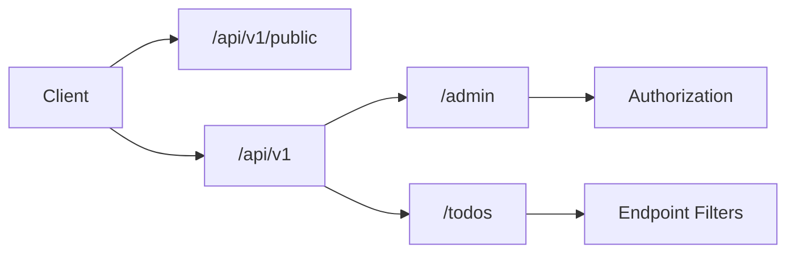

## Nested groups

Route groups inherit prefixes and can add endpoint filters without duplicating attributes.

```csharp title="Program.cs"
var builder = WebApplication.CreateBuilder(args);
builder.Services.AddAuthentication().AddJwtBearer();
builder.Services.AddAuthorization();
var app = builder.Build();

app.UseAuthentication();
app.UseAuthorization();

var api = app.MapGroup("/api/v1")
    .RequireAuthorization()
    .WithOpenApi();

var admin = api.MapGroup("/admin")
    .RequireAuthorization("AdminPolicy")
    .WithTags("Admin");

admin.MapGet("/users", () => Results.Ok(Array.Empty<string>()));
admin.MapPost("/users/{id:guid}/suspend", (Guid id) => Results.Accepted($"/admin/users/{id}"));

var publicApi = app.MapGroup("/api/v1/public")
    .AllowAnonymous()
    .WithTags("Public");

publicApi.MapGet("/status", () => Results.Ok(new { status = "ok" }));

app.Run();
```

## Endpoint filters (long sample)

```csharp title="Filters/ValidationFilter.cs"
public sealed class ValidationFilter<TRequest> : IEndpointFilter
{
    public async ValueTask<object?> InvokeAsync(
        EndpointFilterInvocationContext context,
        EndpointFilterDelegate next)
    {
        var request = context.Arguments.OfType<TRequest>().FirstOrDefault();
        if (request is null)
            return Results.BadRequest("Request body is required.");

        var errors = Validate(request);
        if (errors.Count > 0)
            return Results.ValidationProblem(errors);

        return await next(context);
    }

    private static Dictionary<string, string[]> Validate(TRequest request)
    {
        var errors = new Dictionary<string, string[]>();

        switch (request)
        {
            case CreateTodoRequest todo when string.IsNullOrWhiteSpace(todo.Title):
                errors["Title"] = ["Title is required."];
                break;
            case UpdateTodoRequest update when update.Title is { Length: > 200 }:
                errors["Title"] = ["Title must be 200 characters or fewer."];
                break;
        }

        return errors;
    }
}

public static class FilterExtensions
{
    public static RouteHandlerBuilder WithValidation<T>(this RouteHandlerBuilder builder) =>
        builder.AddEndpointFilter<ValidationFilter<T>>();
}
```

## Wiring filters on a group

<DocsFileTabs title="Filtered todo routes">

```csharp title="Endpoints/TodoEndpoints.cs"
var todos = app.MapGroup("/todos")
    .WithTags("Todos")
    .AddEndpointFilter(async (context, next) =>
    {
        var logger = context.HttpContext.RequestServices.GetRequiredService<ILoggerFactory>()
            .CreateLogger("Todos");
        logger.LogDebug("Handling {Method} {Path}", context.HttpContext.Request.Method, context.HttpContext.Request.Path);
        return await next(context);
    });

todos.MapPost("/", (CreateTodoRequest request, ITodoRepository repo) =>
{
    var todo = repo.Add(request.Title, request.IsComplete);
    return Results.Created($"/todos/{todo.Id}", todo);
}).WithValidation<CreateTodoRequest>();
```

```csharp title="Program.cs"
builder.Services.AddProblemDetails();

var app = builder.Build();
app.UseExceptionHandler();
app.UseStatusCodePages();

app.MapTodoEndpoints();
app.Run();
```

</DocsFileTabs>

## Architecture


